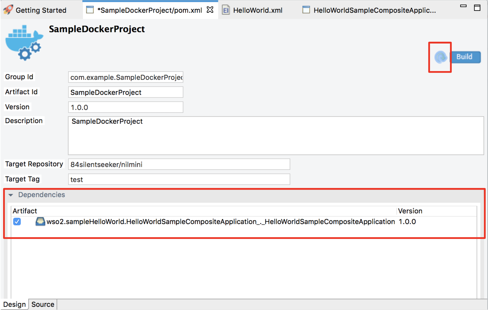

# Creating Docker Project

Create a Docker project if you want to deploy your integration solutions inside a Docker environment. This project directory allows you to package multiple integration projects (created as [ESB pojects](../../develop/creating-projects)) into a single Docker image and then build and push to the Docker registries.
    
## Create Docker project
Follow the steps given below.   

1.  Open **WSO2 Integration Studio** and click **ESB Project → Create New** in the **Getting Started** view as shown below.
    

2.  In the **New ESB Solution Project** dialog that opens, enter a name for the ESB config project. Select the **Create Docker Exporter Project** along with **ESB Config project** and click **Next**.

    

3.  Enter information in the **Docker Project Information** page as follows:

    

    -  **Base Image Repository**:  Base image for the docker build.
    -  **Base Image Tag**: Base image tag for the docker build.
    -  **Target Image Repository**:  Creating Docker image repository name.
    -  **Target Image Tag**: Creating Docker image tag.
    -  **Automatically deploy configurations**: Check if you are using EI7 Micro Integrator as base image.
    -  **Environment Variables**: Add/Remove environment variables to the Docker image.
    
4.  Click **Finish**. The Docker project is created in the project explorer.
5.  Expand the Docker Exporter Project in the project explorer. The following folders and files are stored within.

    
    
    -   **Libs**: Directory to store libraries. During the build time these libraries inside the **Libs** directory will copy to the image.
    -   **Resources**: Directory to store any resource files which want to copy into the Docker image. Make sure to add the relevant Docker COPY command for added files inside the Dockerfile.
    -   **Dockerfile**: The Dockerfile, which contains build details.
    -   **deployment.toml**: The deployment.toml file, which contains Micro Integrator configurations.
    -   **pom.xml**: File for select multiple composite apps and build & push Docker images to the Docker registries.  

!!! Info
    If you already have an ESB Config project with the integration artifacts, click **Miscellaneous → Create New Docker Project** in the **Getting Started** view as shown below.
    
    
## Build Docker images

Follow the steps given below,

1.  Open the **pom.xml** file inside the Docker project.

    
    
2.  In the **Dependencies** section, select the multiple composite applications that you want to package inside the Docker image and save the file.
3.  Click **Build** to start the Docker image build.
4.  It will build the Docker image based on the Dockerfile and the Target details. When the image is created, the following message will display. 

    