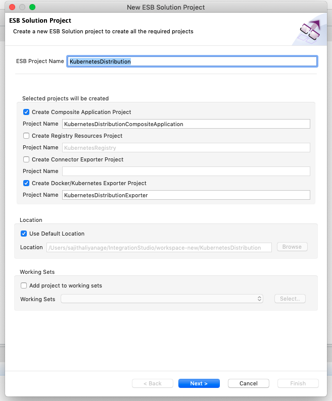
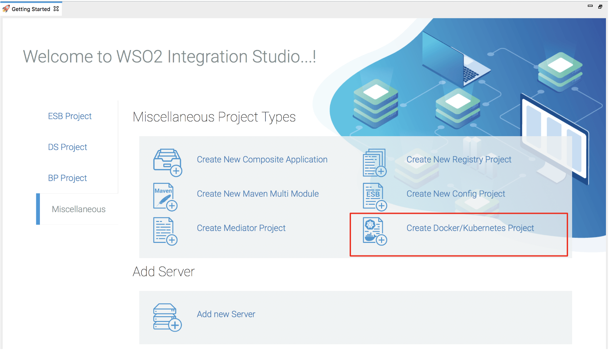
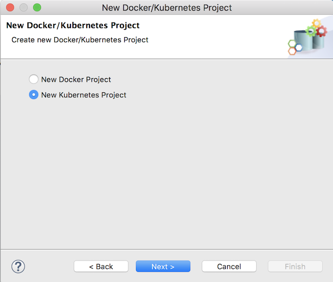
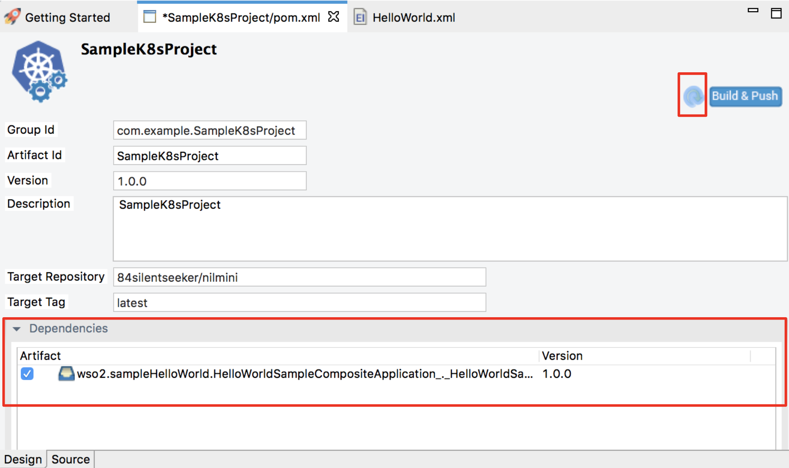
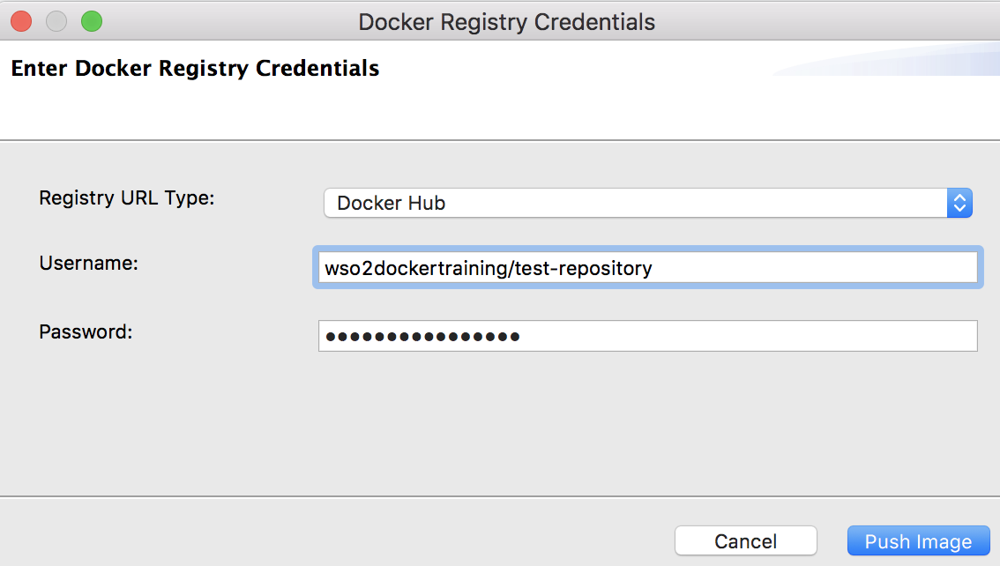

# Creating Kubernetes Project

Create a Kubernetes project directory if you want to deploy your integration solutions in a Kubernetes environment. The Kubernetes project packages the integration solutions (created in [ESB projects](../../develop/creating-projects)) into a single Docker image. Also, a file called **kubernetes_cr.yaml** is generated, which can be used to carry out Kubernetes deployments based on our **k8s-ei-operator**.

## Create Kubernetes project
Follow the steps given below,

1.  Open **WSO2 Integration Studio** and click **ESB Project → Create New** in the **Getting Started** view as shown below.
    

    In the **New ESB Solution Project** dialog that opens, enter a name for the ESB config project. Select the **Create Docker/Kubernetes Exporter Project** along with **ESB Config project** and click **Next**.
    
    

3.  Enter information in the **Docker/Kubernetes Project Information** page as follows:

    

    -   **Container Type**: Type of the container of the project. Select **Kubernetes**.
    -   **Container Name**: Name of the Kubernetes cluster.
    -   **Number of Replicas**: Number of desired Kubernetes pods.
    -   **Remote Repository**:  Base image for the docker build.
    -   **Remote Tag**: Base image tag for the docker build.
    -   **Target Repository**:  Target Docker image repository as in `<url>/<username>/<repository>` or `<username>/<repository>`.
    -   **Target Tag**: Target Docker image tag.
    -   **Expose Port**: Service expose port in Kubernetes cluster.
    -   **Environment Variables**: Multiple environment variable as in key-value pairs.
    
4.  Once you filled the details, click **Finish**. Integration Studio will create a Kubernetes project for you.

5.  Expand the Kubernetes Exporter Project in the project explorer. You can find the following folders and files inside it.

    
    
    -   **CompositeApps**:  Directory to store the composite apps which are selected by the user. During the build time these composite apps will copy to the image.
    -   **Conf**: Directory to store configuration files. During the build time these configuration files inside the Conf will copy to the image.   
    -   **Libs**: Directory to store libraries. During the build time these libraries inside the Libs will copy to the image.
    -   **Dockerfile**: Dockerfile which contains build details.
    -   **kubernetes_cr.yaml**: Kubernetes configuration file generated based on the user inputs.
    -   **pom.xml**: File for select multiple composite apps and build and push Docker images to the Docker registries.

!!! Info
    If you already have an ESB Config project with the integration artifacts, click **Miscellaneous → Create New Docker/Kubernetes Project** in the **Getting Started** view as shown below.
    

    In the **New Docker/Kubernetes Project** dialog that opens, select **New Kubernetes Project** and follow the instructions.
    
       
## Build and Push Docker images

Follow the steps given below.

1.  Open the **pom.xml** file inside the Kubernetes project.

    
    
2.  Select multiple composite applications which are needed to be packed inside the Docker image under the Dependencies section, and save the file.
3.  Click **Build & Push**, to start the Docker image build and push process.

    

    The **Enter Docker Registry Credentials** wizard opens.
    
4.  Enter information in the wizard as follows:
    
    1.  **Registry URL Type**: Docker image registry wants to push. Docker Hub or Other.
    2.  **Enter Registry URL**: If above step it Other, enter the registry url of the private registry.
    3.  **Email**: Email of the target registry repository.
    4.  **Username**: Username of the target registry repository.
    5.  **Password**: Password of the target registry repository.
    
5.  Once you enter the above details, click **Push Image**.

6.  First it will build the Docker image based on the Dockerfile and the Target details. Once it is done, it will show a popup message regarding the status of it.

    

7.  Finally, it will start to push the built image to the given registry. Once it is done, it will show a popup message regarding the status of it.

    
