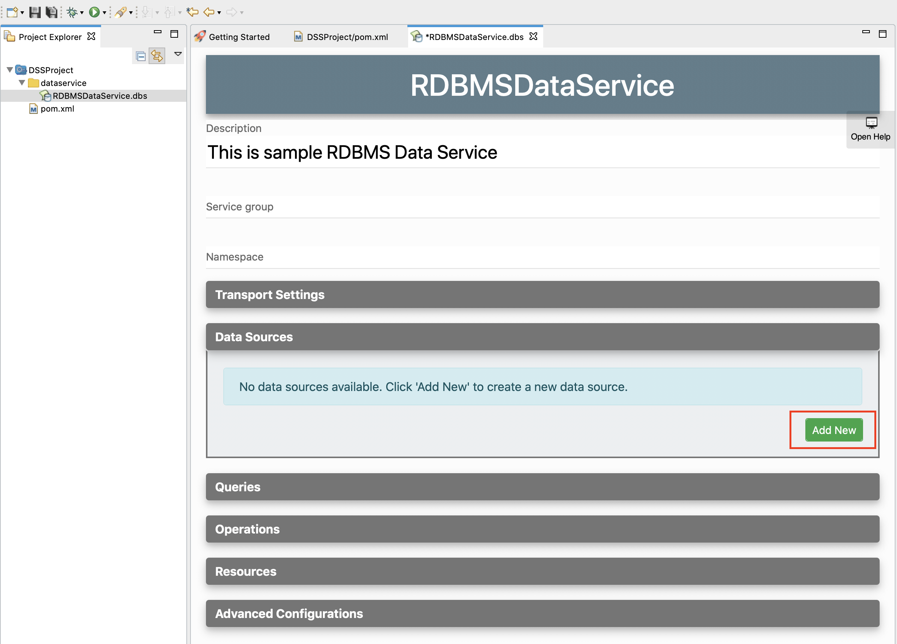
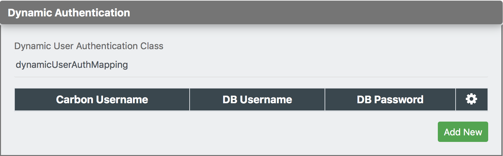
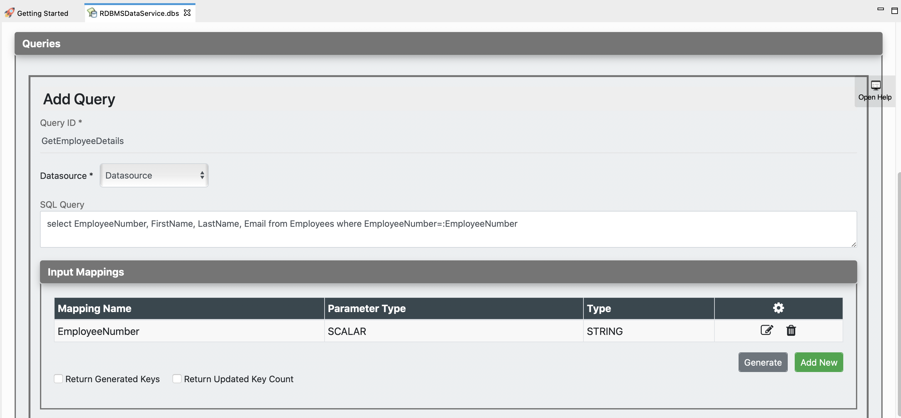
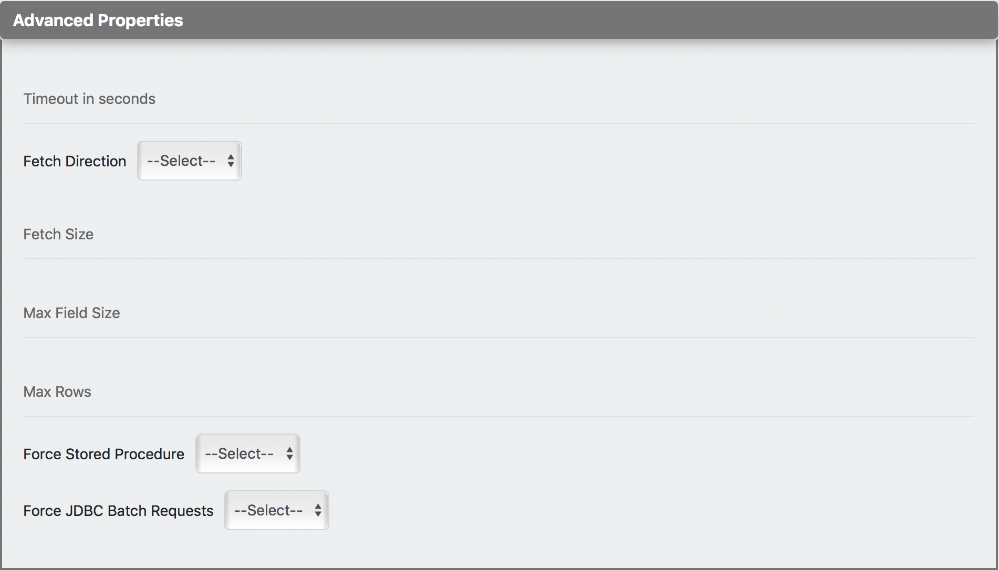
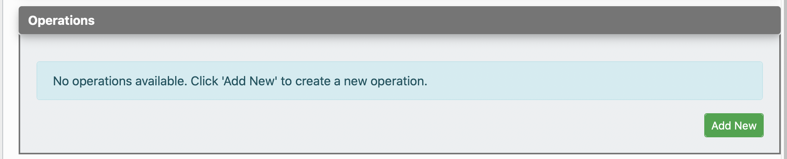

# Creating a Data Service

Follow the instructions given below to create a new REST API artifact.

!!! Tip
    If you do not see the features given below in the WSO2 Integrations Studio that you are using, you need to [get the latest updates](../../../../develop/installing-WSO2-Integration-Studio/#get-the-latest-updates).

## Instructions

!!!	Tip	
	You can also use a sample template to create your data service.

	1.	Open the **Getting Started** view of WSO2 Integration Studio (**Menu -> Help -> Getting Started**). 
	2.	In the Getting Started view, go to the **Data Service** tab and select the **REST Data Service** example.

### Creating the data service artifact

Follow the steps given below to create the data service file:

1.  Right-click the **Data Service** project in the project
    explorer and go to **New -> Data Service**. 

     

2.	In the **New Data Service** wizard that opens, select **Create New
    Data Service** and click **Next**.

    

3.  Enter a name for the data service and click **Finish**.

	

A data service file (DBS file) will now be created in your data service
project as show below.

You can now start updating the data service.

### Adding a datasource

To create a new datasource connection:

1.	Click **Data Sources** and expand the section:

	

2.	Click **Add New** to open the **Create Datasource** page.

	

3.	You can now select the type of datasource that you want to use:
	
	<table>
		<tr>
			<th>Datasource Type</th>
			<th>Description</th>
		</tr>
		<tr>
			<td>
				RDBMS
			</td>
			<td>
				When you select RDBMS, the database engines that you can use are listed in the <b>Database Engine</b> field. Select the required database engine and enter the parameters relevant to the database.  
				See the following examples:
				<ul>
					<li>
						<a href="../../../../use-cases/tutorials/sending-a-simple-message-to-a-datasource">Data Integration tutorial</a>
					</li>
					<li>
						<a href="../../../../use-cases/examples/data_integration/rdbms-data-service">RDBMS datasource example</a>
					</li>
					<li>
						<a href="../../../../use-cases/examples/data_integration/odata-service">OData service example</a>
					</li>
				</ul>
				If you select <b>External Datasource</b>, you need to specify the class that implements the datasource.
			</td>
		</tr>
		<tr>
			<td>
				CSV
			</td>
			<td>
				When you select CSV, you can expose a CSV file as a data service. Specify the details relevant to your CSV file.  
				See the <a href="../../../../use-cases/examples/data_integration/csv-data-service">CSV datasource example</a> for more details.
			</td>
		</tr>
		<tr>
			<td>
				Carbon Datasource
			</td>
			<td>
				This option allows you to specify a separate <a href="../../../../develop/creating-artifacts/data-services/creating-datasources">Carbon Datasource configuration</a> to generate the data service.
			</td>
		</tr>
	</table>

4.	If you specified an RDBM datasource in the previous step:

	-	You can switch to the **Source View** to configure addition [connection pool parameters](../../../../references/synapse-properties/data-services/datasource-Configuration-Parameters).
	-	Click **Test Connection** to expand the section and then click the **Test Connection** button to verify the connectivity between the database and the data service.
		

5.	If you want to configure dynamic authentication, click **Dynamic Authentication** and specify the required values:
	
	

	!!! Tip
		See the example use case on [dynamic user authentication](../../../../develop/advanced-development/dynamic-user-authentication).

5.  Save the updates.

### Creating a query

To specify a query for your source:

1.  Click **Queries** and expand the section:

    

2.  Click **Add New** to open the **Add Query** page.

    

3.  Start by entering the following query details.
	
	<table>
		<tr>
			<th>
				Parameter
			</th>
			<th>
				Description
			</th>
		</tr>
		<tr>
			<td>
				Query ID
			</td>
			<td>
				Give a unique name to identify the query.
			</td>
		</tr>
		<tr>
			<td>
				Datasource
			</td>
			<td>
			   All the datasources created for this data service are listed. Select the required datasource from the list.
			</td>
		</tr>
		<tr>
			<td>
				SQL Query
			</td>
			<td>
				You can enter the SQL query in this text box.
			</td>
		</tr>
	</table>

#### Input mapping

You can configure input parameters for the query using this section.

1.  Click **Input Mappings** and expand the section. 

    

2.	There are two  ways to create the mapping:
	
	-	Click **Generate** to automatically generate the input mappings from the SQL query.
	-	Alternatively, click **Add New** to manually create new input elements.
		

!!! Info
	See the complete list of [input mapping parameters](../../../../references/synapse-properties/data-services/query-parameters/#input-parameters).

Shown below is an example query with input mapping:
                        

#### Result (Output Mapping) 

You can configure output result parameters for the query using this section.

1.  Click **Result (Output Mappings)** to expand the section.
    
2.  Enter a value for the **Grouped by element** field to group all the output elements that you will define.
3.	There are two ways to create the output elements:

	-	Click **Generate** to automatically generate the output elements from the SQL query.
	-	Alternatively, click **Add New** to manually create new output elements.
		

!!! Info
	See the complete list of [output mapping parameters](../../../../references/synapse-properties/data-services/query-parameters/#output-parameters).

Shown below is an example query with output mappings:

#### Advanced properties 

Click **Advanced Properties** to expand the section and add the required parameter values.

!!! Info
	See the complete list of [advanced properties](../../../../references/synapse-properties/data-services/query-parameters/#advanced-query-parameters).

The data service should now have the query element added.

### Adding a SOAP operation

Use this section to configure a SOAP operation for invoking the data service.

1.  Click **Operations** and expand the section:

    

2.  Click **Add New** to add a SOAP Operation for your data service.

	

3.	Enter the following information:

	<table>
		<tr>
			<th>
				Parameter
			</th>
			<th>
				Description
			</th>
		</tr>
		<tr>
			<td>
				Operation Name
			</td>
			<td>
				Give a name to the SOAP operation.
			</td>
		</tr>
		<tr>
			<td>
				Query ID
			</td>
			<td>
				Select the query from the listed queries.
			</td>
		</tr>
		<tr>
			<td>
				Operation Parameters
			</td>
			<td>
				Click <b>Add New</b> and add parameters representing the <a href="#input-mapping">input elements</a> in your query.
			</td>
		</tr>
	</table>

### Adding a RESTful Resource

Use this section to configure a REST resource for invoking the data service.

1.  Click **Resources** and expand the section:
	

2.	Click **Add New** to add a new resource.

	

3.	Give the following details to create the REST resource. 

	<table>
		<tr>
			<th>
				Parameter
			</th>
			<th>
				Description
			</th>
		</tr>
		<tr>
			<td>
				Resource Path
			</td>
			<td>
				Give the HTTP REST resource path you need to expose.
			</td>
		</tr>
		<tr>
			<td>
				Query ID
			</td>
			<td>
				Select the Query ID for which you want to create a REST resource.
			</td>
		</tr>
	</table>

4.	Click **Save** to add the resource to the data service.

The data service should now have the resource added.

## Examples

<ul>
	<li>
		<a href="../../../../use-cases/examples/data_integration/rdbms-data-service">Exposing an RDBMS Datasource</a>
	</li>
	<li>
		<a href="../../../../use-cases/examples/data_integration/json-with-data-service">Exposing Data in JSON Format</a>
	</li>
	<li>
		<a href="../../../../use-cases/examples/data_integration/odata-service">Using and OData Service</a>
	</li>
	<li>
		<a href="../../../../use-cases/examples/data_integration/nested-queries-in-data-service">Using Nested Data Queries</a>
	</li>
	<li>
		<a href="../../../../use-cases/examples/data_integration/batch-requesting">Batch Requesting</a>
	</li>
	<li>
		<a href="../../../../use-cases/examples/data_integration/request-box">Invoking Multiple Operations via Request Box</a>
	</li>
	<li>
		<a href="../../../../use-cases/examples/data_integration/distributed-trans-data-service">Using Distributed Transactions in Data Services</a>
	</li>
	<li>
		<a href="../../../../use-cases/examples/data_integration/data-input-validator">Validating Data Input</a>
	</li>
</ul>

## Tutorials

<li>
	See the tutorial on <a href="../../../../use-cases/tutorials/sending-a-simple-message-to-a-datasource">data integration</a>
</li>
