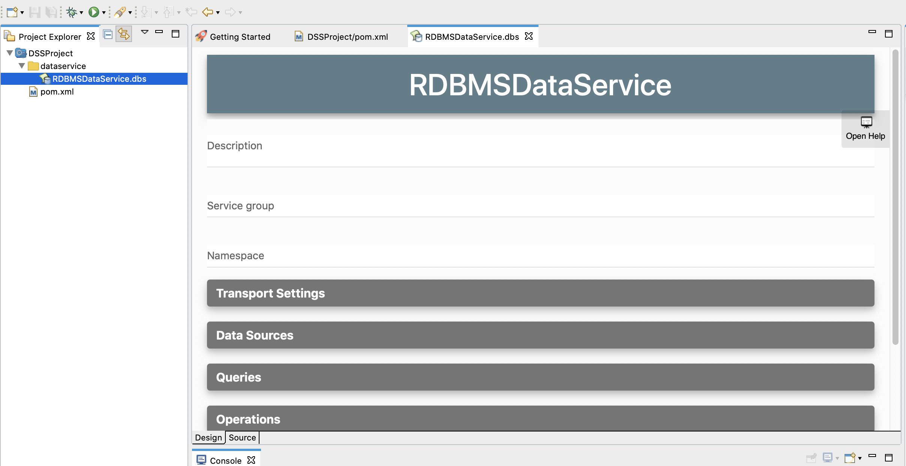
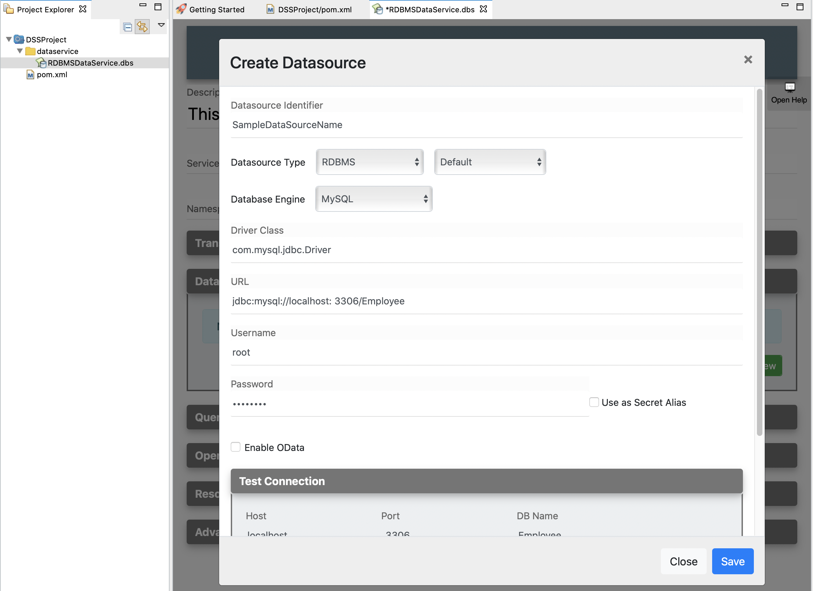

# Creating a Data Service
## Instructions
### Creating the datasource connection

!!! Tip
You can try-out built-in sample and onscreen help about Creating Data Service in the tool. 
First, open the **Getting Started** window by navigating Menu -> Help -> Getting Started 
In the Getting Started window select **Data Service** tab from the Left navigator pane. Then select the **REST Data Service** example.

Follow the steps given below to create the data service file:

1.  Select the already created **Data Service Project** in the project
    navigator, right click and go to **New -> Data Service**.  
    The **New Data Service** window will open as shown below. 

    

2.  To start creating a data service from scratch, select **Create New
    Data Service** and click **Next**.
3.  Enter a name for the data service.
4.  Save the data service.

A data service file (DBS file) will now be created in your data service
project. Shown below is the project directory.

### Add a data source

1. Click on the **Data Sources** to expand the Data Source and then click on the **Add New** button.

2. Give the data base connection details in the Add Data Source dialog

3. You can test the database connection using the Test Connection Section

### Creating a query

1.  Click on the **Queries** menu in the Data Source Editor.
2.  Then click **Add New** button to add a new query.  
    
3.  Enter the following query details.

**QueryID** : Give a unique name to Identify the Query.
    
**Datasource** : Select the data source from the dropdown list (This will list all the created datasources for this data service)

**SQL Query** : You can enter the SQL query in this text box
    
**Input Mappings** : You can click **Generate** button to automatically generate the Input mappings from the SQL Query
                        If you want to add a new input mapping you can add by clicking **Add New** button. 
    
**Result (Output Mappings)** : You can either generate output mappings by clicking **Generate** button or add a new output mapping by clicking **Add New** button 
    
**Advanced Properties** : You can configure advance Properties for queries using this section
    
Finally, click **Save** button to add the Query to the data service.
    
     
The data service should now have the query element added as shown below.
    

### Adding a SOAP Operation
Click on **Add New** under the Operations to add a SOAP Operation for your data service.

   
**Operation Name** : Give a name to the SOAP Operation
    
**Query ID** : Select the Query from the listed queries.
    
**Operation Parameters** : Click **Add New** button to add new parameters to the operation
    

### Creating a resource to invoke the query

Now, let's create a REST resource that can be used to invoke the query.

1.  Click on **Resources** and click **Add New** button to add a new Resource.

2. Give the following details to create the REST resource. 

**Resource Path** : Give the HTTP REST resource path you need to expose.

**Resource Method** : Select the HTTP REST method from the drop down list.

**Query ID** : Select the Query ID from the drop down list that you need to expose as a REST Resource

Click **Save** button to add the Resource to the data service.

The data service should now have the resource added as shown below.

## Examples

<ul>
	<li>
		<a href="../../../../use-cases/examples/data_integration/rdbms-data-service">Exposing an RDBMS Datasource</a>
	</li>
	<li>
		<a href="../../../../use-cases/examples/data_integration/json-with-data-service">Exposing Data in JSON Format</a>
	</li>
	<li>
		<a href="../../../../use-cases/examples/data_integration/odata-service">Using and OData Service</a>
	</li>
	<li>
		<a href="../../../../use-cases/examples/data_integration/nested-queries-in-data-service">Using Nested Data Queries</a>
	</li>
	<li>
		<a href="../../../../use-cases/examples/data_integration/batch-requesting">Batch Requesting</a>
	</li>
	<li>
		<a href="../../../../use-cases/examples/data_integration/request-box">Invoking Multiple Operations via Request Box</a>
	</li>
	<li>
		<a href="../../../../use-cases/examples/data_integration/distributed-trans-data-service">Using Distributed Transactions in Data Services</a>
	</li>
	<li>
		<a href="../../../../use-cases/examples/data_integration/data-input-validator">Validating Data Input</a>
	</li>
</ul>

## Tutorials

<li>
	See the tutorial on <a href="../../../../use-cases/tutorials/sending-a-simple-message-to-a-datasource">data integration</a>
</li>
