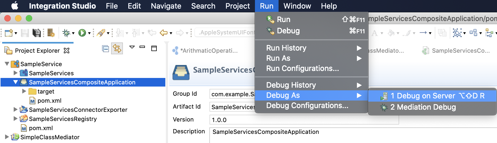
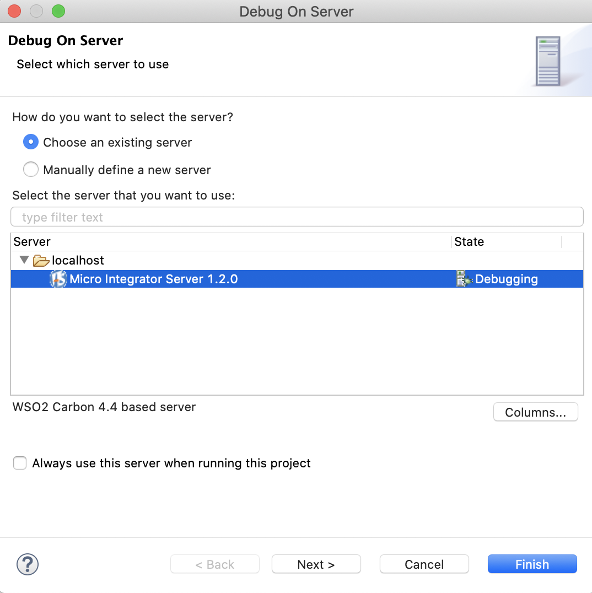
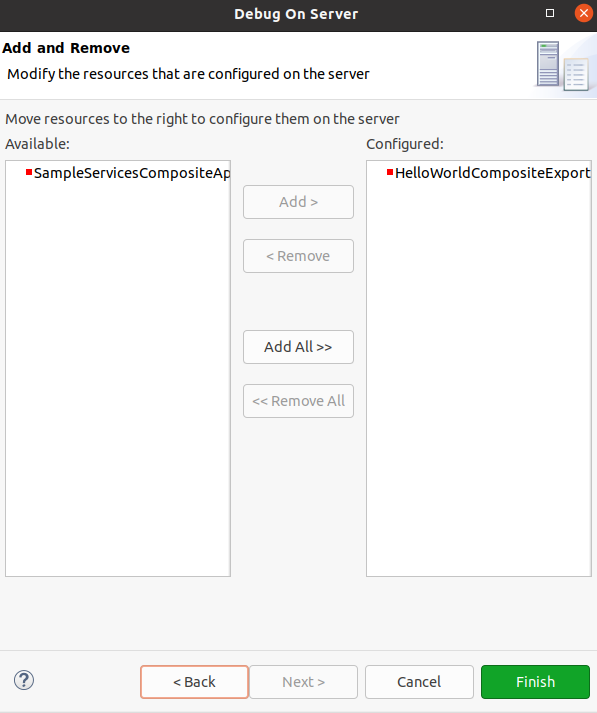
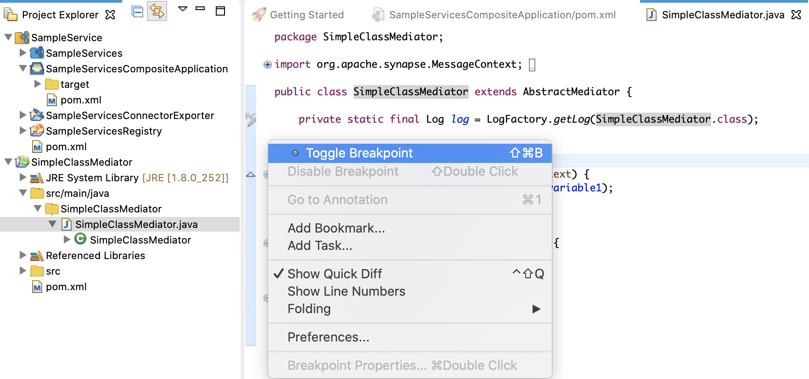
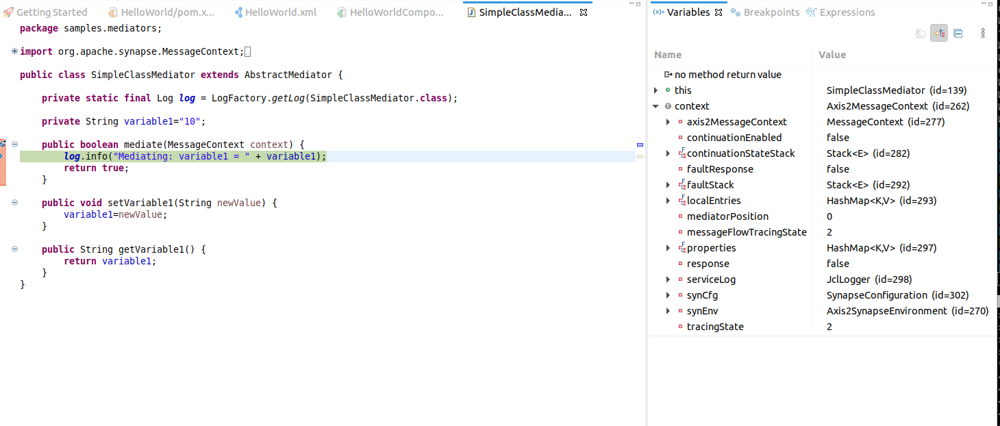

# Debugging On Server

Once you [deploy and run](../deploy-artifacts) your integration solution, you may encounter errors and identify the required modifications for your class mediators. Use the debug on server feature in WSO2 Integration Studio to troubleshoot errors.

There are two ways to debug a developed class mediator.

1.  Instant debugging using the embedded Micro Integrator of WSO2 Integration Studio.
2.  Deploy artifacts to an external Micro Integrator server and debug.

Above two approaches are discussed in detail below.

## Instant debugging using Micro Integrator

1.  When project artifacts are ready, select the project you want to debug and click **Run** -> **Debug As** -> **Debug on Server**.
    

2.  In the Debug On Server dialog box that opens, select the required server and click **Next**.
    

3.  Add the artifacts that need to be deployed to the embedded Micro Integrator and click **Finish**.
    

4.  On the console of WSO2 Integration Studio, notice that Micro
    Integrator is started with the artifacts deployed. HTTP traffic is
    listened on the 8290 port.

5.  Add some breakpoints to the Java class used in the class mediator.  
    

6.  Invoke the service using the inbuilt HTTP client or some external client. As soon as
    a request comes to the class mediator, the first break point will be triggered.  
    
    Note that you can view the message context that comes into the mediator.

    !!! Note
        If you get the error "**Source not found**" follow the instructions below to add the class mediator source.
        
        1.  Click **Edit Source Lookup Path** in the Source not found window that appears.
        2.  Click **Add** in the Edit Source Lookup Path dialog that appears.
        3.  Select Java Project in the Add source dialog.
        4.  Select your mediator project from the Project Selection dialog and click **ok**

7.  Click **Continue** to resume the message flow.

## Debugging with external Micro Integrator

Follow the steps below to enable debugging custom class mediators.

1.  Click **Run** in the top menu of the WSO2 Integration Studio, and
    then click **Debug Configurations** .  
    
2.  Enter the details to create a new configuration as shown in the
    example below. You need to define a port number and a hostname to connect the external Micro Integrator with WSO2 Integration Studio in the debug mode.

    
      
3.  Add the new configuration to the Debug menu. Then you can access the configuation easily.  
    
      
4.  Execute the following commands (passing a the same port number you used in step 2 as a system variable at start up) to start WSO2 Micro Integrator in debug
    mode:  
    -   On **Windows**:

        `MI_HOME\bin\micro-integrator.bat --run -debug 5005`

    -   On **Linux/Solaris**:

        `sh MI_HOME/bin/micro-integrator.sh -debug 5005`

5.  Click the **downward** arrow beside **Debug** in WSO2 Integration Studio and select the new profile created above when the Console indicates the following.

    
     

6.  In WSO2 Integration Studio, right-click and add breakpoints on the desired class mediators to start debugging as shown in the example below.

    

Now you can send a request to the external Micro Integrator and debug the class mediators as discussed under "Instant debugging using Micro Integrator".
