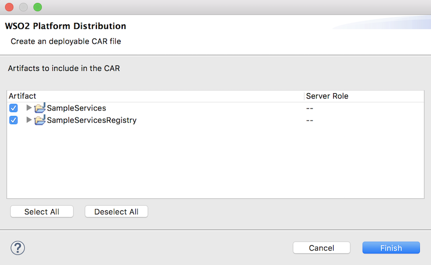

# Deploy and run the integration

You can deploy the artifacts and run it in the embedded Micro Integrator, or a remote instance of the Micro Integrator.

## Using the embedded Micro Integrator

You can test artifacts by deploying the [packaged artifacts](packaging-artifacts.md) in the built-in Micro Integrator:

1.  Be sure to create a **composite application project** and include
    your artifacts.
2.  Right-click the composite application project and click **Export
    Project Artifacts and Run** .  
    
3.  In the dialog that opens, select the artifacts form the composite
    application project that you want to deploy.  
    
4.  Click **Finish** . The artifacts will be deployed in the WSO2 Micro
    Integrator and the server will start. See the startup log in the
    **Console** tab:  
    
5.  If you find errors in your mediation sequence, use the [debugging features](debugging-mediation.md)
    to troubleshoot.

## Using a remote Micro Integrator

The light-weight Micro Integrator is already included in your WSO2 Integration Studio package, which allows you to [deploy and run the artifacts instantly](#using-the-embedded-micro-integrator). 

The following instructions can be used to run your artifacts in a remote Micro Integrator instance.

## Deploy and run artifacts in a remote instance

1.	[Download and install](../../setup/installation/install_in_vm) the Micro Integrator server and on your computer. 
2.	[Package your Synapse artifacts](packaging-artifacts.md) from WSO2 Integration Studio.

However, when your solutions are ready to be moved to your production environments, it is recommended to use a **CICD pipeline**.

!!! Note
    As an alternative, you can skip the steps given below and manually copy the exported CAR file to the `<MI_HOME>/repository/deployment/server/carbonapps/` folder, where `<MI_HOME>` is the root folder of your Micro Integrator installation.
    For more information on how to export a CAR file, see [Exporting Artifacts](exporting-artifacts.md).

## Add a new remote instance

1.  Open the <b>Getting Started</b> view and click click <b>Miscellaneous</b> →<b>Add new Server</b> to open the <b>New Server</b> dialog box.
    
    

2.  In the <b>New Server</b> dialog box that opens, expand the WSO2 folder and select the version of your server.

    

3.  Click <b>Next</b>. In the CARBON_HOME field, provide the path to your product's home directory and then click <b>Next</b>.

4.  Review the default port details for your server and click <b>Next</b>.
    
    

    !!! Note
		If you selected an <b>Enterprise Integrator</b> server in the previous step, enter the port details required for an Enterprise Integrator.

    !!! Note
        If you are already running another server on these ports, give unused ports. See [Default ports](../../setup/changing_default_ports) of WSO2 Micro Integrator for more information.

## Deploy and run artifacts in a remote instance

1.  To deploy the C-App project to your server, select the composite application from the list, click <b>Add</b> to move it into the configured list, and then click <b>Finish</b>.
    

2.  On the <b>Servers</b> tab, note that the server is currently stopped. Click the  icon on the tool bar. If prompted to save changes to any of the artifact files you created earlier, click <b>Yes</b>.

       

## Deploy, redeploy, or remove artifacts in a remote instance

- To deploy/remove C-Apps, right-click the server, click <b>Add and Remove</b> and follow the instructions on the wizard.

    

- If you want to redeploy a C-App after modifying the included artifacts, select the already deployed C-App, right-click and click <b>Redeploy</b>.

!!! Note
	Hot deployment is enabled in the Micro Integrator by default. This allows you to redeploy artifacts without restarting the server.
	If you disabled hot deployment while adding the server, you need to restart the server as well
