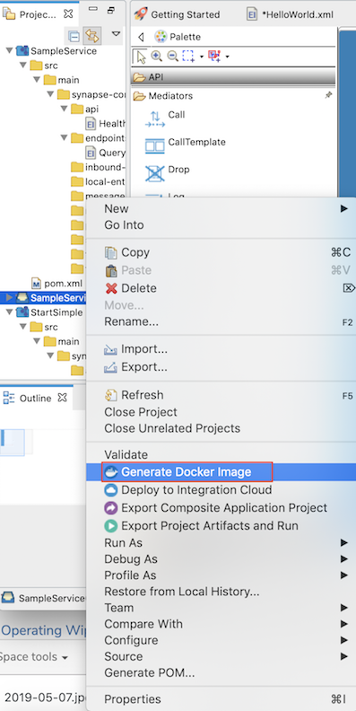

# Generating Docker images

See the topics given below.

## Before you begin

1.  Install Docker from the [Docker Site](https://docs.docker.com/) .
2.  Create a Docker Account at [Docker Hub](https://hub.docker.com) and log in.
3.  Start the Docker server.

## Generate the Docker image

1.  Open WSO2 Integration Studio.
2.  Open an existing project. Right-click on **Composite Project** and
    then click **Generate Docker Image**.  
     

    The **Generate Docker Image Wizard**
    opens.
    
3.  Enter information in the wizard as follows:

     Select one from the following three options:
        
    
       1.  **Create a new Docker Exporter Project** : This option will create a new [Docker Exporter Project](create-docker-project.md).
           You can build a docker image using Docker Exporter Project
    
       2.  **Generate Docker Image with the Embedded MI** : This option will create a Docker Image with the Micro Integrator runtime that is packed inside the Integration studio.
        Note : This is recommended only for testing.
        Enter the following details : 
         

        -   **Name of the application** : The name of the composite
            application with the artifacts created for your ESB project.
            The name of the ESB project is displayed by default, but it
            can be changed if required.
        -   **Application version** : The version of the composite
            application.
        -   **Name of the Docker Image** : A name for the Docker image.
        -   **Docker Image Tag** : A tag for the Docker image to be used
            for reference. This is optional.
        -   **Export Destination** : Browse for the preferred location
            in your machine to export the Docker image.

        -  Once you have entered the required details, click **Next**.
        -  In the next page, select the ESB projects that you want to
        include in the Docker image and click **Finish** .  
          
        Once the Docker image is successfully created, a message similar
        to the following appears in your screen.  
        

       3. **Generate Docker Image With an Existing Project** : This will use the selected Existing Docker Exporter Project and create a docker image.
          