# Developing Your First Integration Solution

Integration developers need efficient tools to build and test all the integration use cases required by the enterprise 
before pushing them into a production environment. 
The following topics will guide you through the process of building and running an example 
integration use case using WSO2 Integration Studio. 
This tool contains an embedded WSO2 Micro Integrator instance as well as other capabilities 
that allows you to conveniently design, develop, and test your integration artifacts before 
deploying them in your production environment.

## Use case

We are going to use the same use case we considered in the [Quick Start Guide](../../overview/quick-start-guide). 
In the quick start guide, we just executed the already-built integration scenario. 
Here, we are going to build the integration scenario from scratch. Let’s recall the 
business scenario:


The scenario is about a basic healthcare system where WSO2 Micro Integrator is used as the integration middleware. Most healthcare centers use a system to help patients book doctor appointments. To check the availability of doctors, patients will typically use each and every online system that is dedicated for a particular healthcare center or personally visit the healthcare centers. 

We will simplify this process of booking doctor appointments by building an integration solution that orchestrates the isolated systems in each healthcare provider and exposes a single interface to the users. 

Both the Grand Oak service and Pine Valley service are exposed over the HTTP protocol. 

- The Grand Oak service accept GET requests in the following service endpoint url:
  ```bash
  http://<HOST_NAME>:<PORT>/grandOak/doctors/<DOCTOR_TYPE>
  ```

- The Pine Vallery service accepts POST requests in the following service endpoint url:
  ```bash
  http://<HOST_NAME>:<PORT>/pineValley/doctors
  ```

    The expected payload should be in the following JSON format:
    ```bash
    {
            "doctorType": "<DOCTOR_TYPE>"
    }
    ```

Let’s implement a simple Rest API that can be used to query the availability of doctors for a particular category 
from all the available healthcare centers.

## Set up the workspace

We will build the integration solution using WSO2 Integration Studio and run it on a VM 
or your local machine.

1. Download the relevant [WSO2 Integration Studio](https://wso2.com/integration/integration-studio/) based on your operating system. For more information, see [Installing WSO2 Integration Studio](../../develop/installing-WSO2-Integration-Studio).
2. Download [curl](https://curl.haxx.se/) or a similar tool that can call an HTTP endpoint.

## Develop the integration artifacts

### Step 1: Create projects
 
Let's create an **ESB Solution project** with the required project directories in WSO2 Integration Studio. These directories store the various ESB artifacts that you create for your integration solution.

1. Open **WSO2 Integration Studio** and click **ESB Project** → **Create New** in the **Getting Started** view as shown below.

    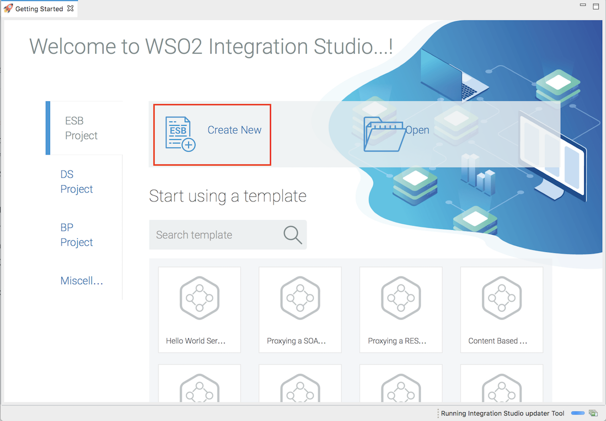

2. In the **New ESB Solution Project** dialog that opens, enter a name for the ESB config project. 
Be sure to leave the ‘Create Composite Application Project’ check box selected.

    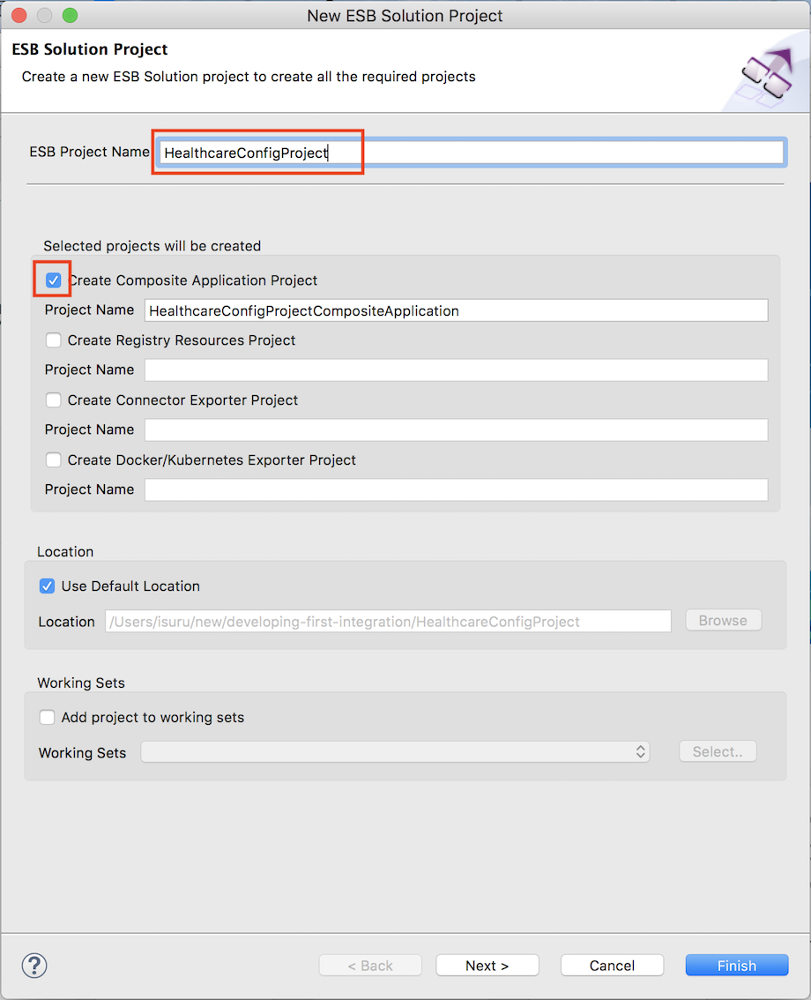

3. Click **Finish** to save the projects. The ESB projects are listed in the project explorer as shown below.

    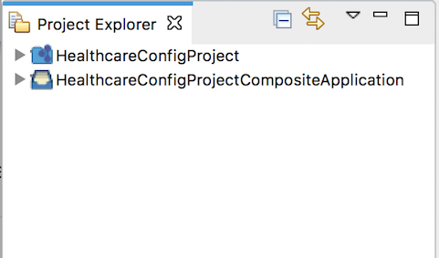

    The `HealthcareConfigProject` directory stores the integration (synapse) artifacts and the 
    `HealthcareConfigProjectCompositeApplication` directory stores the composite application project that is used for 
    packaging the integration artifacts. 

### Step 2: Create Endpoints

The actual back-end services (healthcare services) are logically represented in the integration solution as **Endpiont** artifacts. 

Let's create two Endpoint artifacts for the two healthcare services:

1. Right-click `HealthcareConfigProject` and go to **New** → **Endpoint** to open the **New Endpoint Artifact** dialog box.
    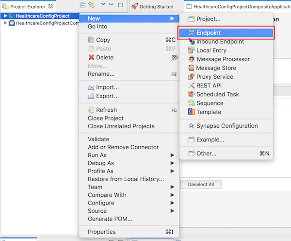
    
2.  Select **Create a New Endpoint** and click **Next**.

3.  Type a unique name for the endpoint and then select **HTTP Endpoint** as the type. For ‘Grand Oak hospital service’, let’s use the following configuration parameters:

    <table>
      <tr>
         <th>Parameter</th>
         <th>Value</th>
      </tr>
    
      <tr>
        <td>Endpoint Name</td>
        <td>GrandOakEndpoint</td>
      </tr>
    
      <tr>
        <td>Endpoint Type</td>
        <td>HTTP Endpoint</td>
      </tr>
    
      <tr>
        <td>URI Template</td>
        <td>http://localhost:9090/grandOak/doctors/{uri.var.doctorType}</td>
      </tr>
    
      <tr>
        <td>Method</td>
        <td>GET</td>
      </tr>
    </table>
   
    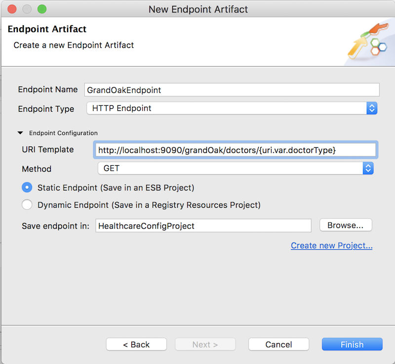

4.  Click **Finish** to save the endpoint configuration.
5.  Follow the same steps to create an endpoint for ‘Pine Valley Hospital’. Use the following parameters:
   
    <table>
      <tr>
         <th>Parameter</th>
         <th>Value</th>
      </tr>
    
      <tr>
        <td>Endpoint Name</td>
        <td>PineValleyEndpoint</td>
      </tr>
    
      <tr>
        <td>Endpoint Type</td>
        <td>HTTP Endpoint</td>
      </tr>
    
      <tr>
        <td>URI Template</td>
        <td>http://localhost:9091/pineValley/doctors</td>
      </tr>
    
      <tr>
        <td>Method</td>
        <td>POST</td>
      </tr>
    </table>  
    
### Step 3: Create the REST API

We are orchestrating multiple services and exposing a single API to the clients. The main integration artifact is going to be a REST API. 

1. Right-click `HealthcareConfigProject` in the navigator and 
go to **New** → **REST API** to open the **API Artifact Creation Options** dialog box.
2. Select **Create A New API Artifact** and click **Next**.
3. Specify values for the required REST API properties: API name, and Context.

    <table>
      <tr>
         <th>Parameter</th>
         <th>Value</th>
      </tr>
      <tr>
        <td>Name</td>
        <td>HealthcareAPI</td>
      </tr>
      <tr>
        <td>Context</td>
        <td>/healthcare</td>
      </tr>
    </table> 
    
    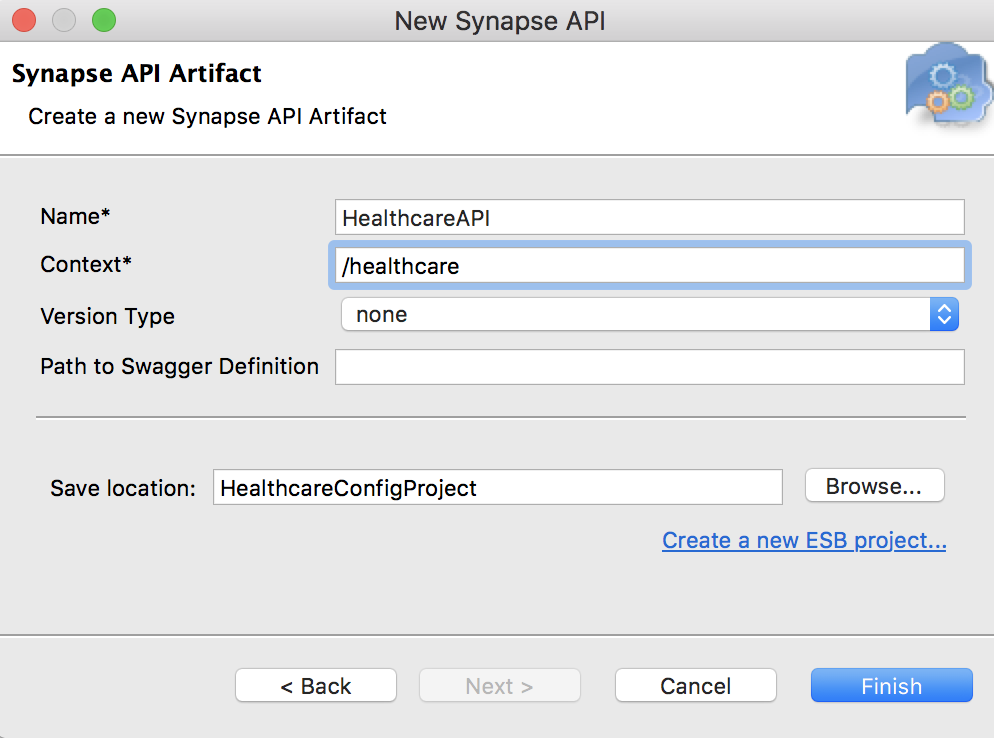
    
4. Click **Finish**. The REST API is created in the `src/main/synapse-config/api` folder under `HealthcareConfigProject`.
5. Open the new artifact from the project explorer. You will see the graphical view of the `HealthcareAPI` with its default **Resource**.

    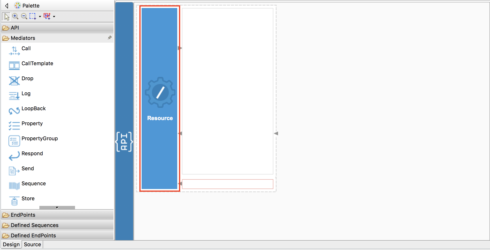
    
    To the left of the editor, you will see the **Mediators** palette containing various mediators 
    that can be dragged and dropped into the canvas of the **API Resource**. 

6. Double-click the API resource to open the **Properties** view:

    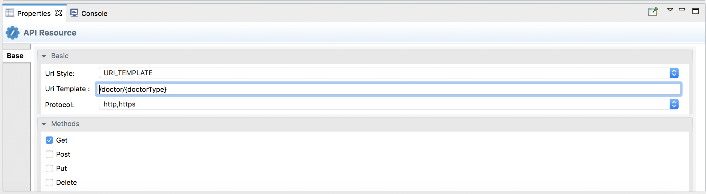
    
    Specify values for the required resource properties:

    <table>
      <tr>
         <th>Parameter</th>
         <th>Value</th>
      </tr>
      <tr>
        <td>Url Style</td>
        <td>URL_TEMPLATE</td>
      </tr>
      <tr>
        <td>Uri Template</td>
        <td>/doctor/{doctorType}</td>
      </tr>
      <tr>
        <td>Methods</td>
        <td>Get</td>
      </tr>
    </table>     

    In the **Uri Template**, {doctorType} is a uri variable that gets resolved to the path parameter value in the runtime. We can access the value of the uri variable in the mediation flow using the variable (property) called ‘uri.var.doctorType’.

### Step 4: Build the mediation logic

1. Create two parallel message flows
    
    In this scenario, the Healthcare API receives an HTTP GET request, which should be delivered to two different back-end services. That is, we need to clone the message into two branches and process them in parallel. 
    To do that, we can use the **Clone Mediator**.

    Drag the **Clone** mediator from the mediator palette and drop it into the request path (inSequence) of the API Resource canvas. 

    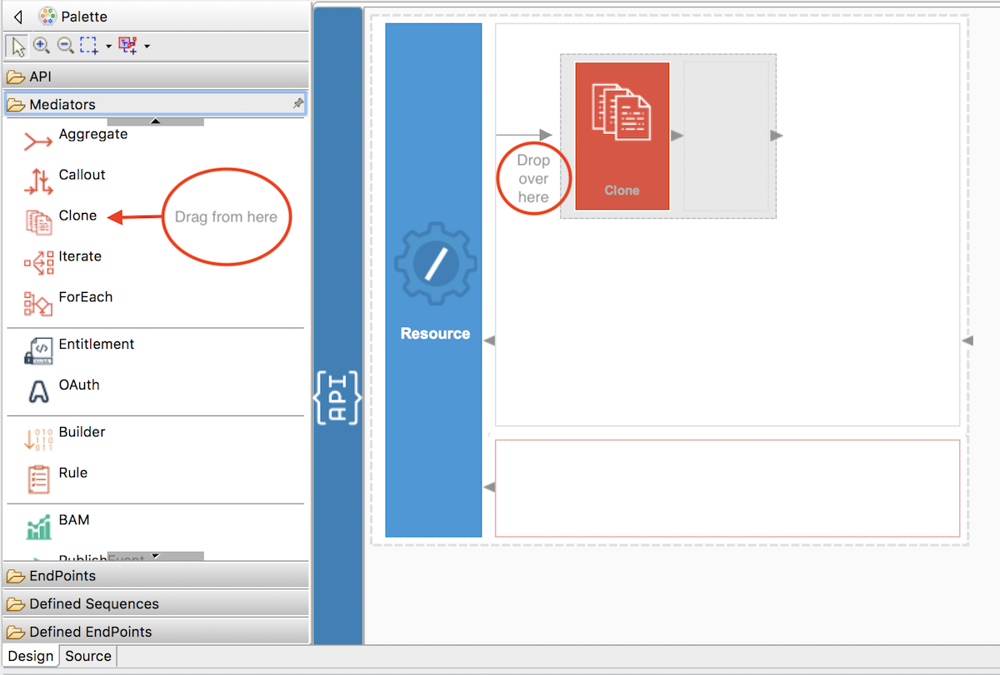

    Right-click the Clone mediator and select **Add/Remove Target..**. 
    In the **Add Target Branches** window, set the number of branches to 2. 
    You will now see two branches inside the **Clone** mediator.

    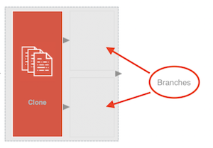

2. Invoke the GrandOak Endpoint

    The **Call** mediator is used to invoke a back-end service. In [Step 2](#step-2-create-endpoints), we have already created an Endpoint to represent the GrandOak endpoint.

    Drag the Call mediator from the mediator palette into one branch of the Clone mediator. 

    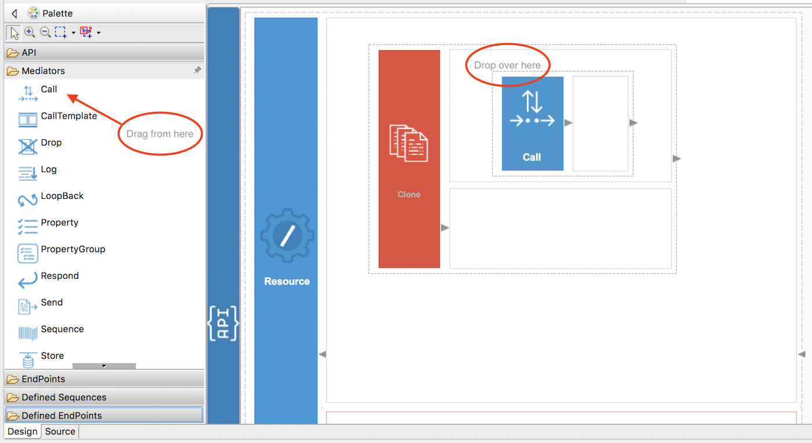
   
    Then, drag the already-defined GrandOak endpoint artifact, which is available under the **Defined Endpoints** section of the palette, into the Call mediator.
    
    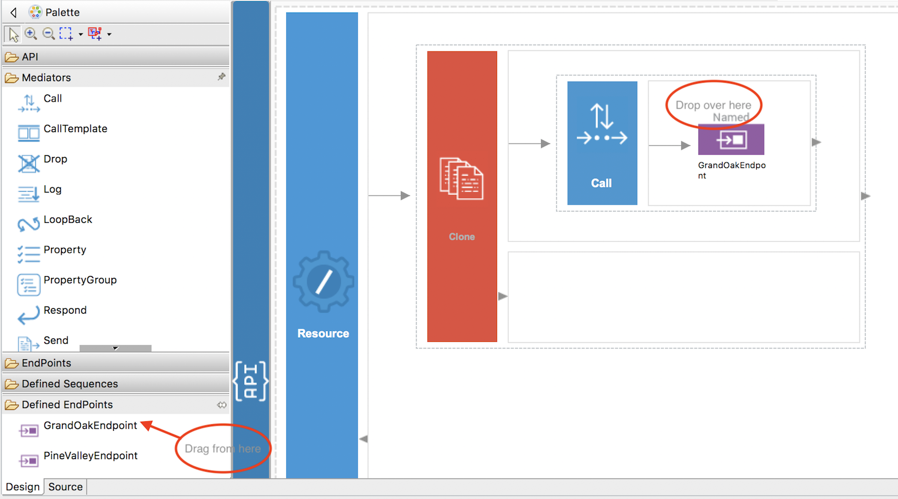
   
3. Construct message payload for the PineValley Endpoint

    Unlike the GrandOAK endpoint, which accepts a simple GET request, the PineValley endpoint requires a POST request with the following JSON message:

    ```bash
    {
        "doctorType": "<DOCTOR_TYPE>"
    }
    ```

    Therefore, we need to first construct the required message payload. There are several 
    Transformation mediators available for constructing messages. Let's use the **PayloadFactory** mediator.
    Drag the PayloadFactory mediator into the 2nd branch of the **Clone** mediator as shown below.

    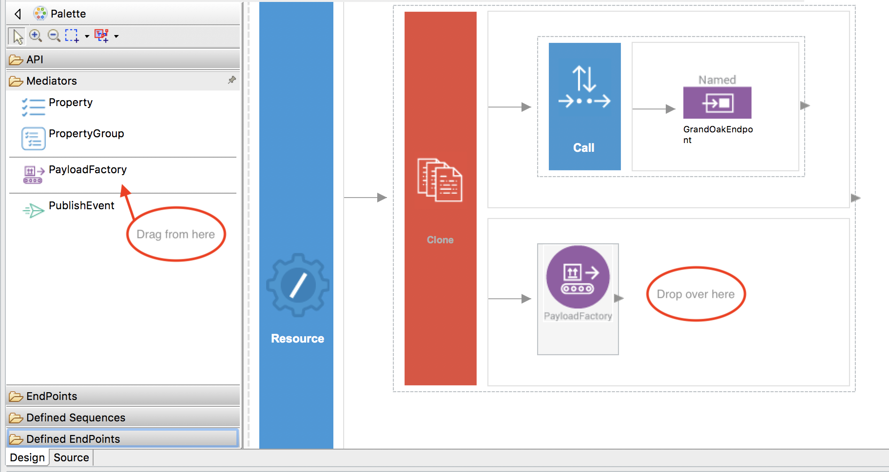
    
    Specify values for the required PayloadFactory properties:

    <table>
      <tr>
         <th>Parameter</th>
         <th>Value</th>
      </tr>
    
      <tr>
        <td>Payload Format</td>
        <td>Inline</td>
      </tr>
    
      <tr>
        <td>Media Type</td>
        <td>json</td>
      </tr>
      
      <tr>
        <td>Payload</td>
        <td>{
                  "doctorType": "$1"
            }
        </td>
      </tr>
      
      <tr>
        <td>Args</td>
        <td>$ctx:uri.var.doctorType</td>
      </tr>
    </table>

    Note the `$1` in the Payload format. It denotes a parameter that can get a value assigned dynamically. The value for the parameters need to be assigned using Arguments **(Args)**. 
    **Args** can be added using the **PayloadFactoryArgument** dialog box, which appears when you click the + sign.
    
    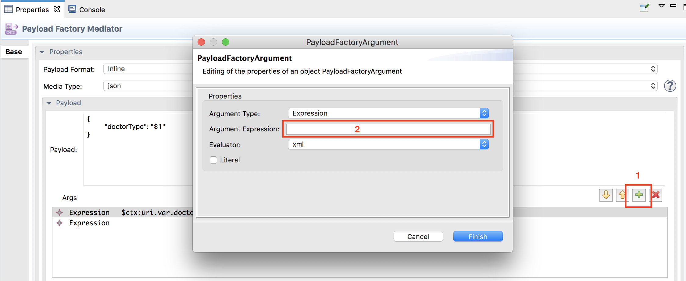
    
    In the `PayloadFactoryArgument` dialog box, select **Expression** as the **Argument Type**, and click **Argument Expression**. You will then see the **Expression Selector** dialog box. Enter **$ctx:uri.var.doctorType** as the value for the expression.
    
4. Invoke the PineValley Endpoint
    
    Use the Call mediator to invoke the PineVallery Endpoint. Follow the same steps you used under ‘Invoke GrandOak Endpoint’. 
    
5. Aggregating response messages
    
    Since we are cloning the messages and delivering into two different services, we will receive two responses. 
    So we need to aggregate those two responses and construct a single response. To do that, we can use the **Aggregate** mediator.
    
    Drag the Aggregate mediator and drop it next to the Clone mediator as shown below.
   
    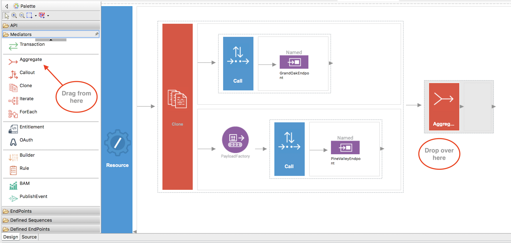
   
    Specify values for the required Aggregate mediator properties.

    <table>
      <tr>
         <th>Parameter</th>
         <th>Value</th>
      </tr>
    
      <tr>
        <td>Aggregation Expression</td>
        <td>json-eval($.doctors.doctor)</td>
      </tr>
    
    </table>

6. Send a response back to the client 

    To send the response back to the client, we can use the **Respond** mediator. Place the Respond mediator inside the Aggregate mediator as shown below.

    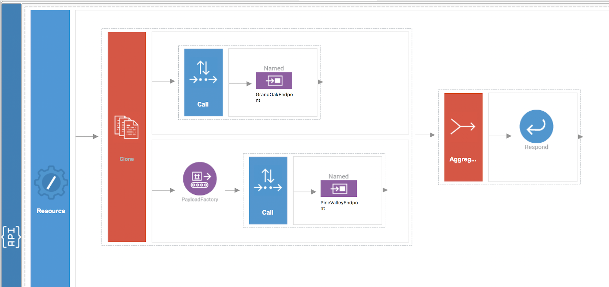
    
The final mediation configuration looks similar to the above diagram.     
Following is what you will see in the **Source View** of WSO2 Integration Studio.

```xml
<?xml version="1.0" encoding="UTF-8"?>
<api context="/healthcare" name="HealthcareAPI" xmlns="http://ws.apache.org/ns/synapse">
<resource methods="GET" uri-template="/doctor/{doctorType}">
    <inSequence>
	<clone>
	    <target>
		<sequence>
		    <call>
			<endpoint key="GrandOakEndpoint"/>
		    </call>
		</sequence>
	    </target>
	    <target>
		<sequence>
		    <payloadFactory media-type="json">
			<format>{
					  "doctorType": "$1"
				       }
			</format>
			<args>
			    <arg evaluator="xml" expression="$ctx:uri.var.doctorType"/>
			</args>
		    </payloadFactory>
		    <call>
			<endpoint key="PineValleyEndpoint"/>
		    </call>
		</sequence>
	    </target>
	</clone>
	<aggregate>
	    <completeCondition>
		<messageCount max="-1" min="-1"/>
	    </completeCondition>
	    <onComplete expression="json-eval($.doctors.doctor)">
		<respond/>
	    </onComplete>
	</aggregate>
    </inSequence>
    <outSequence/>
    <faultSequence/>
</resource>
</api>
```

## Test the integration scenario

There are several ways to test the integration scenario. 

### Deploy integration artifacts and run 

#### Option 1: Run on WSO2 Integration Studio

1. Right-click the HealthcareConfigProject, go to **Run As** → **Run on Micro Integrator**.
   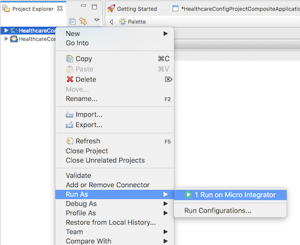

2. You will see the following dialog box. Select the `HealthcareConfigProject` in the Artifact list and click **Finish**.
   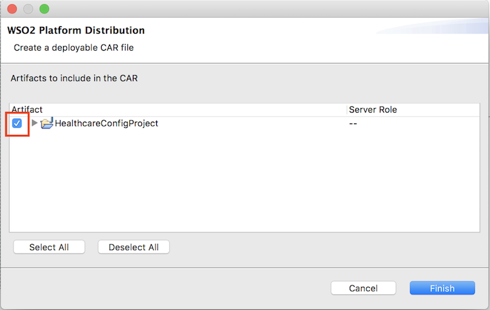

    The embedded Micro Integrator starts with the deployed artifacts.
  
#### Option 2: Run on a local Micro Integrator instance

**Before you begin**, be sure to install the Micro Integrator on your machine:

1.  Go to the [website](https://www.wso2.com/integration/micro-integrator) to download the Micro Integrator. 
2.  Click **Download** and see that the installation options are listed. You can either download and run the **installer**, or use the **binary** file. The home directory of your Micro Integrator installation will be referred to as `<MI_HOME>` from hereon.

Once you have downloaded and set up the Micro Integrator locally, follow the steps given below.

1.  **Export the artifacts as a deployable CAR file**: Right-click `HealthcareConfigProjectProjectCompositeApplication` in WSO2 Integration Studio and select **Export Composite Application Project**.

    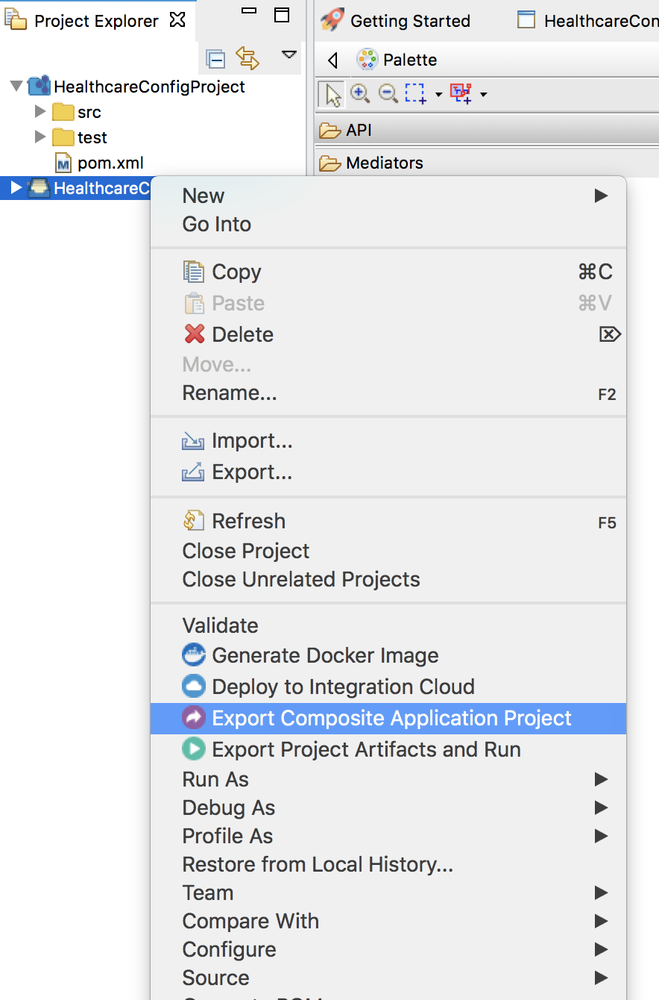
   
2.  **Deploy the Healthcare service**: Copy the exported CAR file of the Healthcare service to the `MI_HOME/repository/deployment/server/carbonapps` directory.

3.  **Start the Micro Integrator**:
    
    If you set up the product using the **installer**, follow the steps relevant to your OS as shown below.

    -   On **MacOS/Linux/CentOS**, open a terminal and execute the following command:
        ```bash
        sudo wso2mi
        ```
    -   On **Windows**, go to **Start Menu -> Programs -> WSO2 -> Micro Integrator**. This will open a terminal and start the Micro Integrator.

    If you set up the product using the **binary** file, open a terminal, navigate to the `<MI_HOME>/bin` directory, and execute the command relevant to your OS as shown below.

    -   On **MacOS/Linux/CentOS**:
        ```bash
        sh micro-integrator.sh
        ```
    -   On **Windows**:
        ```bash
        micro-integrator.bat
        ```

### Start back-end mock services

1.  Download the [`DoctorInfo.jar` file](../assets/attach/developing-first-integration/DoctorInfo.jar). This contains two healthcare services.
2.  Open a terminal, navigate to the location of the downloaded `DoctorInfo.jar` file, and execute the following command to start the services:

    ```bash
    java -jar DoctorInfo.jar
    ```

You will see the following printed on your terminal:

```bash
[ballerina/http] started HTTP/WS listener 0.0.0.0:9090
[ballerina/http] started HTTP/WS listener 0.0.0.0:9091
```
   
### Invoke the Healthcare service

Open a terminal and execute the following curl command to invoke the service:
```bash
curl -v http://localhost:8290/healthcare/doctor/Ophthalmologist
```

Upon invocation, you will observe the following response:

```bash
[
    [
        {
            "name": "John Mathew",
            "time": "03:30 PM",
            "hospital": "Grand Oak"
        },
        {
            "name": "Allan Silvester",
            "time": "04:30 PM",
            "hospital": "Grand Oak"
        }
    ],
    [
        {
            "name": "John Mathew",
            "time": "07:30 AM",
            "hospital": "pineValley"
        },
        {
            "name": "Roma Katherine",
            "time": "04:30 PM",
            "hospital": "pineValley"
        }
    ]
]
```

## What's Next

- [Running on Docker](../../setup/installation/run_in_docker/).
- [Running on Kubernetes](../../setup/installation/run_in_kubernetes/).
- [Writing a unit test for integration artifacts](../creating-unit-test-suite/).
