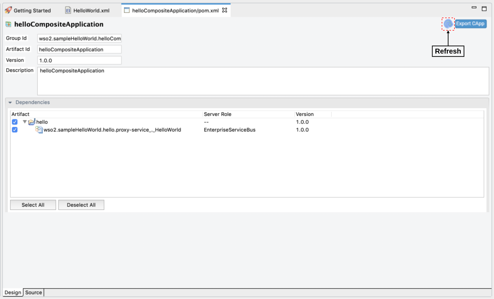

# Troubleshooting WSO2 Integration Studio

The following are some of the ways to troubleshoot errors that you may encounter when working with WSO2 Integration Studio.

## Adding an artifact

Once you add an artifact, you need to refresh the `CompositeApplication.pom`
file to reflect new changes on the Composite Application.



## Restoring the project perspective

If your project view goes missing, you can get it back by navigating
to **Window -> Perspective -> Reset Perspective** from the toolbar.

## Opening a project view

If you need to open a particular project view, you can get it by
navigating to **Window -> Show View -> Other...** from the
toolbar, and open the preferred view from the list.

## Unable to drag and drop mediators into the canvas

When you use **display scaling** that exceed 150% (in **Windows** or **Linux** environments only), you may observe that you cannot drag and drop mediators into the canvas. To overcome this issue, add the following line (VM argument) to the `IntegrationStudio.ini` file in the installation directory of WSO2 Integration Studio.

!!! Warning
    Be sure to add this as the last line in the file.

```bash
-Dswt.autoScale=100
```


  
