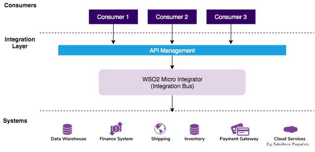
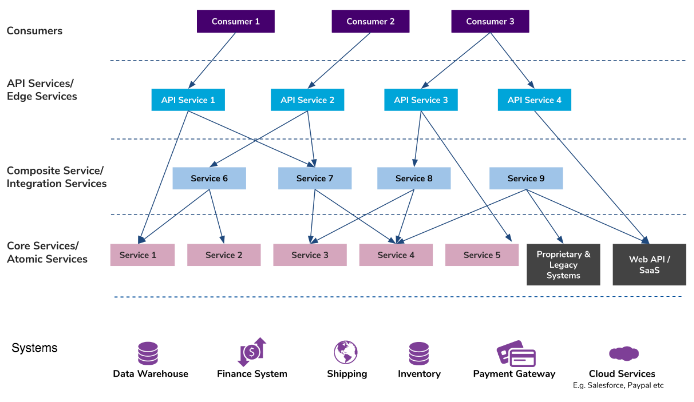

# Introduction

The **Micro Integrator** of [WSO2 Enterprise Integrator 7.0.0](https://ei.docs.wso2.com/en/latest/) is a powerful configuration-driven approach to integration, which allows developers to build integrations graphically. 

This is an alternative to the code-driven integration approach that is offered by the [Ballerina Integrator](https://ei.docs.wso2.com/en/latest/ballerina-integrator/get-started/introduction/).

## Building Centralized, Monolithic integrations

The heart of WSO2 Micro Integrator is an event-driven, standards-based messaging engine (the **Bus**), which supports message routing, message transformations, and other types of messaging use cases. If your organization uses an API-driven, centralized, integration architecture, WSO2 Micro Integrator can be used as the central integration layer that implements the message mediation logic connecting all the systems, data, events, APIs, etc. in your integration ecosystem.

## Building Decentralized, Cloud-Native integrations

WSO2 Micro Integrator is also light-weight and container friendly. This allows you to leverage the comprehensive enterprise messaging capabilities of WSO2 Micro Integrator in your decentralized, cloud-native integrations. 

As shown above, if your organization is running on a decentralized, cloud-native, integration architecture where micro services are used for integrating the various APIs, events, and systems, WSO2 Micro Integrator can easily function as your **Integration** (micro) services and **API** (micro) services.

## Graphical integration desigining

WSO2 Micro Integrator is coupled with [WSO2 Integration Studio](../../develop/WSO2-Integration-Studio); a comprehensive graphical integration flow designer for building integrations using a simple drag-and-drop functionality.
