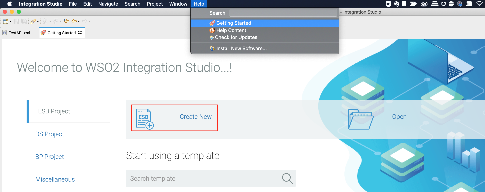
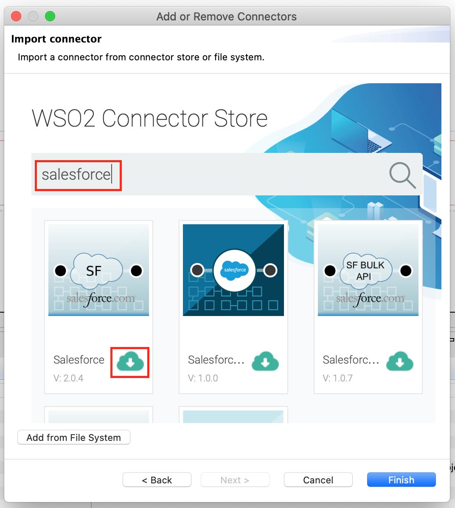

## Importing Connector to Integration Studio Solution Project

1. Open WSO2 Integration Studio and create an **ESB Solution Project**.
  

2. Right click on the project that you created and click on **Add or Remove Connector** -> **Add Connector**.

3. You are directed to the WSO2 Connector Store. 

4. Search for the specific connector and download it to the workspace. 

5. Click **Finish**, and you ESB Solution Project is ready. It will be displayed the downloaded connector in the left side palette. 

