# WS-Security Implementations

Web services security, or to be more precise, SOAP message security
identifies and provides solutions for general computer security threats
as well as threats unique to Web services. WSO2 Micro Integrator supports WS-Security,
WS-Policy, and WS-Security Policy specifications. These specifications
define a behavioral model for Web services. 

Since a requirement for one
web service may not be valid for another, the WSO2 Micro Integrator also helps define service-specific security.
It provides 16 predefined, commonly-used security scenarios. All you
have to do is apply the required security scenario when you define the service. You can also define a custom security
policy. Understanding the exact security requirement is the first step
in planning to secure web services. Consider what security aspects are
important to your service; integrity, confidentiality,
or both.

## Applying WS-Security

See the following resources on how to apply WS security to integration artifacts:

-	[Securing a proxy service](../../../develop/advanced-development/applying-security-to-a-proxy-service)
-	[Securing a data service](../../../develop/creating-artifacts/data-services/securing-data-services)
-	[Securing a REST API](../../../develop/advanced-development/applying-security-to-an-api)

!!! Note
	An [external user store](../../../setup/user_stores/setting_up_a_userstore) should be configured for the Micro Integrator in order to use these security implementations.

## Security scenarios

The topics below explain the 16 default security scenarios supported by WSO2 Micro Integrator.

### UsernameToken

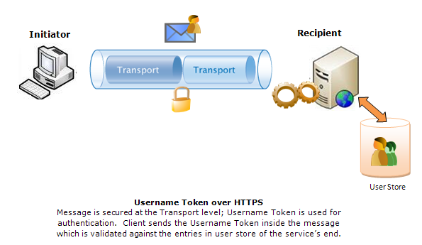

### Non-repudiation

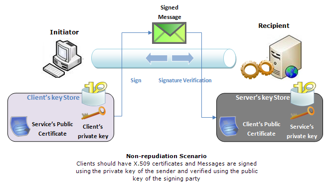

### Integrity

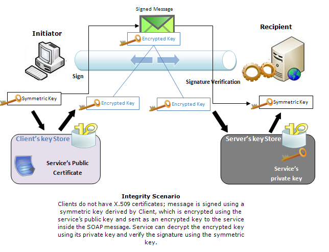

### Confidentiality

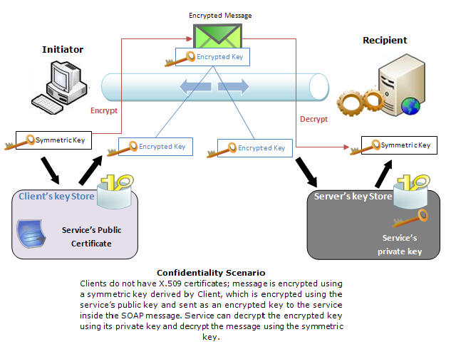

### Sign and Encrypt - X509 Authentication

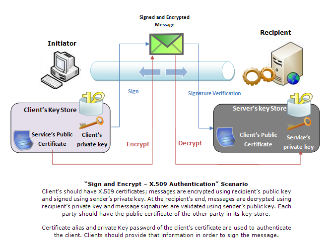

### Sign and Encrypt - Anonymous clients

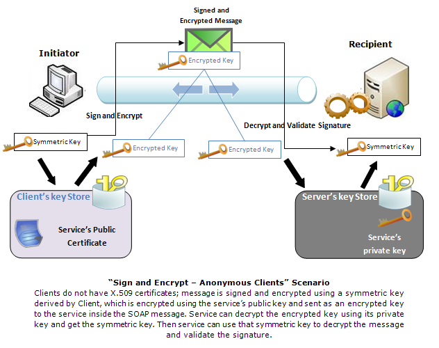

### Encrypt Only - Username Token Authentication

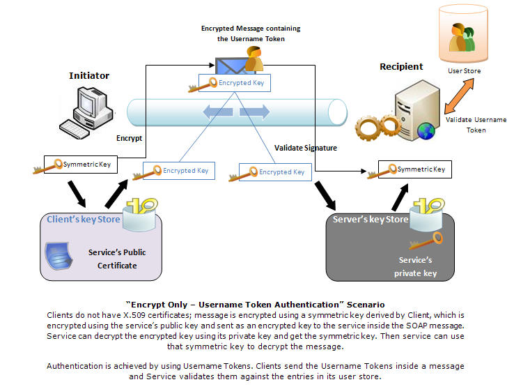

### Sign and Encrypt - Username Token Authentication

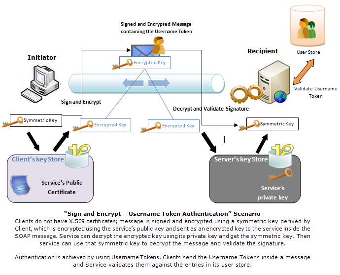

### Secure Conversation - Sign only - Service as STS - Bootstrap policy - Sign and Encrypt , X509 Authentication

### Secure Conversation - Encrypt Only - Service as STS - Sign and Encrypt , X509 Authentication

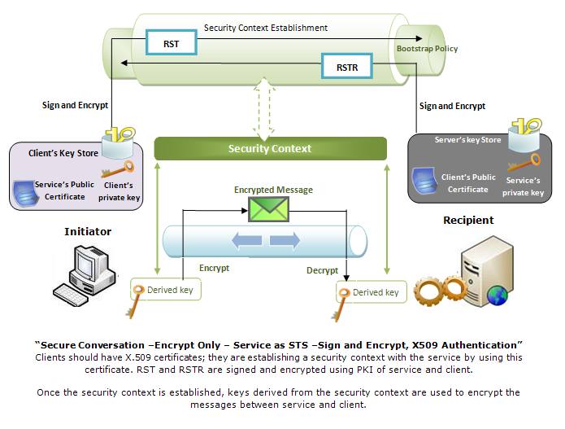

### Secure Conversation - Sign and Encrypt - Service as STS - Bootstrap policy - Sign and Encrypt , X509 Authentication

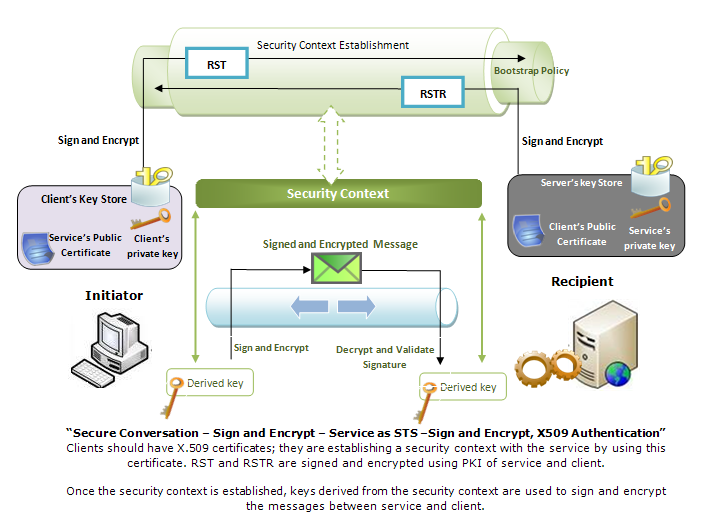

### Secure Conversation - Sign Only - Service as STS - Bootstrap policy - Sign and Encrypt , Anonymous clients

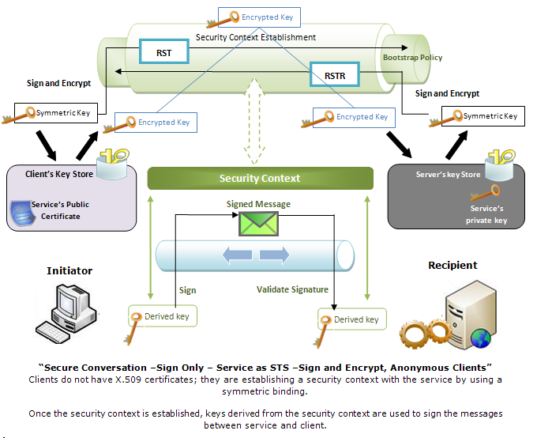

### Secure Conversation - Encrypt Only - Service as STS - Bootstrap policy - Sign and Encrypt , Anonymous clients

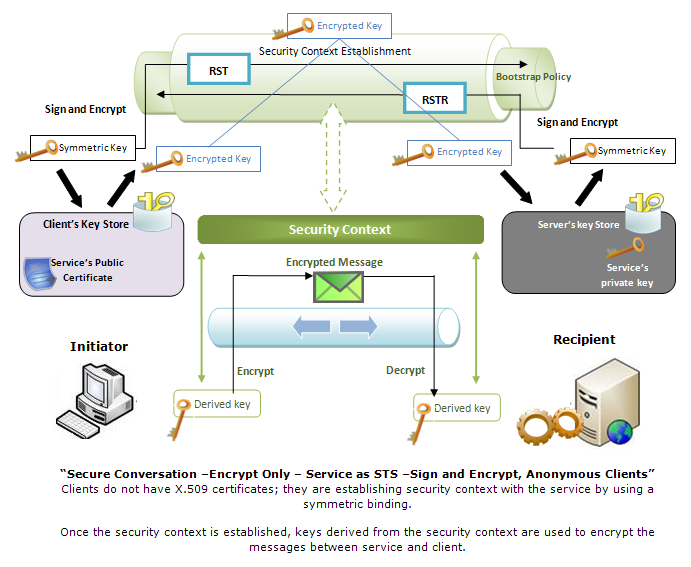

### Secure Conversation - Encrypt Only - Service as STS - Bootstrap policy - Sign and Encrypt , Username Token Authentication

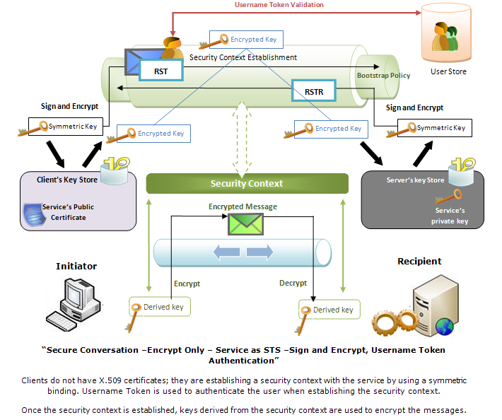

### Secure Conversation - Sign and Encrypt - Service as STS - Bootstrap policy - Sign and Encrypt , Username Token Authentication

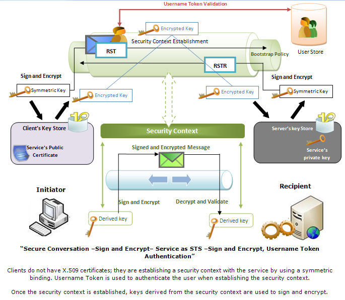

### Kerberos Token-based Security

If you apply security scenario 16 (Kerberos Token-based Security), you
must associate your service with a service principal. Security scenario
16 is only applicable if you have a Key Distribution Center (KDC) and an
Authentication Server in your environment. Ideally you can find KDC and
an Authentication Server in an LDAP Directory server.

Two configuration files are used to specify Kerberos related parameters
as follows.

-   **krb5.conf** - Includes KDC server details, encryption/decryption
    algorithms etc.
-   **jaas.conf** - Includes information relevant to authorization.

The above files are located in the `MI_HOMErepository/conf/security` folder.  

After selecting scenario 16, fill in the information about the service
principal to associate the Web service . You must specify the
service principal name and password. The service principal must be
already defined in the LDAP Directory server.
