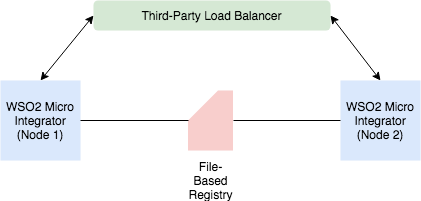

# Deploying WSO2 Micro Integrator
The following sections provide information and instructions on how to deploy the Micro Integrator with a third-party load balancer.

## The deployment pattern

This deployment scenario uses a two-node Micro Integrator deployment. That is, two Micro Integrator nodes are configured to serve requests with high availability and scalability. As depicted by the following diagram, the product nodes in the deployment are fronted by an external third-party load balancer, which routes requests to the two nodes on a round-robin basis.



## Installing WSO2 Micro Integrator

Follow the instructions on [downloading and installing WSO2 Micro Integrator](../../setup/installation/install_in_vm.md) on a single machine.

## Setting up the load balancer

Follow the instructions on [setting up a load balancer](../../setup/deployment/setting_up_lb.md) for a two-node deployment of the Micro Integrator.

## Setting up the file-based registry

Follow the instructions on [configuring the file-based registry](../../setup/deployment/file_based_registry.md) for a two-node deployment of the Micro Integrator.

## Updating keystores

1. [Create a new SSL certificate](../../setup/security/importing_ssl_certificate.md) and import it to the primary keyStore and trustStore (which are located in the MI_HOME/repository/resources/security/ directory). Your primary keystore can now be configured for SSL communication.
2. [Create a new keystore](../../setup/security/creating_keystores.md) to use as the internal keystore (for the purpose of data encryption/decryption in internal data stores).

## Configuring the Micro Integrator nodes

Follow the steps given below to configure the two nodes in the Micro Integrator deployment.

1. Open the deployment.toml file of both the nodes. This file is located in the MI_HOME/conf/ directory.
2. To specify the default settings that should be applicable to the nodes, update the following toml parameters with the required values.

    ```toml
    # The config section that groups the parameters that identify the server.
    [server]

    # The hostname of the server.
    hostname = "localhost"

    # If you are running both product nodes (of your cluster) on the same VM, set a port offset for on the servers.
    offset = 0
    ```
   Find more [parameters](../../../references/config-catalog/#deployment) for deployment settings.

3. If you have [separated the internal keystore](../../setup/deployment/deploying_wso2_ei.md#updating-keystores) of your product, update the `[keystore.internal]` section in the deployment.toml file.
   
    See [Configuring Keystores](../../setup/security/configuring_keystores.md) for instructions.
    
## (Optional) Configuring Analytics

If you have already done the configurations explained above, you have the option of applying the following configurations for your deployment.

If you wish to view reports, statistics, and graphs related to the message mediation that happens through the Micro Integrator, you need to configure Analytics for the Micro Integrator. Follow configuring WSO2 EI Analytics in a production setup.

## Verifying your deployment

Ensure that you have taken into account the respective security hardening factors (e.g., changing and encrypting the default passwords, configuring JVM security etc.) before deploying the Micro Integrator. For more information, see the [Production Deployment Checklist](../../setup/deployment/deployment_checklist.md).

## Starting the Micro Integrator servers

Start the server using the following standard start-up script.

* On **Linux/MacOS/CentOS** : `cd MI_HOME/bin/ sh micro-integrator.sh`
* ON **Windows** : `cd MI_HOME\bin\ micro-integrator.bat`