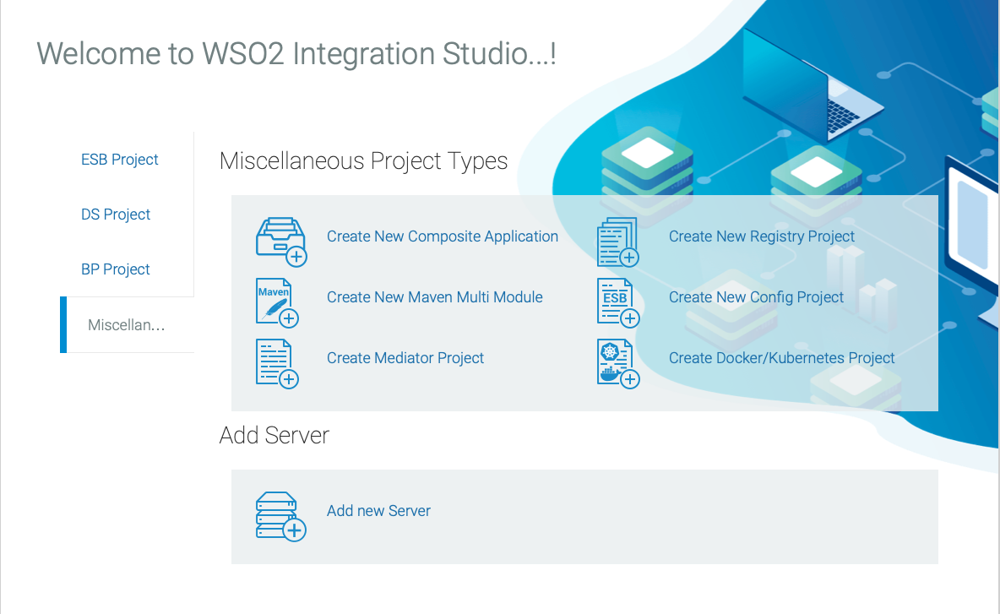
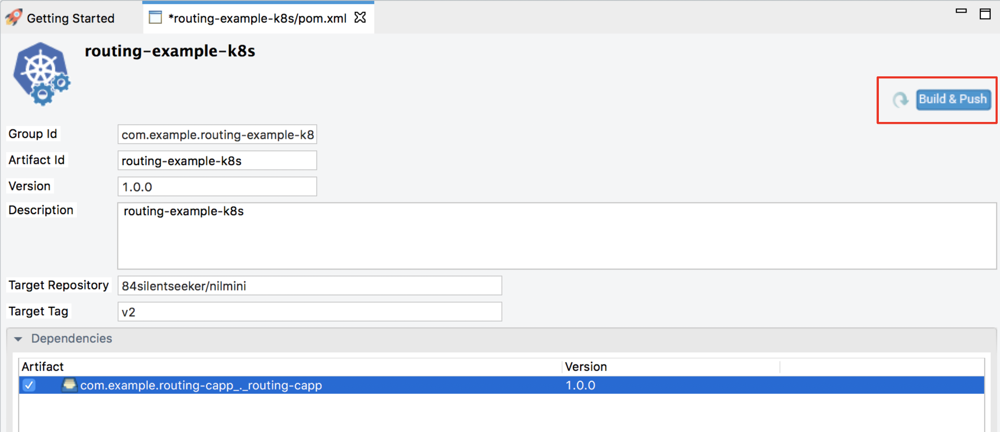

# K8s Deployment Sample 2: Content Based Routing
Let's define a content-based routing scenario using WSO2 Micro Integrator and deploy it on your Kubernetes environment.

## Prerequisites

-   Install and set up [WSO2 Integration Studio](../../../../develop/installing-WSO2-Integration-Studio).
    
    !!! Tip
        Be sure to [get the latest updates](../../../../develop/installing-WSO2-Integration-Studio#get-the-latest-updates) before trying this example.
        
-   Install a [Kubernetes](https://kubernetes.io/docs/setup/) cluster and **v1.11+** client. Alternatively, you can [run Kubernetes locally via Minikube](https://kubernetes.io/docs/setup/learning-environment/minikube/).
-   Install [Docker](https://docs.docker.com/).
-   Install the [EI Kubernetes operator](../../../../setup/deployment/kubernetes_deployment#install-the-ei-k8s-operator).

## Step 1: Create the integration solution

Follow the steps given below.

1.  Create a Maven Multi Module project using WSO2 Integration Studio.

     
    
2.  Create an **ESB Config Project** inside the Maven Multi Module project:
    
    Right-click the Maven Multi Module project in the project explorer, go to **New → Project**, and select **ESB Config Project** to open the **New ESB Config Project** dialog.

    
    
3.  Add the following proxy service configuration inside the ESB Config Project. This service executes the arithmetic operation based on the input payload for each service request.

    1.  Right-click the ESB Config project in the project explorer, go to **New -> Proxy Service** and create a custom proxy service named `ArithmaticOperationService`. 
        

    2.  You can then use the **Source View** to copy the following configuration.
        ```xml
        <?xml version="1.0" encoding="UTF-8"?>
        <proxy name="ArithmaticOperationService" startOnLoad="true" transports="http https" xmlns="http://ws.apache.org/ns/synapse">
            <target>
                <inSequence>
                    <log description="Log Request Payload" level="full"/>
                    <switch description="Route based on the Operation" source="//ArithmaticOperation/Operation">
                        <case regex="Add">
                            <payloadFactory description="Construct payload for addition operation" media-type="xml">
                                <format>
                                    <tem:AddInteger xmlns:tem="http://tempuri.org">
                                        <tem:Arg1>$1</tem:Arg1>
                                        <tem:Arg2>$2</tem:Arg2>
                                    </tem:AddInteger>
                                </format>
                                <args>
                                    <arg evaluator="xml" expression="//ArithmaticOperation/Arg1"/>
                                    <arg evaluator="xml" expression="//ArithmaticOperation/Arg2"/>
                                </args>
                            </payloadFactory>
                            <header description="Set SOAPAction header" name="Action" scope="default" value="http://tempuri.org/SOAP.Demo.AddInteger"/>
                            <call description="Send request to the endpoint">
                                <endpoint key="NumberAdditionEP"/>
                            </call>
                        </case>
                        <case regex="Divide">
                            <payloadFactory description="Construct payload for division operation" media-type="xml">
                                <format>
                                    <tem:DivideInteger xmlns:tem="http://tempuri.org">
                                        <tem:Arg1>$1</tem:Arg1>
                                        <tem:Arg2>$2</tem:Arg2>
                                    </tem:DivideInteger>
                                </format>
                                <args>
                                    <arg evaluator="xml" expression="//ArithmaticOperation/Arg1"/>
                                    <arg evaluator="xml" expression="//ArithmaticOperation/Arg2"/>
                                </args>
                            </payloadFactory>
                            <header description="Set SOAPAction header" name="Action" scope="default" value="http://tempuri.org/SOAP.Demo.DivideInteger"/>
                            <call>
                                <endpoint key="NumberDivisionEP"/>
                            </call>
                        </case>
                        <default>
                            <payloadFactory description="Create response payload for unsupported operation" media-type="xml">
                                <format>
                                    <Message xmlns="">Unsupported operation.</Message>
                                </format>
                                <args/>
                            </payloadFactory>
                        </default>
                    </switch>
                    <respond description="Send result to the client"/>
                </inSequence>
                <outSequence/>
                <faultSequence/>
            </target>
        </proxy>
        ```
    
4.  Add the following endpoint configurations inside the ESB Config project you created above.

    1.  Right-click the ESB Config project in the project explorer, go to **New -> Endpoint** and create a new endpoint with the following configurations:

        <table>
            <tr>
                <th>Parameter</th>
                <th>Value</th>
            </tr>
            <tr>
                <td>Endpoint Name</td>
                <td>NumberAdditionEP</td>
            </tr>
            <tr>
                <td>Endpoint Type</td>
                <td>Address Endpoint</td>
            </tr>
            <tr>
                <td>Address</td>
                <td>http://www.crcind.com/csp/samples/SOAP.Demo.cls</td>
            </tr>
        </table>

    2.  Repeat the above step and create another endpoint with the following configurations:

        <table>
            <tr>
                <th>Parameter</th>
                <th>Value</th>
            </tr>
            <tr>
                <td>Endpoint Name</td>
                <td>NumberDivisionEP</td>
            </tr>
            <tr>
                <td>Endpoint Type</td>
                <td>Address Endpoint</td>
            </tr>
            <tr>
                <td>Address</td>
                <td>http://www.crcind.com/csp/samples/SOAP.Demo.cls</td>
            </tr>
        </table>

    3.  After creating the endpoints, go to the **Source View** of the endpoint artifacts (in WSO2 Integration Studio) and add `format="soap11"` to the endpoint address. The source view of the two endpoints will now look as follows:

        ```xml tab='NumberAdditionEP'
        <?xml version="1.0" encoding="UTF-8"?>
        <endpoint name="NumberAdditionEP" xmlns="http://ws.apache.org/ns/synapse">
            <address format="soap11" uri="http://www.crcind.com/csp/samples/SOAP.Demo.cls">
                <suspendOnFailure>
                    <initialDuration>-1</initialDuration>
                    <progressionFactor>1.0</progressionFactor>
                </suspendOnFailure>
                <markForSuspension>
                    <retriesBeforeSuspension>0</retriesBeforeSuspension>
                </markForSuspension>
            </address>
        </endpoint>
        ```

        ```xml tab='NumberDivisionEP'
        <?xml version="1.0" encoding="UTF-8"?>
        <endpoint name="NumberDivisionEP" xmlns="http://ws.apache.org/ns/synapse">
            <address format="soap11" uri="http://www.crcind.com/csp/samples/SOAP.Demo.cls">
                <suspendOnFailure>
                    <initialDuration>-1</initialDuration>
                    <progressionFactor>1.0</progressionFactor>
                </suspendOnFailure>
                <markForSuspension>
                    <retriesBeforeSuspension>0</retriesBeforeSuspension>
                </markForSuspension>
            </address>
        </endpoint>  
        ```
    
5.  Create a **Composite Application Project** with the above proxy service inside the Maven Multi Module project.

    1.  Right-click the maven multi module project, go to **New → Project**, select **Composite Application Project**, and click **Next**.
    2.  Be sure to select all the integration artifacts under **Dependencies** as shown below.
          

    3.  Click **Finish**.

5.  Create a **Kubernetes Project** inside the Maven Multi Module Project. 

    1.  Right-click the Maven Multi Module project, go to **New → Project**, select **Kubernetes Exporter Project**, and click **Next**.
        
    2.  In the **Kubernetes Project Information** dialog that opens, enter the following details:
        <table>
            <tr>
                <th>
                    Parameter
                </th>
                <th>
                    Description
                </th>
            </tr>
            <tr>
                <td>
                    Kubernetes Project Name
                </td>
                <td>
                   Give a unique name for the project. 
                </td>
            </tr>
            <tr>
                <td>
                    Integration Name
                </td>
                <td>
                    This name will be used to identify the integration solution in the kubernetes custom resource. Let's use <code>routing-example</code> as the integration name for this example.
                </td>
            </tr>
            <tr>
                <td>
                    Number of Replicas
                </td>
                <td>
                    Specify the number of pods that should be created in the kubernetes cluster.
                </td>
            </tr>
            <tr>
                <td>
                    Base Image Repository
                </td>
                <td>
                    Specify the base Micro Integrator Docker image for your solution. For this example, let's use the Micro Integrator docker image from the WSO2 public docker registry: <b>wso2/wso2mi</b>.</br></br>
                    Note that the image value format should be 'docker_user_name/repository_name'.
                </td>
            </tr>
            <tr>
                <td>
                    Base Image Tag
                </td>
                <td>
                    Give a tag name for the base Docker image.
                </td>
            </tr>
            <tr>
                <td>
                    Target Image Repository
                </td>
                <td>
                    The Docker repository to which the Docker image will be pushed: 'docker_user_name/repository_name'.
                </td>
            </tr>
            <tr>
                <td>
                    Target Image Tag
                </td>
                <td>
                    Give a tag name for the Docker image.
                </td>
            </tr>
        </table>
        
    6.  This step is only required if you already have a Docker image (in your local Docker repository) with the same name as the base image specified above. 
    
        !!! Info
            In this scenario, WSO2 Integration Studio will first check if there is a difference in the two images before pulling the image specified in the **Base Image Repository** field. If the given base image is more updated, the existing image will be overwritten by this new image. Therefore, if you are currently using an older version, or if you have custom changes in your existing image, they will be replaced. 
        
        To avoid your existing custom/older images from being replaced, add the following property under **dockerfile-maven-plugin -> executions -> execution -> configurations** in the `pom.xml` file of your Kubernetes Exporter project. This configuration will ensure that the base image will not be pulled when a Docker image already exists with the same name.
            
        ```xml
        <pullNewerImage>false</pullNewerImage>
        ```

Finally, the created Maven Multi Module project should look as follows:


## Step 2: Package and build the solution  

You need to build a Docker image of the integration solution and push it to your Docker registry.
    
1.  Start the Docker daemon in the host machine.
2.  Open the POM file in the Kubernetes project, ensure that the composite application is selected under **Dependencies**, **save** the file.
     
    
3.  Leave the **Automatically deploy configurations** check box selected. This ensures that deployment configurations are automatically deployed to the base image.
4.  Click **Build and Push**.
    In the dialog that opens, enter the credentials of your Docker registry to which the image should be pushed.

    

    !!! Info
        Alternatively, you can build the Docker image and push it to the Docker registry as follows:

        1.  Navigate to the Maven Multi Module project and run the following command to build the project. It will create a docker image with the provided target repository and tag once the build is successfull.
            ```bash
            mvn clean install -Dmaven.test.skip=true
            ```
        2.  Navigate to the Kubernetes project inside the MavenParentProject and run the following command to push the docker image to the remote docker registry.
            ```bash
            mvn dockerfile:push -Ddockerfile.username={username} -Ddockerfile.password={password}
            ``` 

3.  Run the `docker image ls` command to verify that the Docker image is created.
    
## Step 3: Deploy the solution in K8s

!!! Info
    **Before you begin**, be sure that the [system requrements](../../../../setup/deployment/kubernetes_deployment#prerequisites-system-requirements) are in place, and that the [EI Kubernetes Operator](../../../../setup/deployment/kubernetes_deployment#install-the-ei-k8s-operator) is installed.

Follow the steps given below:

1.  Ensure that your Kubernetes cluster is started.
2.  Open the `integration_cr.yaml` file from the Kubernetes project in WSO2 Integration Studio.
3.  See that the **integration** details of the `routing-example` solution are updated:

    ```yaml
    apiVersion: "integration.wso2.com/v1alpha2"
    kind: "Integration"
    metadata:
      name: "routing-example"
    spec:
      replicas: 1
      image: "<Docker image for the Content-Based Routing Scenario>"
    ```

4.  Open a terminal, navigate to the location of your `integration_cr.yaml` file, and execute the following command to deploy the integration solution in the Kubernetes cluster:
    ```bash
    kubectl apply -f integration_cr.yaml
    ``` 

When the integration is successfully deployed, it should create the `routing-example` integration, `routing-example-deployment`, `routing-example-service`, and `ei-operator-ingress` as follows:

!!! Tip
    The `ei-operator-ingress` will not be created if you have [disabled the ingress controller](../../../../setup/deployment/kubernetes_deployment#disable-ingress-controller).

```bash
kubectl get integration

NAME              STATUS    SERVICE-NAME    AGE
routing-example   Running   hello-service   2m

kubectl get deployment

NAME                         READY   UP-TO-DATE   AVAILABLE   AGE
routing-example-deployment   1/1     1            1           2m

kubectl get services
NAME                         TYPE        CLUSTER-IP       EXTERNAL-IP   PORT(S)       AGE
routing-example-service      ClusterIP   10.101.107.154   <none>        8290/TCP      2m
kubernetes                   ClusterIP   10.96.0.1        <none>        443/TCP       2d
k8s-ei-operator              ClusterIP   10.98.78.238     <none>        443/TCP       1d

kubectl get ingress
NAME                  HOSTS     ADDRESS     PORTS     AGE
ei-operator-ingress   wso2ei    10.0.2.15   80, 443   2m
```

## Step 4: Test the deployment

Let's invoke the service without going through the ingress controller.

1. Create a `request.xml` file as follows:
    ```xml
    <ArithmaticOperation>
      <Operation>Add</Operation>
      <Arg1>10</Arg1>
      <Arg2>25</Arg2>
    </ArithmaticOperation>
    ```
    or
    ```xml
    <ArithmaticOperation>
      <Operation>Divide</Operation>
      <Arg1>25</Arg1>
      <Arg2>5</Arg2>
    </ArithmaticOperation>
    ```
    
2.  Apply port forwarding as shown below. This will allow you to invoke the service without going through the Ingress controller:
    ```bash
    kubectl port-forward service/routing-example-service 8290:8290
    ```

2. Execute the following command to invoke the service:
    ```bash
    curl -X POST -d @request.xml http://localhost:8290/services/ArithmaticOperationService -H "Content-Type: text/xml"
    ``` 

You will receive the following SOAP response:

```xml
<?xml version="1.0" encoding="UTF-8" ?>
<SOAP-ENV:Envelope xmlns:SOAP-ENV='http://schemas.xmlsoap.org/soap/envelope/' xmlns:xsi='http://www.w3.org/2001/XMLSchema-instance' xmlns:s='http://www.w3.org/2001/XMLSchema'>
  <SOAP-ENV:Body><AddIntegerResponse xmlns="http://tempuri.org"><AddIntegerResult>35</AddIntegerResult></AddIntegerResponse></SOAP-ENV:Body>
</SOAP-ENV:Envelope>
```
