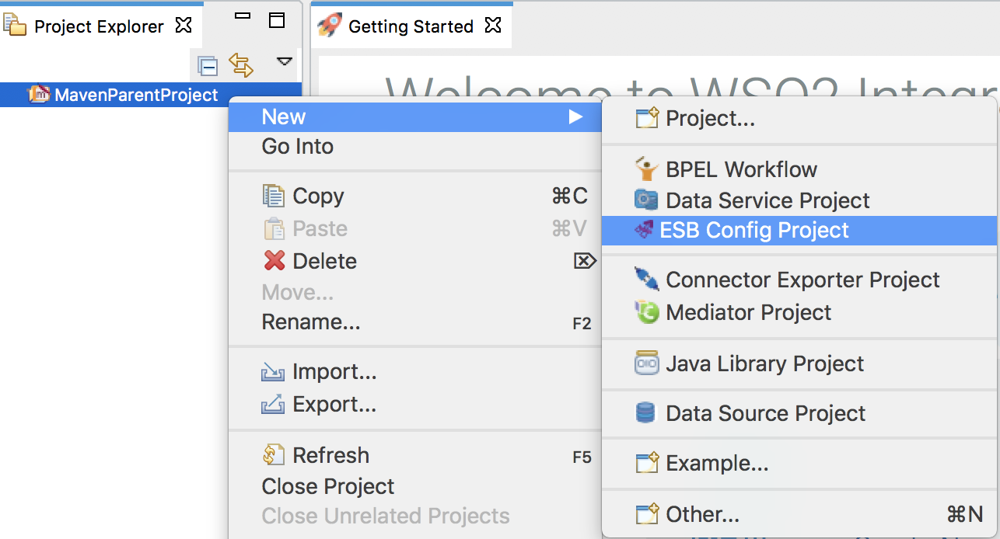

# K8s-ei-operator Example 2

## Content Based Routing Scenario

Let's define a content-based routing scenario using WSO2 Micro Integrator and deploy it on your Kubernetes environment.

Follow the below steps to deploy and run the integration solution on Kubernetes.

1.  Create a Maven Multi Module Project using WSO2 Integration Studio.

     
    
2.  Create an **ESB Config Project** inside the Maven Multi Module Project.
    **New → Project → ESB Config Project**
    
     
    
3.  Add the following proxy service configuration inside the ESB Config Project. This service executes the arithmetic operation based on the input payload for each service request.
    ```xml
    <?xml version="1.0" encoding="UTF-8"?>
    <proxy name="ArithmaticOperationService" startOnLoad="true" transports="http https" xmlns="http://ws.apache.org/ns/synapse">
        <target>
            <inSequence>
                <log description="Log Request Payload" level="full"/>
                <switch description="Route based on the Operation" source="//ArithmaticOperation/Operation">
                    <case regex="Add">
                        <payloadFactory description="Construct payload for addition operation" media-type="xml">
                            <format>
                                <tem:AddInteger xmlns:tem="http://tempuri.org">
                                    <tem:Arg1>$1</tem:Arg1>
                                    <tem:Arg2>$2</tem:Arg2>
                                </tem:AddInteger>
                            </format>
                            <args>
                                <arg evaluator="xml" expression="//ArithmaticOperation/Arg1"/>
                                <arg evaluator="xml" expression="//ArithmaticOperation/Arg2"/>
                            </args>
                        </payloadFactory>
                        <header description="Set SOAPAction header" name="Action" scope="default" value="http://tempuri.org/SOAP.Demo.AddInteger"/>
                        <call description="Send request to the endpoint">
                            <endpoint key="NumberAdditionEP"/>
                        </call>
                    </case>
                    <case regex="Divide">
                        <payloadFactory description="Construct payload for division operation" media-type="xml">
                            <format>
                                <tem:DivideInteger xmlns:tem="http://tempuri.org">
                                    <tem:Arg1>$1</tem:Arg1>
                                    <tem:Arg2>$2</tem:Arg2>
                                </tem:DivideInteger>
                            </format>
                            <args>
                                <arg evaluator="xml" expression="//ArithmaticOperation/Arg1"/>
                                <arg evaluator="xml" expression="//ArithmaticOperation/Arg2"/>
                            </args>
                        </payloadFactory>
                        <header description="Set SOAPAction header" name="Action" scope="default" value="http://tempuri.org/SOAP.Demo.DivideInteger"/>
                        <call>
                            <endpoint key="NumberDivisionEP"/>
                        </call>
                    </case>
                    <default>
                        <payloadFactory description="Create response payload for unsupported operation" media-type="xml">
                            <format>
                                <Message xmlns="">Unsupported operation.</Message>
                            </format>
                            <args/>
                        </payloadFactory>
                    </default>
                </switch>
                <respond description="Send result to the client"/>
            </inSequence>
            <outSequence/>
            <faultSequence/>
        </target>
    </proxy>
    ```
    
    Add the following endpoint configurations inside the ESB Config Project you created above.
    ```xml
    <?xml version="1.0" encoding="UTF-8"?>
    <endpoint name="NumberAdditionEP" xmlns="http://ws.apache.org/ns/synapse">
        <address format="soap11" uri="http://www.crcind.com/csp/samples/SOAP.Demo.cls"/>
    </endpoint>
    ```
    ```xml
    <?xml version="1.0" encoding="UTF-8"?>
    <endpoint name="NumberDivisionEP" xmlns="http://ws.apache.org/ns/synapse">
        <address format="soap11" uri="http://www.crcind.com/csp/samples/SOAP.Demo.cls"/>
    </endpoint>    
    ```
    
4.  Create a **Composite Application Project** inside the Maven Multi Module Project by **selecting the above configuration(s)** under Dependencies.
    **New → Project → Composite Application Project**
    
        

5.  Create a **Docker/Kubernetes Project** inside the Maven Multi Module Project.
    **New → Project → Docker/Kubernetes Project** and select **New Kubernetes Project**.
    
       
    
    Finally, created Maven Multi Module Project Explorer should be as follows,
        
     

6.  Navigate to the Kubernetes project and open the **pom.xml** file in the Kubernetes project. Select the multiple composite applications you want to add to the docker image under the **Dependencies** section and save the changes.

     
    
7.  Start the Docker daemon in the host machine.

8.  Navigate to the Maven multi module project and run the following command to build the project. It will create a docker image with the provided target repository and tag once the build is successfull.
    ```bash
    mvn clean install -Dmaven.test.skip=true
    ```
9.  Run the `docker image ls` command to verify whether or not the docker image has been built. 

10.  Navigate to the Kubernetes project inside the MavenParentProject and run the following command to push the docker image to the remote docker registry.
    ```bash
    mvn dockerfile:push -Ddockerfile.username={username} -Ddockerfile.password={password}
    ``` 
    
    Else, you can use Kubernetes [Build and Push Docker Images](../../../../develop/create-kubernetes-project/#build-and-push-docker-images) section to build and push docker images to the remote registries.
    
10. Follow the **[Kubernetes Deployment using k8s-ei-operator](../../../../setup/deployment/kubernetes_deployment)** documentation to deploy and run the integration solution inside the Kubernetes environment.

11. Create a `request.xml` file as follows:
    ```xml
    <ArithmaticOperation>
      <Operation>Add</Operation>
      <Arg1>10</Arg1>
      <Arg2>25</Arg2>
    </ArithmaticOperation>
    ```
    or
    ```xml
    <ArithmaticOperation>
      <Operation>Divide</Operation>
      <Arg1>25</Arg1>
      <Arg2>5</Arg2>
    </ArithmaticOperation>
    ```
12. Execute the following command:
    ```bash
    curl -X POST -d @request.xml http://localhost:8290/services/ArithmaticOperationService -H "Content-Type: text/xml"
    ```  
    
