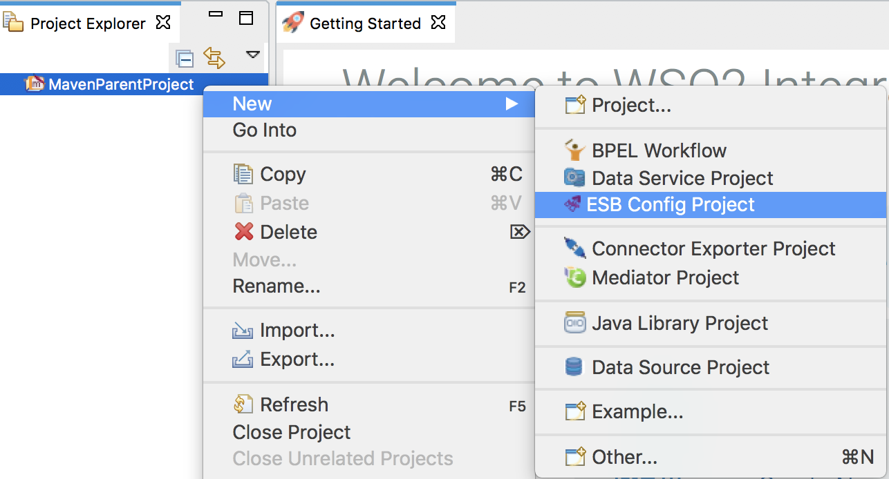
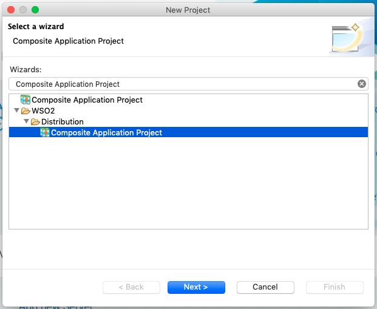
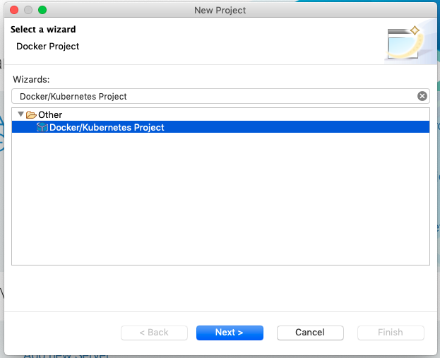
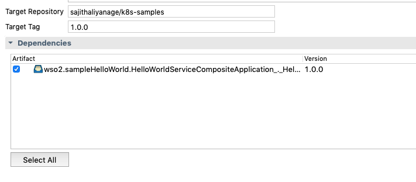

#k8s-ei-operator Scenarios

## Hello World Scenario

This scenario demonstrates the basic Hello World example we can create using WSO2 Enterprise Integration and how to deploy that integration in Kubernetes environment.

Follow the below steps to deploy and run the integration solution on the Kubernetes environment,

1.  Create a Maven Multi Module Project using the Integration Studio.

     
    
2.  Create a **ESB Config Project** inside the Maven Multi Module Project.
    **New → Project → ESB Config Project**
    
     
    
3.  Add the following proxy-service configuration inside the above created ESB Config Project which response "{"Hello":"World"}" payload for the service request.
    ```xml
    <?xml version="1.0" encoding="UTF-8"?>
    <proxy name="HelloWorld" startOnLoad="true" transports="http https" xmlns="http://ws.apache.org/ns/synapse">
        <target>
            <inSequence>
                <payloadFactory media-type="json">
                    <format>{"Hello":"World"}</format>
                    <args/>
                </payloadFactory>
                <respond/>
            </inSequence>
            <outSequence/>
            <faultSequence/>
        </target>
    </proxy>
    ```
    
4.  Create a **Composite Application Project** inside the Maven Multi Module Project selecting the above configuration(s) under Dependencies.
    **New → Project → Composite Application Project**
    
        

5.  Create a **Docker/Kubernetes Project** inside the Maven Multi Module Project.
    **New → Project → Docker/Kubernetes Project**
    
        

6.  Open the **pom.xml** file in Kubernetes project and select the multiple composite applications you want to add to the docker image under **Dependencies** section.

     
    
6.  Starts the Docker daemon in the host machine.

7.  Navigate to the Maven multi module project and run the following command to build the project. It will create a docker image with provided target repository and tag once it build successfully.
    ```
    mvn clean install -Dmave.test.skip=true
    ```
8.  Run the ```docker image ls``` command to verify whether docker image has been built or not. 

9.  Navigate to the Kubernetes project inside the MavenParentProject and run maven push command to the push docker image to the remote docker registry.
    ```
    cd k8s-hello-world
    mvn dockerfile:push -Ddockerfile.username={username} -Ddockerfile.password={password}
    ``` 

    Else, you can use Kubernetes [Build and Push Docker Images](https://ei.docs.wso2.com/en/latest/micro-integrator/develop/create-kubernetes-project/#build-and-push-docker-images) section to build and push docker images to the remote registries.
    
10. Follow the **[Kubernetes Deployment using k8s-ei-operator](https://ei.docs.wso2.com/en/latest/micro-integrator/develop/kubernetes_deployment/)** documentation to deploy and run the integration solution inside the Kubernetes environment.

11. Invoke the service as follows
    ```
    curl http://localhost:8290/services/HelloWorld
    ```  
    