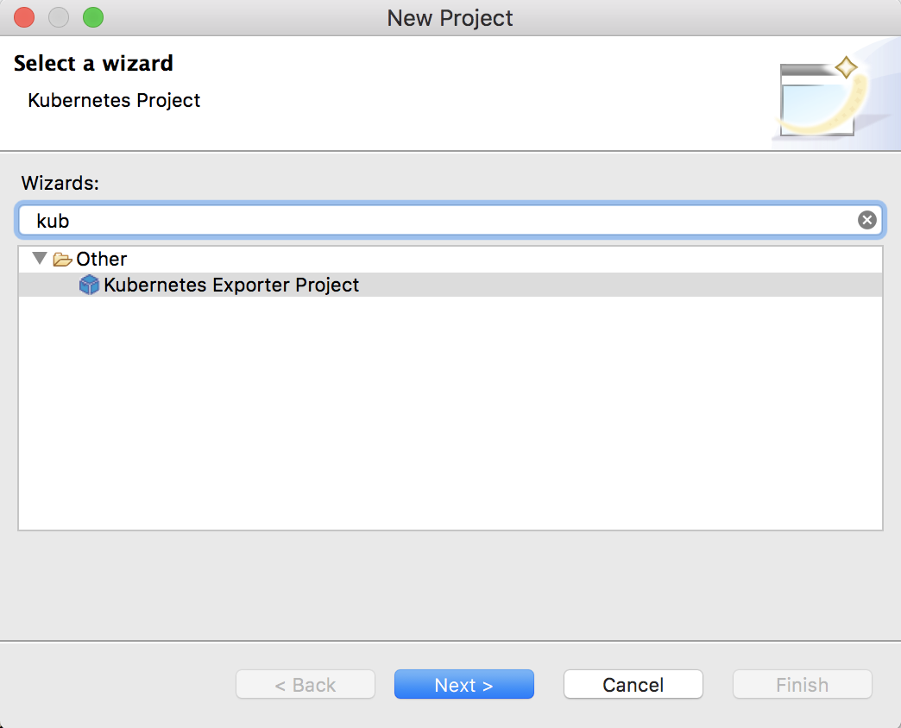
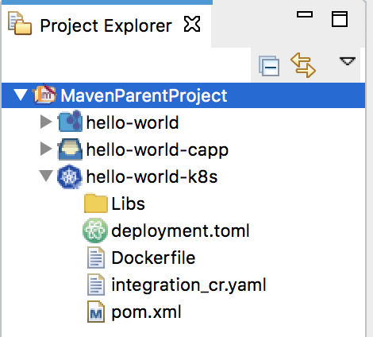

# K8s-ei-operator Example 1

## Hello World Scenario

Let's define a basic Hello World scenario using WSO2 Micro Integrator and deploy it on your Kubernetes environment.

Follow the below steps to deploy and run the integration solution on Kubernetes.

1.  Create a Maven Multi Module Project using WSO2 Integration Studio.

     
    
2.  Create an **ESB Config Project** inside the Maven Multi Module Project.
    **New → Project → ESB Config Project**
    
     
    
3.  Add the following proxy service configuration inside the ESB Config Project. This will return the "{"Hello":"World"}" response payload for the service request.
    ```xml
    <?xml version="1.0" encoding="UTF-8"?>
    <proxy name="HelloWorld" startOnLoad="true" transports="http https" xmlns="http://ws.apache.org/ns/synapse">
        <target>
            <inSequence>
                <payloadFactory media-type="json">
                    <format>{"Hello":"World"}</format>
                    <args/>
                </payloadFactory>
                <respond/>
            </inSequence>
            <outSequence/>
            <faultSequence/>
        </target>
    </proxy>
    ```
    
4.  Create a **Composite Application Project** inside the Maven Multi Module Project by **selecting the above configuration(s)** under Dependencies.
    **New → Project → Composite Application Project**
    
        

5.  Create a **Docker/Kubernetes Project** inside the Maven Multi Module Project.
    **New → Project → Docker/Kubernetes Project** and select **New Kubernetes Project**.
    
     
    
    Finally, created Maven Multi Module Project Explorer should be as follows,
    
    
    
6.  Navigate to the Kubernetes project and open the **pom.xml** file. Select the multiple composite applications you want to add to the docker image under the **Dependencies** section and save the changes.

     
    
7.  Start the Docker daemon in the host machine.

8.  Navigate to the Maven multi module project and run the following command to build the project. It will create a docker image with the provided target repository and tag once the build is successfull.
    ```bash
    mvn clean install -Dmaven.test.skip=true
    ```
9.  Run the `docker image ls` command to verify whether or not the docker image has been built. 

10.  Navigate to the Kubernetes project inside the MavenParentProject and run the following command to the push docker image to the remote docker registry.
    ```bash
    mvn dockerfile:push -Ddockerfile.username={username} -Ddockerfile.password={password}
    ``` 

    Else, you can use the Kubernetes [Build and Push Docker Images](../../../../develop/create-kubernetes-project/#build-and-push-docker-images) section to build and push docker images to the remote registries.
    
11. Follow the **[Kubernetes Deployment using k8s-ei-operator](../../../../setup/deployment/kubernetes_deployment)** documentation to deploy and run the integration solution inside the Kubernetes environment.

12. Invoke the service as follows:

    ```bash
    curl http://localhost:8290/services/HelloWorld
    ```  
    
