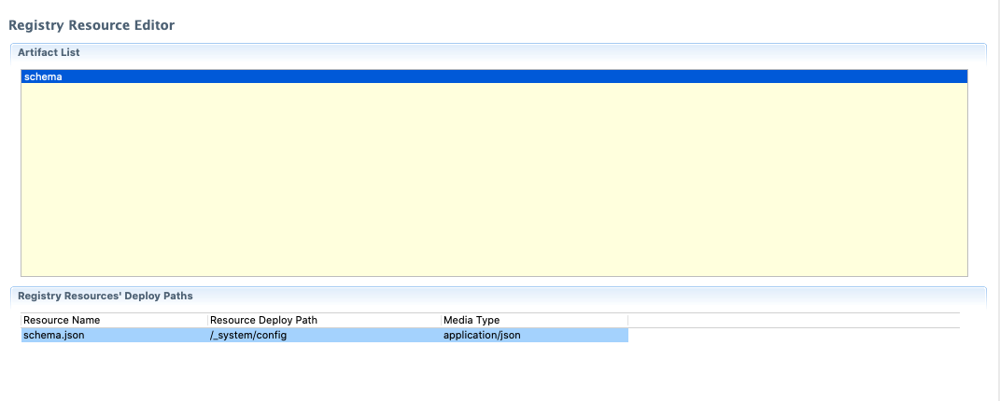

# Migrating from WSO2 EI 6.x to WSO2 EI 7.1

This guide provides the recommended strategy for migrating from WSO2 EI 6.x to WSO2 EI 7.1. Note that these guidelines are only applicable when you are migrating the ESB profile of EI 6.x to the Micro Integrator in EI 7.1.

## Before you begin

See the following topics to understand the benefits of moving to EI 7.1 from EI 6.x:

-   [Comparison: EI 6.x vs EI 7.1](../../../references/comparisong-mi7-ei6xx/#comparison-wso2-ei-6xx-vs-wso2-ei-700)
-   [Advantages of using the Micro Integrator in EI 7.1](../../../references/comparisong-mi7-ei6xx/#advantages-of-using-the-micro-integrator-in-ei-70)
-   [Comparison: ESB profile of EI 6.x vs Micro Integrator of EI 7.1](../../../references/comparisong-mi7-ei6xx/#comparison-esb-profile-of-ei-6x-vs-micro-integrator-of-ei-70)
-   [Features removed from the Micro Integrator of EI 7.1](../../../references/comparisong-mi7-ei6xx/#features-removed-from-the-micro-integrator-of-ei-70)

Note that EI 7 is a **WUM-only release**, which means that manual patches are not allowed. You can use [WSO2 Update Manager(WUM)](https://docs.wso2.com/display/updates/WSO2+Updates) to get the latest fixes or updates for this release.

## Why migrate to EI 7.1?

If you are an EI 6.x user, migration is recommended for the following requirements:
 
-   You need to switch to a micro-services architecture from the conventional centralized architecture.
-   You need a more lightweight, container-friendly runtime in centralized architecture.
-   You need native support for Kubernetes.
   
The decision on migration to the new platform needs to be taken by considering several factors including the preferred architectural style (centralized vs microservices), deployment environment in your organization, and the effort it takes to migrate existing integration configurations.

## Migrating to the Micro Integrator 
 
Both the ESB profile of EI 6.x and the Micro Integrator of EI 7.1 uses the same ESB runtime and the same developer tool ([WSO2 Integration Studio](../../../develop/WSO2-Integration-Studio)) for developing integrations. Most of the mediation(ESB) and data integration features available in the ESB profile of EI 6.x are available in the Micro Integrator as well. Some of the features are [removed from WSO2 Micro Integrator](../../../references/comparisong-mi7-ei6xx/#features-removed-from-the-micro-integrator-of-ei-70) as they are not needed for microservice deployments or they are not frequently used.

In summary, all the integration capabilities that you used in the ESB can be used in the Micro Integrator with minimal changes. However, EI 7.1 comes with a [Toml-based configuration strategy](../../../references/config-catalog) to replace XML configurations, which simplifies your product configurations.
 
See the [detailed comparison of EI 6.x and EI 7.0](../../../references/comparisong-mi7-ei6xx) to understand what has 
changed between the ESB profile of EI 6.x.x and the Micro Integrator of EI 7.0.
See the [detailed comparison of EI 6.x and EI 7.1](../../../references/comparisong-mi7-ei6xx) to understand what has changed between the ESB profile of EI 6.x.x and the Micro Integrator of EI 7.1.0

Follow the instructions below to start the migration!

### Set up the migration

-	Make a backup of the EI 6.x distribution (`<EI_6.x.x_HOME>` folder) to back up the product configurations.
-	Make a backup of the database used by the current EI 6.x.x deployment. This backup is necessary in case the migration causes any issues in the existing database.
-	Download and install EI 7.1 in your environment:

	!!! Tip
		The home directory of your Micro Integrator will be referred to as `<MI_HOME>` from hereon.

	-	Install the product [using the Installer](../../../setup/installation/install_in_vm_installer).
	-	Install the product [using the binary distribution](../../../setup/installation/install_in_vm_binary).

-	Use [WSO2 Update Manager](https://docs.wso2.com/display/updates/) to get the latest available updates for your EI 7.0 distribution.

	!!! Info
		Note that you need a valid [WSO2 subscription](https://wso2.com/subscription) to use updates in a production environment.

### Migrating the user store

If you are already using a JDBC or LDAP user store with EI 6.x, you can simply connect the same to the Micro Integrator by updating the configuration details in `deployment.toml` file. Following is a set of high-level configurations. 

```toml tab='RDBMS User Store'
[user_store]
type = "database"
read_only = "false"

[[datasource]]
id = "WSO2_USER_DB"
url= "jdbc:mysql://localhost:3306/userdb"
username="root"
password="root"
driver="com.mysql.jdbc.Driver"

[realm_manager]
data_source = "WSO2_USER_DB" 

[internal_apis.file_user_store]
enable = false
```

```toml tab='Read-Only LDAP User Store'
[user_store]
connection_url = "ldap://localhost:10389"  
connection_name = "uid=admin,ou=system"
connection_password = "admin"  
user_search_base = "ou=Users,dc=wso2,dc=org"
type = "read_only_ldap"
   
[internal_apis.file_user_store]
enable = false
```

```toml tab='Read-Write LDAP User Store'
[user_store]
connection_url = "ldap://localhost:10389"  
connection_name = "uid=admin,ou=system"
connection_password = "admin"  
user_search_base = "ou=Users,dc=wso2,dc=org"
type = "read_write_ldap"
   
[internal_apis.file_user_store]
enable = false
```
!!! Tip
	See the instructions on [configuring a user store](../../user_stores/setting_up_a_userstore) for more information.
	
### Migrating the registry
The Micro Integrator uses a [file based registry](../file_based_registry) instead of a database (which is used in EI 6.x). Note the following when migrating the registry:

-	If the registry resources in EI 6.x are added via carbon applications developed using WSO2 Integration Studio, you can directly migrate the artifacts to the Micro Integrator of EI 7.1. Copy the carbon applications from the `<EI_6.x.x_HOME>/repository/deployment/server/carbonapps` folder to the `<MI_HOME>/repository/deployment/server/carbonapps` folder.
-	If the registry resources are added through the management console in EI 6.x.x, you need to convert them to a Registry Resources module in WSO2 Integration Studio and deploy them via a Carbon Application. Use one of the following approaches:
    	- [Checkout the Registry Resources](../../../develop/creating-artifacts/creating-registry-resources/#check-out-from-registry) from EI 6.x.x server directly into the Registry Resources module in WSO2 Integration Studio.
    	- Download the Registry Resources from EI 6.x.x and [import them](../../../develop/creating-artifacts/creating-registry-resources/#import-from-file-system) into the Registry Resources module in WSO2 Integration Studio.
    
!!! Note
    When you are importing Registry Resources into WSO2 Integration Studio, make sure that the media type of the Resource is set properly.
    

### Migrating artifacts

The recommended way to create integration artifacts (in EI 6.x or EI 7.x ) is to use [WSO2 Integration Studio](../../../develop/WSO2-Integration-Studio):

- If the artifacts are created in the recommended way, copy the CAR files inside `<EI_6.x.x_HOME>/repository/deployment/server/carbonapps` to the `<MI_HOME>/repository/deployment/server/carbonapps` folder.
- If the artifacts are created using the management console of EI 6.x, you need to recreate them using WSO2 Integration Studio and package them as a composite application. See the instructions on [packaging artifacts](../../../develop/packaging-artifacts).

!!! Tip
     For testing purposes, you can copy the artifacts to the same folder structure inside the `<MI_HOME>/repository/deployment/server/synapse-configs/default` directory.

### Migrating deployed Connectors

- If the connector is added to EI 6.x via a composite application with the [Connector Exporter Project](../../../develop/creating-artifacts/adding-connectors), the same can be used in EI 7.1 seamlessly. Simply copy the CAR file in EI 6.x to the `<MI_HOME>/repository/deployment/server/carbonapps` folder.
- If the connector is added to EI 6.x via the management console, pack them using connector exporter project and deploy via composite application in EI 7.1. For more information, read about the [Connector Exporter Project](../../../develop/creating-artifacts/adding-connectors).

### Migrating custom components

Copy custom OSGI components in the `<EI_6.x.x_HOME>/dropins` folder to the `<MI_HOME>/dropins` folder. If you have custom JARs in the `<EI_6.x.x_HOME>/lib` directory, copy those components to the `<MI_HOME>/lib` directory.

!!! Note
    To provide seamless integration with RabbitMQ, the Rabbitmq client lib is included in the Micro Integrator by default. Hence, you don't need to manually add any RabbitMQ components.

### Migrating keystores
Copy the JKS files in the `<EI_6.x.x_HOME>/repository/resources/security` directory to the `<MI_HOME>/repository/resources/security` directory. 

### Migrating configurations

Configuration management was handled in WSO2 EI 6.x versions via multiple files such as `carbon.xml`, `synapse.properties`, `axis2.xml`, etc.

Micro Integrator of EI 7.1 provides a new configuration model where all of the product configurations are primarily managed by a single configuration file named `deployment.toml` (stored in the `<MI_HOME>/conf` directory). 

In EI 7.1, the logging configurations are managed with log4j2, whereas the EI 6.x series (prior to EI 6.6.0) used log4j.

The following sections of this document will guide you on how to migrate the Product Configurations including log4j.

**Migrating to TOML configurations**

Given below are the most critical XML configuraton files in the ESB profile of EI 6.x.x. Expand each section to find the TOML configurations corresponding to the XML configurations in the file. 

!!! Tip
     If you have a [WSO2 subscription](https://wso2.com/subscription), it is highly recommended to reach WSO2 Support before attempting to proceed with the configuration migration.

??? note "carbon.xml"
	
	-	Hostname

	    ```xml tab='XML configuration'
		<HostName>www.wso2.org</HostName>
		```

		```toml tab='TOML configuration'
		[server]
	    hostname = "www.wso2.org"
		```

    	Find more [parameters](../../../references/config-catalog/#deployment).

	-	Port offset

	    ```xml tab='XML configuration'
		<Ports>
	        <Offset>1</Offset>
	    </Ports>
		```

		```toml tab='TOML configuration'
	    [server] 
	    offset  = 0
		```
	    
	    Find more [parameters](../../../references/config-catalog/#deployment).


	-	Primary keystore

	    ```xml tab='XML configuration'
		<Security>
	        <KeyStore>            
	            <Location>${carbon.home}/repository/resources/security/wso2carbon.jks</Location>
	            <Type>JKS</Type>
	            <Password>wso2carbon</Password>
	            <KeyAlias>wso2carbon</KeyAlias>
	            <KeyPassword>wso2carbon</KeyPassword>
	        </KeyStore>
	    </Security>
		```

		```toml tab='TOML configuration'
		[keystore.primary] 
	    file_name = "wso2carbon.jks"
	    type = "JKS"
	    password = "wso2carbon"
	    alias = "wso2carbon"
	    key_password = "wso2carbon"
		```
	    
	    Find more [parameters](../../../references/config-catalog/#primary-keystore).

	-	Internal keystore

	    ```xml tab='XML configuration'
		<InternalKeyStore>
	         <Location>${carbon.home}/repository/resources/security/wso2carbon.jks</Location>
	            <Type>JKS</Type>
	            <Password>wso2carbon</Password>
	            <KeyAlias>wso2carbon</KeyAlias>
	           <KeyPassword>wso2carbon</KeyPassword>
	    </InternalKeyStore>
		```

		```toml tab='TOML configuration'
		[keystore.internal] 
	    file_name = "wso2carbon.jks"
	    type = "JKS"
	    password = "wso2carbon"
	    alias = "wso2carbon"
	    key_password = "wso2carbon" 
		```
	    
	    Find more [parameters](../../../references/config-catalog/#internal-keystore).

	-	Truststore

	    ```xml tab='XML configuration'
		<TrustStore>
	        <Location>${carbon.home}/repository/resources/security/client-truststore.jks</Location>
	        <Type>JKS</Type>
	        <Password>wso2carbon</Password>
	    </TrustStore>
		```

		```toml tab='TOML configuration'
		[truststore] 
	    file_name = "client-truststore.jks"  
	    type = "JKS"                        
	    password = "wso2carbon"            
	    alias = "symmetric.key.value"      
	    algorithm = "AES"
		```

	    Find more [parameters](../../../references/config-catalog/#trust-store).


??? note "user-mgt.xml"

	-	Admin user

	    ```xml tab='XML configuration'
		<Realm>
	        <Configuration>
	            <AdminRole>admin</AdminRole>
	            <AdminUser>                
	                <UserName>admin</UserName>                
	                <Password>admin</Password>
	            </AdminUser>
	        </Configuration>
	    </Realm>
		```

		```toml tab='TOML configuration'
		[super_admin]
	    username = "admin"              # inferred 
	    password = "admin"              # inferred 
	    admin_role = "admin"            # inferred
		```
		
	-	User datasource

	    ```xml tab='XML configuration'
		<Realm>
	        <Configuration>
	             <Property name="isCascadeDeleteEnabled">true</Property>
	             <Property name="dataSource">jdbc/WSO2CarbonDB</Property>
	        </Configuration>
	    </Realm>
		```

		```toml tab='TOML configuration'
	    [realm_manager] 
	    data_source = "WSO2CarbonDB"       
	    properties.isCascadeDeleteEnabled = true   
		```

	-	LDAP userstore

	    ```xml tab='XML configuration'
		<UserStoreManager class="org.wso2.carbon.user.core.ldap.ReadOnlyLDAPUserStoreManager">
	        <Property name="TenantManager">org.wso2.carbon.user.core.tenant.CommonHybridLDAPTenantManager</Property>
	        <Property name="ConnectionURL">ldap://localhost:10389</Property>
	        <Property name="ConnectionName">uid=admin,ou=system</Property>
	    </UserStoreManager>
		```

		```toml tab='TOML configuration'
		[internal_apis.file_user_store]
	    enable = false
	    
		[user_store]
	    type = "read_only_ldap" # inferred default read_only_ldap # OR  read_write_ldap
	    class = "org.wso2.micro.integrator.security.user.core.ldap.ReadOnlyLDAPUserStoreManager" # inferred
	    connection_url = "ldap://localhost:10389"   #inferred
	    connection_name = "uid=admin,ou=system"   #inferred
		```
	    
	    Find more [parameters](../../../references/config-catalog/#ldap-user-store).

	-	JDBC userstore

	    ```xml tab='XML configuration'
		 <UserStoreManager class="org.wso2.carbon.user.core.jdbc.JDBCUserStoreManager">
	        <Property name="TenantManager">org.wso2.carbon.user.core.tenant.JDBCTenantManager</Property>
	     </UserStoreManager>
		```

		```toml tab='TOML configuration'
		[internal_apis.file_user_store]
	    enable = false
	    
	    [user_store]
	    class = "org.wso2.micro.integrator.security.user.core.jdbc.JDBCUserStoreManager"
	    type = "database"
		```

??? note "master-datasource.xml"

	Carbon database (`WSO2_CARBON_DB`).

    ```xml tab='XML configuration'
	<datasource>
        <name>WSO2_CARBON_DB</name>
        <description>The datasource used for registry and user manager</description>
        <jndiConfig>
            <name>jdbc/WSO2CarbonDB</name>
        </jndiConfig>
        <definition type="RDBMS">
            <configuration>
                <url>jdbc:h2:./repository/database/WSO2CARBON_DB;DB_CLOSE_ON_EXIT=FALSE;LOCK_TIMEOUT=60000</url>
                <username>wso2carbon</username>
                <password>wso2carbon</password>
                <driverClassName>org.h2.Driver</driverClassName>
                <maxActive>50</maxActive>
                <maxWait>60000</maxWait>
                <testOnBorrow>true</testOnBorrow>
            </configuration>
        </definition>
    </datasource>
	```

	```toml tab='TOML configuration'
	[[datasource]]
    id = "WSO2_CARBON_DB"
    url= "jdbc:h2:./repository/database/WSO2CARBON_DB;DB_CLOSE_ON_EXIT=FALSE;LOCK_TIMEOUT=60000"
    username="username"
    password="password"
    driver="org.h2.Driver"
    pool_options.maxActive=50
    pool_options.maxWait = 60000 # wait in milliseconds
    pool_options.testOnBorrow = true
	```
    
    Find more [parameters](../../../references/config-catalog/#database-connection).


??? note "axis2.xml"

	-	Hot deployment

	    ```xml tab='XML configuration'
		<parameter name="hotdeployment" locked="false">true</parameter>
		```

		```toml tab='TOML configuration'
		[server]
	    hot_deployment = true 
		```

	-	Enable MTOM

	    ```xml tab='XML configuration'
		<parameter name="enableMTOM" locked="false">false</parameter>
		```

		```toml tab='TOML configuration'
		[server]
	    enable_mtom = false
		```
	    
	    Find more [parameters](../../../references/config-catalog/#deployment).

	-	Enable SWA

	    ```xml tab='XML configuration'
		<parameter name="enableSwA" locked="false">false</parameter>
		```

		```toml tab='TOML configuration'
		[server]
	    enable_swa = false
		```
	    
	    Find more [parameters](../../../references/config-catalog/#deployment).

	-	Message formatters

	    ```xml tab='XML configuration'
		<messageFormatters>
	            <messageFormatter contentType="application/x-www-form-urlencoded"
	                              class="org.apache.synapse.commons.formatters.XFormURLEncodedFormatter"/>
	            <messageFormatter contentType="multipart/form-data"
	                              class="org.apache.axis2.transport.http.MultipartFormDataFormatter"/>
	            <messageFormatter contentType="application/xml"
	                              class="org.apache.axis2.transport.http.ApplicationXMLFormatter"/>
	            <messageFormatter contentType="text/xml"
	                             class="org.apache.axis2.transport.http.SOAPMessageFormatter"/>
	            <messageFormatter contentType="application/soap+xml"
	                             class="org.apache.axis2.transport.http.SOAPMessageFormatter"/>
	            <messageFormatter contentType="text/plain"
	                             class="org.apache.axis2.format.PlainTextFormatter"/>
	            <messageFormatter contentType="application/octet-stream"
	                              class="org.wso2.carbon.relay.ExpandingMessageFormatter"/>
	            <messageFormatter contentType="application/json"
	                              class="org.wso2.carbon.integrator.core.json.JsonStreamFormatter"/>
	    </messageFormatters>                         
		```

		```toml tab='TOML configuration'
		[message_formatters]
	    form_urlencoded =  "org.apache.synapse.commons.formatters.XFormURLEncodedFormatter"
	    multipart_form_data =  "org.apache.axis2.transport.http.MultipartFormDataFormatter"
	    application_xml = "org.apache.axis2.transport.http.ApplicationXMLFormatter"
	    text_xml = "org.apache.axis2.transport.http.SOAPMessageFormatter"
	    soap_xml = "org.apache.axis2.transport.http.SOAPMessageFormatter"
	    text_plain = "org.apache.axis2.format.PlainTextFormatter"
	    application_json =  "org.wso2.micro.integrator.core.json.JsonStreamFormatter"
	    octet_stream = "org.wso2.carbon.relay.ExpandingMessageFormatter"
	    ```
	    
	    Find more [parameters](../../../references/config-catalog/#message-formatters-non-blocking-mode).

	-	Message builders

	    ```xml tab='XML configuration'
		<messageBuilders>
	            <messageBuilder contentType="application/xml"
	                            class="org.apache.axis2.builder.ApplicationXMLBuilder"/>
	            <messageBuilder contentType="application/x-www-form-urlencoded"
	                            class="org.apache.synapse.commons.builders.XFormURLEncodedBuilder"/>
	            <messageBuilder contentType="multipart/form-data"
	                            class="org.apache.axis2.builder.MultipartFormDataBuilder"/>
	            <messageBuilder contentType="text/plain"
	                            class="org.apache.axis2.format.PlainTextBuilder"/>
	            <messageBuilder contentType="application/octet-stream"
	                            class="org.wso2.carbon.relay.BinaryRelayBuilder"/>
	            <messageBuilder contentType="application/json"
	                            class="org.wso2.carbon.integrator.core.json.JsonStreamBuilder"/>
	    </messageBuilders>                                               
		```

		```toml tab='TOML configuration'
		[message_builders]
	    application_xml = "org.apache.axis2.builder.ApplicationXMLBuilder"
	    form_urlencoded = "org.apache.synapse.commons.builders.XFormURLEncodedBuilder"
	    multipart_form_data = "org.apache.axis2.builder.MultipartFormDataBuilder"
	    text_plain = "org.apache.axis2.format.PlainTextBuilder"
	    application_json = "org.wso2.micro.integrator.core.json.JsonStreamBuilder"
	    octet_stream =  "org.wso2.carbon.relay.BinaryRelayBuilder"
		```
	    
	    Find more [parameters](../../../references/config-catalog/#message-builders-non-blocking-mode).

	-	HTTP transport receiver

	    ```xml tab='XML configuration'
		<transportReceiver name="http" class="org.apache.synapse.transport.passthru.PassThroughHttpListener">
	            <parameter name="port" locked="false">8280</parameter>
	            <parameter name="non-blocking" locked="false">true</parameter>
	            <parameter name="bind-address" locked="false">hostname or IP address</parameter>
	            <parameter name="WSDLEPRPrefix" locked="false">https://apachehost:port/somepath</parameter>      
	    </transportReceiver>                                             
		```

		```toml tab='TOML configuration'
		[transport.http] 
	    listener.enable = true                     
	    listener.port = 8280    
	    listener.wsdl_epr_prefix ="https://apachehost:port/somepath" 
	    listener.bind_address = "hostname or IP address"
		```
	    
	    Find more [parameters](../../../references/config-catalog/#https-transport-non-blocking-mode).

	-	HTTPS transport receiver

	    ```xml tab='XML configuration'
	    <transportReceiver name="https" class="org.apache.synapse.transport.passthru.PassThroughHttpSSLListener">
	        <parameter name="port" locked="false">8243</parameter>
	        <parameter name="non-blocking" locked="false">true</parameter>
	        <parameter name="HttpsProtocols">TLSv1,TLSv1.1,TLSv1.2</parameter>
	        <parameter name="bind-address" locked="false">hostname or IP address</parameter>
	        <parameter name="WSDLEPRPrefix" locked="false">https://apachehost:port/somepath</parameter>
	        <parameter name="keystore" locked="false">
	            <KeyStore>
	                <Location>repository/resources/security/wso2carbon.jks</Location>
	                <Type>JKS</Type>
	                <Password>wso2carbon</Password>
	                <KeyPassword>wso2carbon</KeyPassword>
	            </KeyStore>
	        </parameter>
	        <parameter name="truststore" locked="false">
	            <TrustStore>
	                <Location>repository/resources/security/client-truststore.jks</Location>
	                <Type>JKS</Type>
	                <Password>wso2carbon</Password>
	            </TrustStore>
	        </parameter>
	    </transportReceiver>                                         
		```

		```toml tab='TOML configuration'
	    [transport.http]
	    listener.secured_enable = true              
	    listener.secured_port = 8243        
	    listener.secured_wsdl_epr_prefix = "https://apachehost:port/somepath"  
	    listener.secured_bind_address = "hostname or IP address" 
	    listener.secured_protocols = "TLSv1,TLSv1.1,TLSv1.2"   
	    listener.keystore.location ="repository/resources/security/wso2carbon.jks"
	    listener.keystore.type = "JKS" listener.keystore.password = "wso2carbon"
	    listener.keystore.key_password = "wso2carbon"
	    listener.truststore.location = "repository/resources/security/client-truststore.jks" 
	    listener.truststore.type = "JKS" listener.truststore.password = "wso2carbon"
		```
	    
	    Find more [parameters](../../../references/config-catalog/#https-transport-non-blocking-mode).

	-	VFS transport receiver

	    ```xml tab='XML configuration'
		<transportReceiver name="vfs" class="org.apache.synapse.transport.vfs.VFSTransportListener"/>                                            
		```

		```toml tab='TOML configuration'
		[transport.vfs] ]
	    listener.enable = true
		```
	    
	    Find more [parameters](../../../references/config-catalog/#vfs-transport).

	-	Mailto transport receiver

	    ```xml tab='XML configuration'
		<transportReceiver name="mailto" class="org.apache.axis2.transport.mail.MailTransportListener"/>	```
	    ```
	    
		```toml tab='TOML configuration'
		[transport.mail.listener]
		enable = true
	    name = "mailto"
		```
	    
	    Find more [parameters](../../../references/config-catalog/#mail-transport-listener-non-blocking-mode).

	-	JMS transport receiver

	    ```xml tab='XML configuration'
		<transportReceiver name="jms" class="org.apache.axis2.transport.jms.JMSListener">
	            <parameter name="myTopicConnectionFactory" locked="false">
	            	<parameter name="java.naming.factory.initial" locked="false">org.apache.activemq.jndi.ActiveMQInitialContextFactory</parameter>
	            	<parameter name="java.naming.provider.url" locked="false">tcp://localhost:61616</parameter>
	            	<parameter name="transport.jms.ConnectionFactoryJNDIName" locked="false">TopicConnectionFactory</parameter>
	    		    <parameter name="transport.jms.ConnectionFactoryType" locked="false">topic</parameter>
	            </parameter>
	    </transportReceiver>
	    ```
	       
		```toml tab='TOML configuration'
		[transport.jms] 
		listener_enable = true 
		 
	    [[transport.jms.listener]] 
	    name = "myTopicListener"
	    parameter.initial_naming_factory = "org.apache.activemq.artemis.jndi.ActiveMQInitialContextFactory" 
	    parameter.provider_url = "tcp://localhost:61616" 
	    parameter.connection_factory_name = "TopicConnectionFactory" 
	    parameter.connection_factory_type = "topic" # [queue, topic] 
	    parameter.cache_level = "consumer"
		```
	    
	    Find more [parameters](../../../references/config-catalog/#jms-transport-listener-blocking-mode).

	-	FIX transport receiver

	    ```xml tab='XML configuration'
		<transportReceiver name="fix" class="org.apache.synapse.transport.fix.FIXTransportListener"/>
	    ```
	       
		```toml tab='TOML configuration'
		[transport.fix] 
	    listener.enable = true
		```
	    
	    Find more [parameters](../../../references/config-catalog/#fix-transport).

	-	RabbitMQ transport receiver

	    ```xml tab='XML configuration'
		<transportReceiver name="rabbitmq" class="org.apache.axis2.transport.rabbitmq.RabbitMQListener">
	            <parameter name="AMQPConnectionFactory" locked="false">
	                <parameter name="rabbitmq.server.host.name" locked="false">localhost</parameter>
	                <parameter name="rabbitmq.server.port" locked="false">5672</parameter>
	                <parameter name="rabbitmq.server.user.name" locked="false">guest</parameter>
	                <parameter name="rabbitmq.server.password" locked="false">guest</parameter>
	            </parameter>
	    </transportReceiver>
	    ```
	       
		```toml tab='TOML configuration'
		[transport.rabbitmq] 
		listener_enable = true
	     
	    [[transport.rabbitmq.listener]] 
	    name = "AMQPConnectionFactory" 
	    parameter.hostname = "localhost" 
	    parameter.port = 5672 
	    parameter.username = "guest" 
	    parameter.password = "guest"
		```
	    
	    Find more [parameters](../../../references/config-catalog/#rabbitmq-listener).

	-	HTTP transport sender

	    ```xml tab='XML configuration'
		<transportSender name="http" class="org.apache.synapse.transport.passthru.PassThroughHttpSender">
	            <parameter name="non-blocking" locked="false">true</parameter>
	     </transportSender>
	    ```
	       
		```toml tab='TOML configuration'
		[transport.http] 
	    sender.enable = true 
		```
	    
	    Find more [parameters](../../../references/config-catalog/#https-transport-non-blocking-mode).

	-	HTTPS transport sender

	    ```xml tab='XML configuration'
		<transportSender name="https" class="org.apache.synapse.transport.passthru.PassThroughHttpSSLSender">
	            <parameter name="non-blocking" locked="false">true</parameter>
	            <parameter name="keystore" locked="false">
	                <KeyStore>
	                    <Location>repository/resources/security/wso2carbon.jks</Location>
	                    <Type>JKS</Type>
	                    <Password>wso2carbon</Password>
	                    <KeyPassword>wso2carbon</KeyPassword>
	                </KeyStore>
	            </parameter>
	            <parameter name="truststore" locked="false">
	                <TrustStore>
	                    <Location>repository/resources/security/client-truststore.jks</Location>
	                    <Type>JKS</Type>
	                    <Password>wso2carbon</Password>
	                </TrustStore>
	            </parameter>
	    </transportSender>
	    ```
	       
		```toml tab='TOML configuration'
		[transport.http] 
	    sender.secured_enable = true
	    sender.keystore.location ="repository/resources/security/wso2carbon.jks"
	    sender.keystore.type = "JKS" 
	    sender.keystore.password = "wso2carbon" 
	    sender.keystore.key_password = "wso2carbon"
	    sender.truststore.location = "repository/resources/security/client-truststore.jks" 
	    sender.truststore.type = "JKS" 
	    sender.truststore.password = "wso2carbon"
		```
	    
	    Find more [parameters](../../../references/config-catalog/#https-transport-non-blocking-mode).

	-	VFS transport sender

	    ```xml tab='XML configuration'
		<transportSender name="vfs" class="org.apache.synapse.transport.vfs.VFSTransportSender"/>
	    ```
	       
		```toml tab='TOML configuration'
		[transport.vfs]
	    sender.enable = true
		```
	    
	    Find more [parameters](../../../references/config-catalog/#vfs-transport).

	-	VFS transport sender

	    ```xml tab='XML configuration'
		<transportSender name="mailto" class="org.apache.axis2.transport.mail.MailTransportSender">
	            <parameter name="mail.smtp.host">smtp.gmail.com</parameter>
	            <parameter name="mail.smtp.port">587</parameter>
	            <parameter name="mail.smtp.starttls.enable">true</parameter>
	            <parameter name="mail.smtp.auth">true</parameter>
	            <parameter name="mail.smtp.user">synapse.demo.0</parameter>
	            <parameter name="mail.smtp.password">mailpassword</parameter>
	            <parameter name="mail.smtp.from">synapse.demo.0@gmail.com</parameter>
	    </transportSender>
	    ```
	       
		```toml tab='TOML configuration'
		[[transport.mail.sender]]
	    name = "mailto" 
	    parameter.hostname = "smtp.gmail.com" 
	    parameter.port = "587" 
	    parameter.enable_tls = true 
	    parameter.auth = true 
	    parameter.username = "synapse.demo.0" 
	    parameter.password = "mailpassword" 
	    parameter.from = "synapse.demo.0@gmail.com"
		```
	    
	    Find more [parameters](../../../references/config-catalog/#mail-transport-sender-non-blocking-mode).

	-	FIX transport sender

	    ```xml tab='XML configuration'
		<transportSender name="fix" class="org.apache.synapse.transport.fix.FIXTransportSender"/>
	    ```
	       
		```toml tab='TOML configuration'
		[transport.fix]
	    sender.enable = true
		```
	    
	    Find more [parameters](../../../references/config-catalog/#fix-transport).

	-	RabbitMQ transport sender

	    ```xml tab='XML configuration'
		<transportSender name="rabbitmq" class="org.apache.axis2.transport.rabbitmq.RabbitMQSender"/>
		```
	       
		```toml tab='TOML configuration'
		[transport.rabbitmq]
	    sender_enable = true
		```
	    
	    Find more [parameters](../../../references/config-catalog/#rabbitmq-sender).


	-	RabbitMQ transport sender

	    ```xml tab='XML configuration'
	    <transportSender name="jms" class="org.apache.axis2.transport.jms.JMSSender"/>	
	    ```
	       
		```toml tab='TOML configuration'
		[transport.jms]
	    sender_enable = true
		```
	    
	    Find more [parameters](../../../references/config-catalog/#jms-transport-sender-non-blocking-mode).

	-	Clustering

	    ```xml tab='XML configuration'
	    <clustering class="org.wso2.carbon.core.clustering.hazelcast.HazelcastClusteringAgent"
	                    enable="true">
	    <parameter name="clusteringPattern">nonWorkerManager</parameter>
	    </clustering>
	    ```
	       
		```toml tab='TOML configuration'
		[[datasource]]
	    id = "WSO2_COORDINATION_DB"
	    url= "jdbc:mysql://localhost:3306/clusterdb"
	    username="root"
	    password="root"
	    driver="com.mysql.jdbc.Driver"
		```
	    
	    Find more [parameters](../../../setup/deployment/deploying_wso2_ei).

??? note "synapse.properties"

	Synapse thread pool properties:

    ```xml tab='XML configuration'
    synapse.threads.core = 20
    synapse.threads.max = 100
    ```
       
	```toml tab='TOML configuration'
	[mediation]
    synapse.core_threads = 20
    synapse.max_threads = 100
	```
    
    Find more [parameters](../../../references/config-catalog/#message-mediation).

The complete list of TOML configurations for the Micro Integrator are listed in the [product configuration catalog](../../../references/config-catalog).

**Migrating Log4j configurations**

Older versions of the WSO2 EI 6.x family (EI 6.5.0 and earlier) use log4j. In  WSO2 EI 7 Micro Integrator, the `carbon.logging.jar` file is not packed and the `pax-logging-api` is used instead. With this upgrade, the log4j version is also updated to log4j2.

Therefore, you need to follow the instructions given below to migrate from log4j (in EI 6.5.0 or earlier version) to log4j2 (in EI 7 Micro Integrator).

If you have used a custom log4j component in you you older EI version, apply the following changes to your component:

1.	Replace carbon logging or commons.logging dependencies with pax-logging dependency as shown below.
		```xml
		<!-- Pax Logging -->
		<dependency>
		   <groupId>org.ops4j.pax.logging</groupId>
		   <artifactId>pax-logging-api</artifactId>
		   <version>${pax.logging.api.version}</version>
		</dependency>
		<!-- Pax Logging Version -->
		<pax.logging.api.version>1.10.1</pax.logging.api.version>
		```

2.	If log4j dependency is directly used, apply one of the options given below.

	-	Replace the log4j dependency (shown below) with log4j2 and rewrite the loggers accordingly.
			```xml
			<dependency>
			   <groupId>org.ops4j.pax.logging</groupId>
			   <artifactId>pax-logging-log4j2</artifactId>
			   <version>${pax.logging.log4j2.version}</version>
			</dependency>
			```
	-	Replace the log4j dependency with pax-logging dependency and rewrite the loggers using commons.logging accordingly.

3.	If commons.logging is imported using Import-Package, add the version range.
		```xml
		org.apache.commons.logging; 
		version="${commons.logging.version.range}" 
		<commons.logging.version.range>[1.2.0,2.0.0)</commons.logging.version.range>
		```

4.	Follow the instructions on [configuring log4j2](../../../administer-and-observe/logs/configuring_log4j_properties) to register the Appenders and Loggers.

### Migrating encrypted passwords

To migrate the encrypted passwords from EI 6.x, you need to first obtain the plain-text passwords. Once you have them, follow the normal procedure of encrypting secrets in EI 7. See [Encrypt Secrets](../../security/encrypting_plain_text) for instructions.
