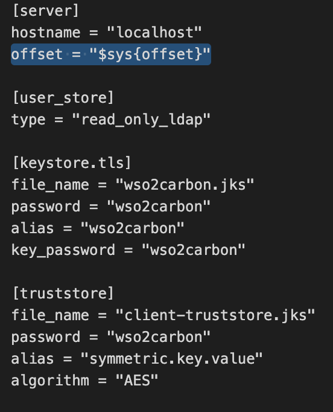
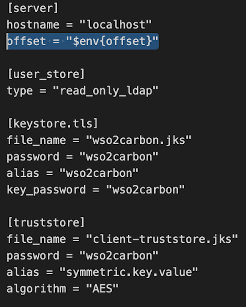

# Managing Server Configurations Between Multiple Environments 
All configurations related to a micro-integrator instance are specified in a single
[TOML based configuration file](https://ei.docs.wso2.com/en/latest/micro-integrator/references/config-catalog/).
In order to support ease of management between different environments, this configuration file supports 
environment variables and system properties to set up the server environment.

In your deployment.toml file you can define the configuration in one of three ways based on your preference. 
Let's assume you want to set the server offset of your micro-integrator instance.

## $sys{systemPropertyName} - System Property
When defining the offset as a system property you will have to add the offset property to 
the deployment.toml file as follows.

`offset = "$sys{propertyName}"
`

Upon saving the deployment.toml you can start the server and set the system property and start the server as usual.
You can set the system property during server startup as follows while executing the micro-integrator.sh file
in the <MI-HOME>/bin directory.

`./micro-integrator.sh -Doffset=19`

## $env{environmentVariableName} - Environment Variable
If you want to set a configuration property of the Micro-integrator instance using an Environment variable 
(as opposed to a system property), you can define the property in the deployment.toml as follows.

`offset = "$env{offset}"`

Upon saving the deployment.toml set the environment variables you have defined as follows before
starting the server as follows.
`export offset=22`

## ${VariableName} - Resolving in Runtime

As opposed to defining the configuration parameter as $sys{property} or $env{variable}, 
you can also set it as follows. 

`offset = "${offset}"`

When defined as above, the value will not be resolved by the configuration mapper before the server
startup and instead it will be resolved at runtime. 
The property can either be set as an environment variable or a system property and the precedence for 
the resolution will be as follows (if you have set it as both system property and an environmental variable).
	
	System property > Environment variable
 
## Docker Deployment
You can deploy your integration scenarios in a docker environment using the Docker/Kubernetes exporter project.
Inside the docker exporter project, you will find a deployment.toml file which will be used as 
the configuration file for the Micro-integrator instance in your docker image. 
You can configure this deployment.toml file as described above and then build the docker image as required.

You will have to set the System properties and environment variables you have defined in the .toml 
file inside your docker container with your docker run command.
 These values will be resolved dynamically during the run time.

