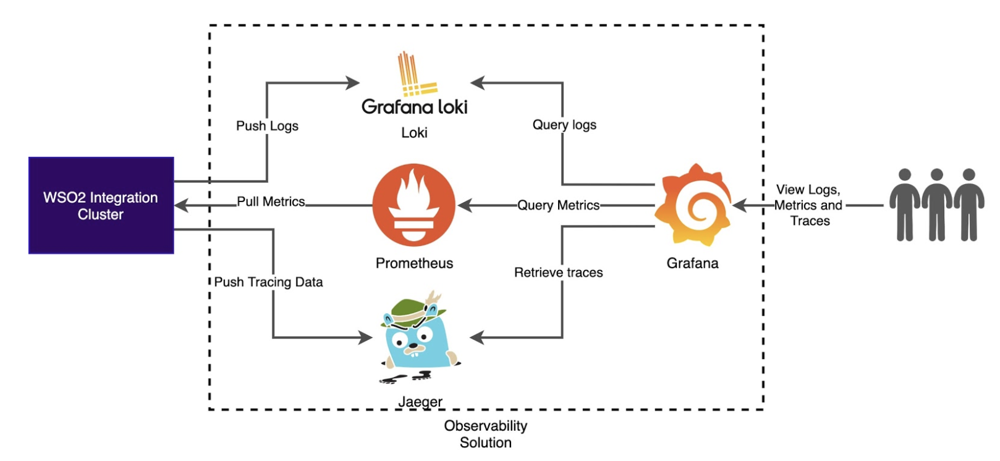

# Observability Deployment Strategy

WSO2 Enterprise Integrator 7.1 offers two observability solutions for monitoring and managing your integration deployments in the Micro Integrator. You can choose one of the two solutions depending on the nature of your Micro Integrator deployment. 

## Choosing an observability strategy

The cloud-native solution is more suitable in the following scenarios:

- If you are creating a new cloud-native Micro Integrator deployment. Refer the <a href="../../../setup/deployment/kubernetes_deployment_patterns">Micro Integrator Kubernetes Deployment</a> guide for details on how to setup a cloud-native Micro Integrator deployment on Kubernetes.
- If you already have Prometheus, Grafana, and Jaeger as you in-house monitoring and observability tools.

The classic observability solution is more suitable in the following scenarios:

- If you require more business analytics and less operational observability.
- If you want a simpler deployment.
- If you already have an observability stack such as ELK.

## Cloud-Native Observability

The following diagram depicts the complete observability solution for your Micro Integrator deployment, which includes **metrics monitoring**, **log monitoring**, and **message tracing** capabilities.

You can also set up different flavours of this solution depending on your requirement.

### Technologies

The cloud-native observability solution is based on proven projects from the **Cloud Native Computing Foundation**, which makes the solution cloud native and future proof. Following are the technologies used in the current solution:

| **Feature**   | **Technology**              |
|---------------|-----------------------------|
| Metrics       | Prometheus                  |
| Visualization | Grafana                     |
| Logging       | Fluent-Bit and Grafana Loki |
| Tracing       | Jaeger                      |

### Minimum cloud-native observability

The basic deployment offers you metrics capabilities. You can set up the basic deployment with only Prometheus and Grafana to view and explore with the available Prometheus metrics.

### Log Processing
 
Once you set up the basic deployment, you can integrate log-processing capabilities. To use this, you need to install **Fluent-Bit** as the logging agent and **Grafana Loki** as the log aggregator.

### Message Tracing

Once you set up the basic deployment, you can integrate message tracing capabilities. To use this you need to install **Jaeger**.  

## Classic Observability (using the EI Analytics Profile)

The following diagram depicts an observability solution for your Micro Integrator deployment, which includes **metrics monitoring** and **message tracing** capabilities. This uses the Analytics profile of WSO2 EI 6.x as its technology. 

## What's Next

-	See the instructions on <a href="../../../setup/observability/setting-up-minimum-basic-observability-deployment">setting up a cloud-native observability deployment</a>.
-	See the instructions on <a href="../../../setup/observability/setting-up-classic-observability-deployment">setting up a classic observability deployment</a>.

