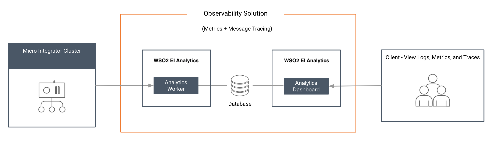
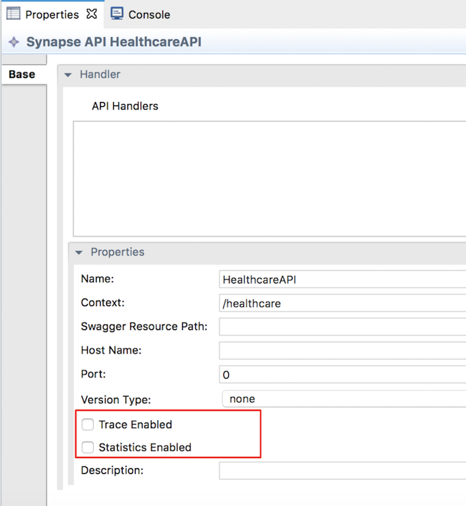
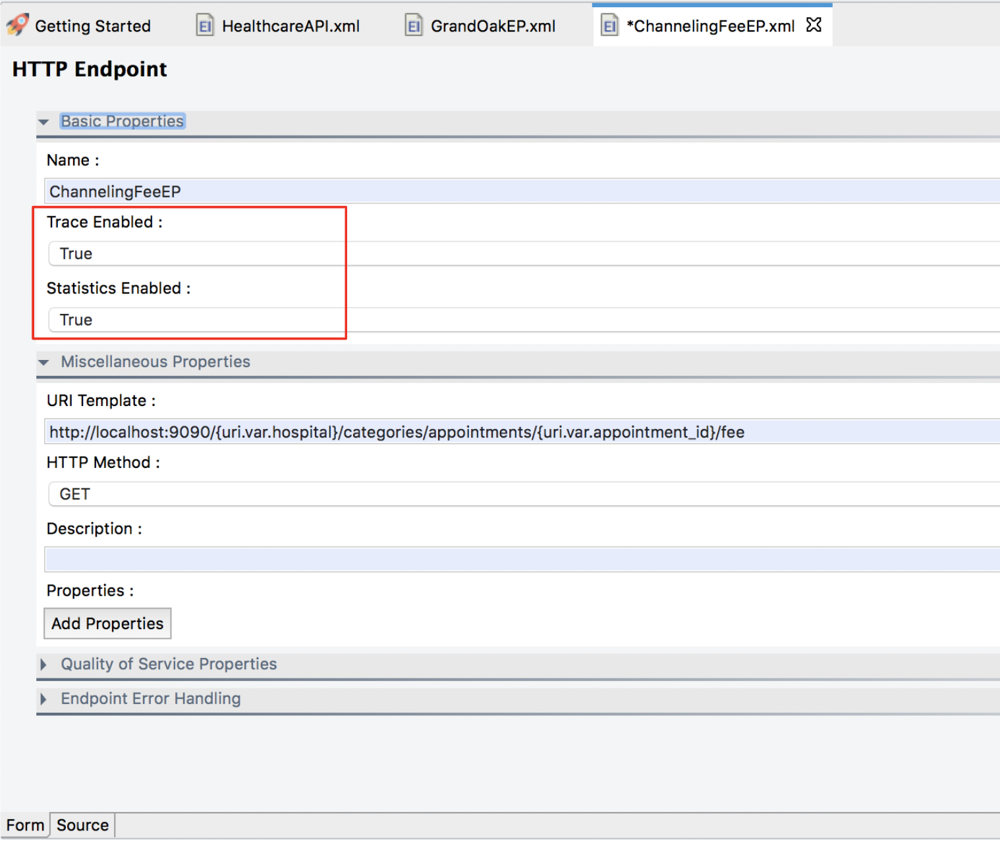

# Setting up the EI Analytics for Observability

Follow the instructions given below to enable observability for your Micro Integrator deployment using <b>EI Analytics</b>. 



EI Analytics consists of two components: **Server** and **Portal**. The server processes the data streams that are sent from the Micro Integrator and publishes the statistics to a database. The portal reads the statistics published by the worker and displays the statistics. The server and portal are connected through the database.

This solution is more suitable if you already have an observability stack such as ELK,  or if you want more business analytics and less operational observability. To select the most appropriate observability solution for your deployment, see [Observability Deployment Strategy](../../../setup/observability/observability-deployment-strategy).

## System requirements

You will be running three servers (EI Analytics server, EI Analytics portal, and the Micro Integrator) for this solution. Be sure that you have the required system specifications to run each server.

-   For the Analytics **Server**:

    <table>
    <tbody>
    <tr class="odd">
    <th>Memory</th>
    <td><p><ul><li>~ 4 GB per worker node<li>It is recommended to allocate 4 cores.</li></li><li>~ 2 GB is the initial heap (-Xms)  required for the server startup. The maximum heap size is 4 GB (-Xmx)</li></ul></p></td>
    </tr>
    <tr class="even">
    <th>Disk</th>
    <td><p><li>~ 480 MB, excluding space allocated for log files and databases.</li></p></td>
    </tr>
    </tbody>
    </table>

-   For the Analytics **Portal**:

    <table>
    <tbody>
    <tr class="odd">
    <th>Memory</th>
    <td><p><ul><li>~ 2 GB minimum, 4 GB Maximum<li>2 CPU cores minimum. It is recommended to allocate 4 cores.</li></li><li>~ 512 MB heap size. This is generally sufficient to process typical SOAP messages but the requirements vary with larger message sizes and  the number of messages processed concurrently.</li></ul></p></td>
    </tr>
    <tr class="even">
    <th>Disk</th>
    <td><p><li>~ 480 MB, excluding space allocated for log files and databases.</li></p></td>
    </tr>
    </tbody>
    </table>

-   For the Micro Integrator, see the [installation prerequsites](../../../setup/installation/install_prerequisites).

## Download the servers

-   Download and install EI Analytics. 

    The location of your Analytics installation will be referred to as `<EI_ANALYTICS_HOME>`.

-   Download and [install the Micro Integrator](../../../setup/installation/install_in_vm_installer) of EI 7.1. 


## Configuring the Micro Integrator

### Configure SSL certificates

!!! Warning
    Be sure to configure this step before starting the Micro Integrator.

To allow the Micro Integrator server and the Analytics server to communicate using SSL, the digital certificates should be shared by the two servers. See the instructions on [adding SSL certificates to keystores](../../../setup/security/importing_ssl_certificate).
    
### Enabling statistics monitoring

To enable statistics monitoring for the Micro Integrator, add the following parameters in the `deployment.toml` file of your Micro Integrator. This file is stored in the `MI_HOME/conf`.

```toml
[mediation]
flow.statistics.enable=true
stat.tracer.collect_payloads=true
stat.tracer.collect_mediation_properties=true
```

### Enabling statistics for ALL artifacts

If you want to collect statistics for **all** your integration artifacts, be sure to add the following parameter to the `deployment.toml` file in addition the [parameters explained above](#configuring-the-micro-integrator):

```toml
[mediation]
flow.statistics.capture_all=true
```

Alternatively, you can enable statistics for selected artifacts as explained below.

### Enabling statistics for specific artifacts

Let's use the integration artifacts from the [service chaining](../../../use-cases/tutorials/exposing-several-services-as-a-single-service) tutorial.

!!! Warning
    It is not recommended to enable **tracing** in production environments as it generates a large number of events that reduces the performance of the analytics profile. Therefore, tracing should only be enabled in development environments.

If you did not try the [service chaining](../../../use-cases/tutorials/exposing-several-services-as-a-single-service) tutorial yet:

1.  Download the [pre-packaged project](https://github.com/wso2-docs/WSO2_EI/blob/master/Integration-Tutorial-Artifacts/Integration-Tutorial-Artifacts-EI7.1.0/service-orchestration-tutorial.zip) for the **service chaining** use case.
2.  [Open WSO2 Integration Studio](../../../develop/installing-WSO2-Integration-Studio) and [import the pre-packaged project](../../../develop/importing-projects).

Follow the steps below to enable statistics and tracing for the **REST API** artifact:

1.  Select `HealthcareAPI` in the canvas of WSO2 Integration Studio to open the **Properties** tab.
2.  Select **Statistics Enabled** and (if required) **Trace Enabled** as shown below.
     

Follow the steps below to enable statistics for the **endpoint** artifacts:

1.  Select the required endpoint artifacts from the project explorer. 
2.  Select **Statistics Enabled** and (if required) **Trace Enabled** as shown below.
     

### Enabling Load Balancing Data Agent for Publishing to Analytics

You can send events to multiple Analytics servers, either by sending the same event to many Analytics servers or by load balancing events among a set of servers. This handles the fail-over problem. When events are load balanced within a set of servers and if one receiver cannot be reached, events are automatically sent to the other available and active Analytics servers.
The following scenarios are covered in this section.

#### Load balancing across group of servers 

For this functionality, include the server URL in the Data Agent as a general Anslytics receiver URL. The URL should be entered in a comma separated format as shown below.

eg: `tcp://<Analytics-1>:<port>,tcp://<Analytics-2>:<port>,tcp://<Analytics-3>:<port>`

sample: `tcp://10.100.2.32:7611, tcp://10.100.2.33:7611, tcp://10.100.2.34:7611`
    
It also handles fail-over cases such as, if Anslytics Receiver-1 is marked as down, then the Data Agent will send the data only to Anslytics Receiver-2 and Anslytics Receiver-3 in a round robin manner. When Anslytics Receiver-1 becomes active after some time, the Data Agent automatically detects it, adds it to the operation, and again starts to load balance between all three receivers. This functionality significantly reduces the loss of data and provides more concurrency.

#### Load balancing across multiple groups of servers  

In this setup there are two sets of servers that are referred to as set-A and set-B. 
You can send events to both the sets. You can also carry out load balancing for both sets as mentioned in load balancing between a set of servers. 
This scenario is a combination of load balancing between a set of servers and sending an event to several receivers. 
An event is sent to both set-A and set-B. Within set-A, it will be sent either to Analytics A1 or Analytics A2. 
Similarly within set-B, it will be sent either to Analytics B1 or Analytics B2. 
In the setup, you can have any number of sets and any number of servers as required by mentioning them accurately in the server URL.
    
    
Similar to the other scenarios, you can describe this as a receiver URL. The sets should be mentioned within curly braces separated by commas. Further more, each receiver that belongs to the set, should be within the curly braces and with the receiver URLs in a comma separated format. The receiver URL format is given below.

eg: `{tcp://Analytics-A1:port, tcp://Analytics-A2:port},{tcp://Analytics-B1:port, tcp://Analytics-B2:port}`

sample: `{tcp://10.100.2.32:7611, tcp://10.100.2.33:7611}, {tcp://10.100.2.34:7611, tcp://10.100.2.35:7611}`

#### Sending all the events to several analytics servers

This setup involves sending all the events to more than one Analytics server. 
This approach is mainly followed when you use other servers to analyze events together with Analytics servers. 
For example, you can use the same Data Agents to publish the events to WSO2 Ei Analytics. 
You can use this functionality to publish the same event to both Analytics servers at the same time. 
    
    
eg: `{tcp://Analytics-1>:<port>}, {tcp://Analytics-2>:<port>}, {tcp://<Analytics-3>:<port>}`

sample `{tcp://10.100.2.32:7611},{ tcp://10.100.2.33:7611}, {tcp://10.100.2.34:7611}`

#### Failover configuration

When using the failover configuration in publishing events to Analytics, events are sent to multiple Analytics servers in a sequential order based on priority. 
You can specify multiple Analytics servers so that events can be sent to the next server in the sequence in a situation where they were not successfully sent to the first server. 
In the scenario depicted in the above image, the events are first sent to Analytics-1. 
If it is unavailable, then events will be sent to Analytics-2. 
If Analytics-2  is also unavailable, then the events will be sent to Analytics-3.
    

eg: `tcp://<Analytics-1>:<port>|tcp://<Analytics-2>:<port>|tcp://<Analytics-3>:<port>`

sample `tcp://10.100.2.32:7611| tcp://10.100.2.33:7611| tcp://10.100.2.34:7611`

## What's Next?

If you have successfully set up your anlaytics deployment, see the instructions on [using the analytics portal](../../../administer-and-observe/using-the-analytics-dashboard).
