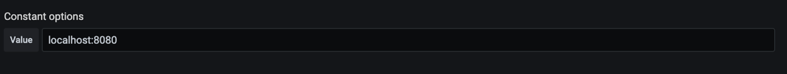
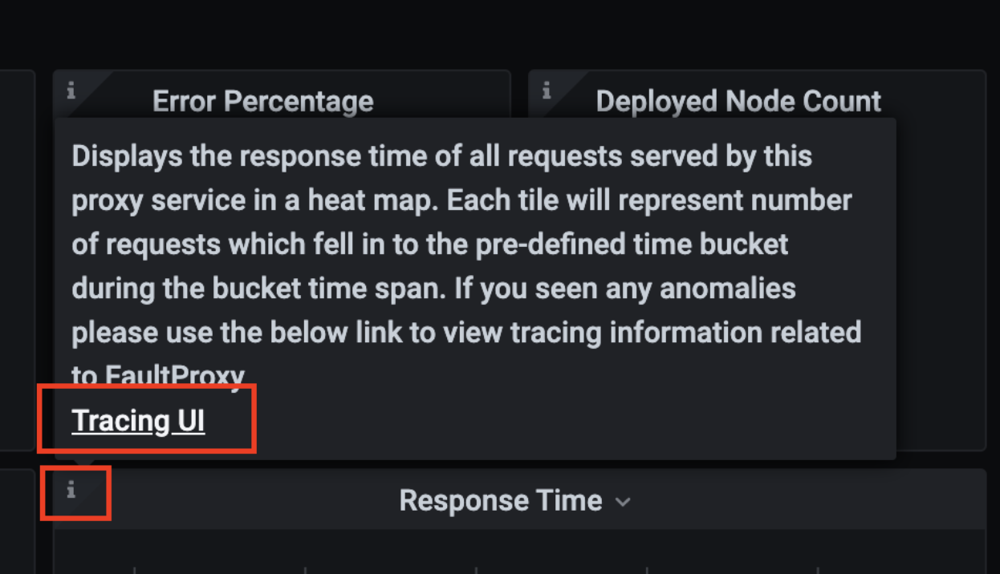

!!! note
    This section is still a work in progress and not tested.

# Setting up the cloud native observability deployment in a Kubernetes environment

To streamline the deployment of the cloud native observability solution in Kubernetes, WSO2 EI provides a Helm chart that you can utilize to deploy the solution to your Kubernetes cluster. The deployment installs the relevant products and adds the required configurations. After the installation, you can directly use the observability solution with a very few additional configurations. 

## Setting up the basic cloud native observability solution

The basic observability stack allows you to view metrics by installing and configuring Prometheus and Grafana. To install it, follow the steps below:

!!! info
    Do not follow the steps below if you want to install the solution with log processing and/or tracing capabilities. To install the solution including those capabilities, click on the appropriate link given below.  <br/><br/>
    - **Log processing**: <INSERT_LINK> <br/><br/>
    - **Tracing**: <INSERT_LINK> <br/><br/>
    - **Log processing and Tracing** <INSERT_LINK> <br/><br/>
    
!!! tip "Before you begin:"
    - Set up a Kubernetes cluster. For instructions, see [Kubernetes Documentation](https://kubernetes.io/docs/home/).
    - Install Helm in the client machine.
    
1. Clone the [Helm repository](https://github.com/wso2/observability-ei).

2. Navigate to the home directory of the cloned repository.

3. To install the basic deployment with the `wso2-observability` release name, issue the following command.

    `helm install wso2-observability . --render-subchart-notes`
    
4. Make changes to the default settings of the chart if required. For information about configurable parameters, see [Enterprise Integrator Observability - Configuration](https://github.com/wso2/observability-ei#configuration).
    
The above step deploys the basic deployment and displays instructions to access the dashboards. This deployment allows you to access both Prometheus and Grafana UIs, and provides you with ability to view and analyze metrics.

### Configuring WSO2 EI to integrate with the observability deployment

To integrate with the observability deployment you are required to perform the following three main tasks in the EI containers:

- **Engaging the statistics publishing handler**

    To achieve this, add the following lines in the `<PATH>/deployment.toml`file in the Kubernetes project *before* creating your micro integrator image.
    
    ```
    [[synapse_handlers]]
    name="MetricHandler"
    class="org.wso2.micro.integrator.observability.metric.handler.MetricHandler"
    ``` 
    
    For more information about the Micro Integrator Kubernetes development flow, see [MI kubernetes guide]<LINK>.

- **Enabling the metrics endpoint**

    To achieve this, you need to set an environment variable in the Kubernetes resource definition. You can either add that at the time of creating the project using the wizard. Alternatively, you can open the <PATH>/integration_cr.yaml file in the Kubernetes project and add the following under the spec tag.
    
    ```
    env:
      - name: "JAVA_OPTS"
        value: "-DenablePrometheusApi=true"
    ```

- **Enabling discovery for Prometheus**

    This allows Prometheus to discover Micro Integrator targets through service discovery methods. To achieve this, set the following pod level annotations to the Micro Integrator pod.
    
    - `prometheus.io.wso2/path: /metric-service/metrics`
    - `prometheus.io.wso2/port: "9201"`
    - `prometheus.io.wso2/scrape: "true"`
    
Once the above tasks are completed, the container that is being deployed through the integration Kubernetes resource emits metric data, and the Observability deployment can discover and start without further configuration.

## Setting up the observability solution with log processing capabilities

This deployment involves deploying Prometheus, Grafana, Loki and Fluent-bit Daemon set with all the required configurations to integrate deployed products. To install the deployment using Helm, follow the steps below:

!!! tip "Before you begin:"
    - Set up a Kubernetes cluster. For instructions, see [Kubernetes Documentation](https://kubernetes.io/docs/home/).
    - Install Helm in the client machine.
    
1. Clone the [Helm repository](https://github.com/wso2/observability-ei).

2. Navigate to the home directory of the cloned repository.

3. Open the `values.yaml` file and set the `enabled` parameter to `true` for Loki-stack as shown in the extract below.

    ```
    loki-stack:
     enabled: true
    ```
    
4. To install the observability deployment including log processing capabilities with the `wso2-observability` release name, issue the following command.

    `helm install wso2-observability . --render-subchart-notes`
    
5. Make changes to the default settings of the chart if required. For information about configurable parameters, see [Enterprise Integrator Observability - Configuration](https://github.com/wso2/observability-ei#configuration).

Above steps deploy the observability solution with log processing capabilities and display instructions to access the dashboards. With this deployment you can access Prometheus and Grafana UIs.     

### Configuring WSO2 EI to publish logs

To integrate with the observability deployment you are required to perform the following four main tasks in the EI containers:

- **Engaging the statistics publishing handler**

    To achieve this, add the following lines in the `<PATH>/deployment.toml`file in the Kubernetes project *before* creating your micro integrator image.
    
    ```
    [[synapse_handlers]]
    name="MetricHandler"
    class="org.wso2.micro.integrator.observability.metric.handler.MetricHandler"
    ``` 
    
    For more information about the Micro Integrator Kubernetes development flow, see [MI kubernetes guide]<LINK>.

- **Enabling the metrics endpoint**

    To achieve this, you need to set an environment variable in the Kubernetes resource definition. You can either add that at the time of creating the project using the wizard. Alternatively, you can open the <PATH>/integration_cr.yaml file in the Kubernetes project and add the following under the spec tag.
    
    ```
    env:
      - name: "JAVA_OPTS"
        value: "-DenablePrometheusApi=true"
    ```

- **Enabling discovery for Prometheus**

    This allows Prometheus to discover Micro Integrator targets through service discovery methods. To achieve this, set the following pod level annotations to the Micro Integrator pod.
    
    - `prometheus.io.wso2/path: /metric-service/metrics`
    - `prometheus.io.wso2/port: "9201"`
    - `prometheus.io.wso2/scrape: "true"`
    
- **Configuring EI pods to parse logs through Fluent-bit**

    To do this, set the following pod level annotation to the Micro Integrator pod.
    
    `fluentbit.io/parser: wso2`

## Setting up the observability solution with tracing capabilities

This involves deploying Prometheus, Grafana and Jaeger-operator with all the required configurations to integrate deployed products. To install the deployment using Helm, follow the steps below:

!!! tip "Before you begin:"
    - Set up a Kubernetes cluster. For instructions, see [Kubernetes Documentation](https://kubernetes.io/docs/home/).
    - Install Helm in the client machine.
    

1. Clone the [Helm repository](https://github.com/wso2/observability-ei).

2. Navigate to the home directory of the cloned repository.

3. Open the `values.yaml` file and set the `enabled` parameter to `true` for Jaeger as shown in the extract below.

    ```
    jaeger:
     enabled: true
    ```
    
4. To install the observability deployment including tracing capabilities with the `wso2-observability` release name, issue the following command.

    `helm install wso2-observability . --render-subchart-notes`
    
5. Make changes to the default settings of the chart if required. For information about configurable parameters, see [Enterprise Integrator Observability - Configuration](https://github.com/wso2/observability-ei#configuration).

The above steps deploy the observability solution with tracing capabilities and displays instructions to access the dashboards. With this deployment you are able to access Prometheus, Grafana and Jaeger UIs.

This deployment installs Jaeger-Operator. To install the Jaeger deployment, follow the steps in [Jaeger Operator documentation - Creating a new instance](https://github.com/jaegertracing/helm-charts/tree/master/charts/jaeger-operator#creating-a-new-jaeger-instance) and deploy the preferred Jaeger deployment.

### Configuring WSO2 EI to publish tracing information

To configure WSO2 EI to publish tracing information, add the following lines to the deployment.toml file in the Kubernetes project *before* creating your micro integrator container image.

```
[mediation]
flow.statistics.capture_all= true
stat.tracer.collect_payloads= true
stat.tracer.collect_mediation_properties= true

[opentracing]
enable = true
logs = true
manager_host = <Manager_hostname_here>
agent_host = <Agent_hostname_here>
```
    
!!! tip
    Enter the host name of your Jaeger service as the value for `manager_host` and `agent_host` parameters. 

These settings enable the tracing data instrumentation and publishing to a jaeger instance.

For more information about the Micro Integrator Kubernetes development flow, see [MI kubernetes guide]<LINK>.

### Configuring Grafana to visualize tracing information

The Helm chart configures the Jaeger data source automatically. Therefore, unlike in Setting up [Cloud Native Observability in a Virtual Machine](setting-up-minimum-basic-observability-deployment.md), it is not required to add it manually. However to configure the links into Jaeger UI from the service level dashboards, you need to perform the following steps:

1. Access Grafana via `localhost:3000` and sign in.

2. Navigate to the settings section of the service level dashboard by clicking the cog wheel icon in the top right corner.

3. Click **Variable**. This opens the following view.

    
    
4. Edit the JaegerHost variable and provide your Jaeger query component hostname and port in the `host:port` syntax as shown below.

    
    
5. Click **Save**

You need to perform the above steps for all the service level dashboards (i.e., Proxy Service dashboard, API Service Dashboard, and Inbound Endpoint dashboard).

Once Grafana is successfully configured to visualize statistics, you should be correctly redirected to the Jaeger UI from the Response Time widget of each service level dashboard as shown below.



## Setting up the observability solution with logging and tracing capabilities

To install the cloud native observability solution with logging and tracing capabilities in your Kubernetes cluster, follow the steps below:

!!! tip "Before you begin:"
    - Set up a Kubernetes cluster. For instructions, see [Kubernetes Documentation](https://kubernetes.io/docs/home/).
    - Install Helm in the client machine.

1. Clone the [Helm repository](https://github.com/wso2/observability-ei).

2. Navigate to the home directory of the cloned repository.

3. Open the `values.yaml` file and set the `enabled` parameter to `true` for both Loki-stack and Jaeger as shown in the extract below.

    ```
    loki-stack:
     enabled: true
    jaeger:
     enabled: true
    ```
    
4. To install the complete deployment with the `wso2-observability` release name, issue the following command.

    `helm install wso2-observability . --render-subchart-notes`
    
5. Make changes to the default settings of the chart if required. For information about configurable parameters, see [Enterprise Integrator Observability - Configuration](https://github.com/wso2/observability-ei#configuration).
    
The above step deploys the complete deployment and displays instructions to access the dashboards. This deployment allows you to access Prometheus, Grafana, and Jaeger UIs.


