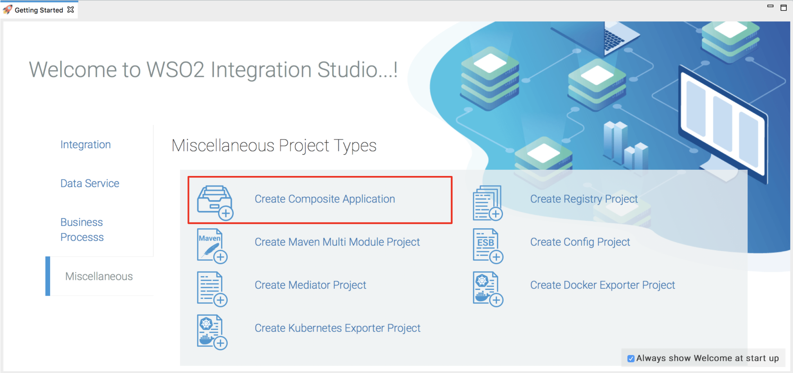

# Data Integration

## What you'll build

A **data service** provides a Web service interface to access data that is stored in relational databases, CSV files, Microsoft Excel sheets,
Google spreadsheets, and more. The following sections describe how you can use WSO2 Integration Studio to work with data services' artifacts. 

## Let's get started!

### Step 1: Set up the workspace

To set up the tools:

-  Go to the [product page](https://wso2.com/integration/) of **WSO2 Micro Integrator**, download the **product installer** and run it to set up the product.
-  Select the relevant [WSO2 Integration Studio](https://wso2.com/integration/tooling/) based on your operating system and extract the ZIP file.  The path to the extracted folder is referred to as `MI_TOOLING_HOME` throughout this tutorial.
-  Download the CLI Tool for monitoring artifact deployments.

To demonstrate how data services work, we will use a MySQL database as the datasource. Follow the steps given below to set up a MySQL database:

1.  Install the MySQL server.
2.  Download the JDBC driver for MySQL from [here](http://dev.mysql.com/downloads/connector/j/) and copy it to your `MI_TOOLING_HOME/Eclipse/runtime/microesb/lib` directory. 

    !!! Note
        If the driver class does not exist in the relevant folders when you create the datasource, you will get an exception such as `Cannot load JDBC driver class com.mysql.jdbc.Driver`.
    
3.  Create a database named `Employees`.

    ```bash
    CREATE DATABASE Employees;
    ```

4.  Create the Employee table inside the Employees database:

    ```bash
    USE Employees;
    CREATE TABLE Employees (EmployeeNumber int(11) NOT NULL, FirstName varchar(255) NOT NULL, LastName varchar(255) DEFAULT NULL, Email varchar(255) DEFAULT NULL, Salary varchar(255));
    ```

### Step 2: Creating a data service

Follow the steps given below to create a new data service.

#### Creating a data service project

All the data services' artifacts that you create should be stored in a
Data Service project. Follow the steps given below to create a project:

1.  Open **WSO2 Integration Studio,** and click **DS Project → Create
    New** in the **Getting Started** tab as shown below.  
    

2.  In the **New Data Service Project** dialog that opens, give a name
    for the project and click **Next**.
3.  If required, change the Maven information about the project.
4.  Click **Finish**. The new project will be listed in the project
    explorer.

#### Creating the datasource connection

Follow the steps given below to create the data service file:

1.  Select the already created **Data Service Project** in the project
    navigator, right click and go to **New -> Data Service**.  
    The **New Data Service** window will open as shown below.  
    
2.  To start creating a data service from scratch, select **Create New
    Data Service** and click **Next**.

3.  Enter a name for the data service:

    <table>
        <tr>
            <th>Property</th>
            <th>Description</th>
        </tr>
    <tbody>
    <tr class="odd">
    <td>Data Service Name</td>
    <td>RDBMSDataService</td>
    </tr>
    </tbody>
    </table>

4.  Click **Next** and start adding the datasource connection details
    given below.

    |       Property                     |       Description                     |
    |------------------------------------|---------------------------------------|
    | Datasource ID                      | Datasource                            |
    | Datasource Type                    | RDBMS                                 |
    | Datasource Type (Default/External) | Leave **Default** selected.           |
    | Database Engine                    | MySQL                                 |
    | Driver Class                       | com.mysql.jdbc.Driver                 |
    | URL                                | jdbc:mysql://localhost:3306/Employees |
    | User Name                          | root                                  |

5.  Save the data service.

A data service file (DBS file) will now be created in your data service
project. Shown below is the project directory.


#### Creating a query

Let's write an SQL query to GET data from the MySQL datasource that you
configured in the previous step:

1.  Select the data service you created in the previous step.
2.  Right-click and click **Add Query** .  
    
3.  Enter the following query details:

    | Parameter  |  Description       |
    |------------|--------------------|
    | Query ID   | GetEmployeeDetails |
    | Datasource | Datasource         |

4.  Save the query. The query element is now added to the data
    service:  
    
5.  Right-click the **GetEmployeeDetails** query and click **Add SQL**
    to add the following SQL statement:

    ```bash
    select EmployeeNumber, FirstName, LastName, Email from Employees where EmployeeNumber=:EmployeeNumber
    ```

6.  Save the SQL statement.
7.  Right-click the query again and click **Add Input Mapping** .

8.  Enter the following input mapping details:

    | Property       | Description    |
    |----------------|----------------|
    | Mapping Name   | EmployeeNumber |
    | Parameter Type | SCALAR         |
    | SQL Type       | STRING         |

9.  Save the input mapping.
10. Right-click the query again and click **Add Output Mapping**.
11. Enter the following value to group the output mapping:

    <table>
        <tr>
            <th>Property</th>
            <th>Description</th>
        </tr>
    <tr class="odd">
    <td>Grouped by Element</td>
    <td>Employees</td>
    </tr>
    </table>

12. Save the output mapping.

13. Right-click the output mapping and go to **Add Output Mapping → Add
    Element** to create an element.

14. Enter the following element details.

    <table>
    <tr>
            <th>Property</th>
            <th>Description</th>
        </tr>
    <tbody>
    <tr class="odd">
    <td>Datasource Type</td>
    <td>column</td>
    </tr>
    <tr class="even">
    <td>Output Field Name</td>
    <td>EmployeeNumber</td>
    </tr>
    <tr class="odd">
    <td>Datasource Column Name</td>
    <td>EmployeeNumber</td>
    </tr>
    <tr class="even">
    <td>Schema Type</td>
    <td>String</td>
    </tr>
    </tbody>
    </table>

15. Save the element.
16. Follow the same steps to create the following output elements:

    | Datasource Type | Output Field Name | Datasource Column Name | Schema Type |
    |-----------------|-------------------|------------------------|-------------|
    | column          | FirstName         | FirstName              | string      |
    | column          | LastName          | LastName               | string      |
    | column          | Email             | Email                  | string      |

17. Save the output elements.

The data service should now have the query element added as shown below.


#### Creating a resource to invoke the query

Now, let's create a REST resource that can be used to invoke the query.

1.  Right-click the data service and click **Add Resource**. Add the following resource details.

    <table>
    <tr>
            <th>Property</th>
            <th>Description</th>
        </tr>
    <tbody>
    <tr class="odd">
    <td>Resource Method</td>
    <td>GET</td>
    </tr>
    <tr class="even">
    <td>Resource Path</td>
    <td>Employee/{EmployeeNumber}</td>
    </tr>
    </tbody>
    </table>

2.  Expand the GET resource, and click the **GetEmployeeDetails (call-query)**. Connect the query to the resource by adding the following:

    <table>
    <tr>
            <th>Property</th>
            <th>Description</th>
        </tr>
    <tbody>
    <tr class="odd">
    <td>Query ID</td>
    <td>GetEmployeeDetails</td>
    </tr>
    </tbody>
    </table>

3.  Save the resource.

The data service should now have the resource added as shown below.


### Step 3: Package the artifacts

Create a new composite application project:

1.  Open the **Getting Started** view and click **Miscellaneous → Create New Composite Application**.  
     
2.  In the **New Composite Application Project** dialog that opens, select the data service file, and click **Finish**.  
    

Package the artifacts in your composite application project to be able to deploy the artifacts in the server.

1.  Open the `pom.xml` file in the composite application project POM editor.
2.  Ensure that your data service file is selected in the POM file.
3.  Save the project.

### Step 4: Build and run the artifacts

To test the artifacts, deploy the [packaged artifacts](#step-3-package-the-artifacts) in the embedded Micro Integrator:

1.  Right-click the composite application project and click **Export Project Artifacts and Run**.
2.  In the dialog that opens, select the composite application project that you want to deploy.  
4.  Click **Finish**. The artifacts will be deployed in the embedded Micro Integrator and the server will start. See the startup log in the **Console** tab. 

### Step 5: Testing the data service

Send a GET request to invoke the service. You can use **curl** as shown below.

```bash
curl -X GET http://localhost:8280/services/RDBMSDataService.HTTPEndpoint/Employee/3
```

You will receive the employee's details in the response.


<!--

## What you'll build

Let’s try a simple scenario where a patient makes an inquiry specifying
the doctor's specialization (category) to retrieve a list of doctors
that match the specialization. The required information is stored in an
H2 database. We will create a data service in WSO2 Micro Integrator,
which will expose the information in the database, thereby decoupling
the client and the database layer in the back end. The client will then
communicate with the data service hosted in the Micro Integrator to get the required
information instead of communicating directly with the back end.

**In this tutorial** , we will define a data service in the Micro Integrator to expose the back-end database. A client can then invoke the
data service to send messages to the database. If you want to use a
back-end service instead of a database, see the tutorial on [sending a simple message to a service](sending-a-simple-message-to-a-service) .


## Let's get started!

### Step 1: Set up the workspace

To set up the tools:

1.  Go to the product page of WSO2 Micro Integrator, download the product installer and run it to set up the product.
2.  Select the relevant WSO2 Integration Studio based on your operating system and extract the ZIP file. The path to this folder is referred to as `MI_TOOLING_HOME` throughout this tutorial.
3.  Download the CLI Tool for monitoring artifact deployments.

To create the H2 database instance:

Let's set up a back-end database for the healthcare service. We will create a database named `DATA_SERV_QSG` in the
`MI_HOME/samples/data-services/database` directory for this purpose.

1.  Download the `dataServiceSample.zip` file and extract it to a location on your computer. Let's call this location `<Dataservice_Home>` . This
    contains a DB script for updating the back-end database with the channeling information of the healthcare service.
2.  Open a terminal, navigate to the `<Dataservice_Home>` directory and execute the following command:

    !!! Tip
        When executing the below command, replace the `<PATH_TO_EI_HOME>` with the folder path of your WSO2 Micro Integrator distribution. For example, if your Micro Integrator distribution
        (i.e., `MI_HOME` ) is located in the `/Users/Documents/` directory, execute the
        following command:
        `ant -Ddshome=/Users/Documents/wso2ei-6.x.x`
    
        Also, you need to install [Apache Ant](https://ant.apache.org/) to
        execute this command.
    
        ```java
        ant -Ddshome=<PATH_TO_MI_HOME>
        ```

The database is now updated with information on all available doctors in the healthcare service.

### Step 2: Develop the integration artifacts

Follow the steps given below to start the Micro Integrator and create the data service.

1.  To start the Micro Integrator, open a terminal, navigate to the `MI_HOME/bin/` directory, and execute one of the following commands:

    ```bash tab='On Linux/MacOS/CentOS'
    sh micro-integrator.sh
    ```

    ```bash tab='On Windows'
    micro-integrator.bat
    ```

1.  In your Web browser, navigate to the ESB profile's management
    console using the following URL:
    `                     https://localhost:9443/carbon                    /         `
    .
2.  Log into the management console using the following credentials:
    -   Username: `            admin           `
    -   Password: `            admin           `

### Exposing a datasource through a data service

Now, let's start creating the data service using the management console.

1.  On the **Main** tab, click **Create** under **Data Service** .

2.  In the **Create Data Service** screen, enter
    `           DOCTORS_DataService          ` as the data service name,
    and click **Next** .

3.  Click **Add New Datasource** and enter the following details:

    | Field           | Value                                                                                      |
    |-----------------|--------------------------------------------------------------------------------------------|
    | DatasourceID    | `               default              `                                                     |
    | Datasourcetype  | Select **RDBMS** and **default** .                                                         |
    | Database Engine | `               H2              `                                                          |
    | Driver Class    | `               org.h2.Driver              `                                               |
    | URL             | `               jdbc:h2:file:./samples/data-services/database/DATA_SERV_QSG              ` |
    | User Name       | `               wso2ds              `                                                      |
    | Password        | `               wso2ds              `                                                      |

4.  Click **Save** and then click **Next** to start defining a query.

5.  Now, let's start writing a query to get data from the datasource.  
    First, you need to define a query to get the details of all the
    available doctors from the database.

    1.  Click **Add New Query** to open the **Add New Query** screen.
    2.  Enter the following values:  

        <table>
        <thead>
        <tr class="header">
        <th>Field</th>
        <th>Value</th>
        </tr>
        </thead>
        <tbody>
        <tr class="odd">
        <td><strong>Query ID</strong></td>
        <td><code>                 select_all_DOCTORS_query                </code></td>
        </tr>
        <tr class="even">
        <td><strong>Datasource</strong></td>
        <td><code>                 default                </code></td>
        </tr>
        <tr class="odd">
        <td><strong>SQL</strong></td>
        <td><div class="content-wrapper">
        <div class="code panel pdl" style="border-width: 1px;">
        <div class="codeContent panelContent pdl">
        <div class="sourceCode" id="cb1" data-syntaxhighlighter-params="brush: java; gutter: false; theme: Confluence" data-theme="Confluence" style="brush: java; gutter: false; theme: Confluence"><pre class="sourceCode java"><code class="sourceCode java"><span id="cb1-1"><a href="#cb1-1"></a>SELECT NAME, HOSPITAL, SPECIALITY, AVAILABILITY, CHARGE FROM PUBLIC.<span class="fu">DOCTORS</span></span></code></pre></div>
        </div>
        </div>
        </div></td>
        </tr>
        </tbody>
        </table>

    3.  Click ****Generate Response**** to automatically create mappings
        for the fields.

    4.  Under the **Result (Output Mapping)** section, change the values
        of the following fields.  

        |                        |                                                      |
        |------------------------|------------------------------------------------------|
        | **Grouped by element** | `                 DOCTORSCollection                ` |
        | **Row name**           | `                 DOCTOR                `            |

        The output mapping will be as shown below.  
        {width="800"
        height="338"}

                !!! info
        
                Output mapping specifies how the data that is fetched from your
                query will be shown in the response. Note that, by default, the
                output type is **XML** .
        

6.  Click **Save** .
7.  Now, let's create another query that can get the doctor information
    based on specialization.
    1.  Click **Add New Query** to open the **Add New Query** screen.
    2.  Enter the following values:

        <table>
        <thead>
        <tr class="header">
        <th>Field</th>
        <th>Value</th>
        </tr>
        </thead>
        <tbody>
        <tr class="odd">
        <td><strong>Query ID</strong></td>
        <td><code>                 select_DOCTORS_from_SPECIALITY_query                </code></td>
        </tr>
        <tr class="even">
        <td><strong>Datasource</strong></td>
        <td><code>                 default                </code></td>
        </tr>
        <tr class="odd">
        <td><strong>SQL</strong></td>
        <td><div class="content-wrapper">
        <div class="code panel pdl" style="border-width: 1px;">
        <div class="codeContent panelContent pdl">
        <div class="sourceCode" id="cb1" data-syntaxhighlighter-params="brush: java; gutter: false; theme: Confluence" data-theme="Confluence" style="brush: java; gutter: false; theme: Confluence"><pre class="sourceCode java"><code class="sourceCode java"><span id="cb1-1"><a href="#cb1-1"></a>SELECT NAME, HOSPITAL, SPECIALITY, AVAILABILITY, CHARGE FROM PUBLIC.<span class="fu">DOCTORS</span> WHERE SPECIALITY=?</span></code></pre></div>
        </div>
        </div>
        </div></td>
        </tr>
        </tbody>
        </table>

    3.  Click **Generate Input Mappings** and a new input mapping record
        will be created.

    4.  Edit the record and change the **Mapping Name** to SPECIALITY,
        and click **Save** . You will now have the following input
        mapping:  
        {width="842"
        height="109"}

                !!! info
        
                Input mappings allow you to add parameters to a query so that
                you can set the parameter value when executing the
                query. According to the above definition, you need to provide
                the SPECIALTY as an input in order to retrieve the data
                corresponding to the SPECIALTY.
        

    5.  Click **Main Configuration** , to go back to the main
        configuration after adding the input mapping.  

    6.  Click **Generate Response** to automatically create mappings for
        the fields.

    7.  Under the **Result (Output Mapping)** section, change the values
        of the following fields  

        |                        |                                               |
        |------------------------|-----------------------------------------------|
        | **Grouped by element** | `                 DOCTORList                ` |
        | **Row name**           | `                 DOCTOR                `     |

        The output mapping will be as shown below.  
        {width="800"
        height="363"}  

                !!! info
        
                Output mapping specifies how the data that is fetched from your
                query is shown in the response. Note that, by default, the
                output type is **XML** .
        

8.  Click **Save** and then click **Next** to open the **Operations**
    screen.  
    Since we are exposing the data as a REST resource, we do not need an
    operation. An operation is needed only if you are exposing the data
    as a SOAP operation.
9.  Click Next to open the **Resources** screen.
    1.  Click **Add New Resources** to open the **Add Resources**
        screen.  
        Let's first create a resource to invoke the
        `             select_all_DOCTORS_query            ` :  

        | Field               | Value                                                       |
        |---------------------|-------------------------------------------------------------|
        | **Resource Path**   | `                 /getAllDoctors                `           |
        | **Resource Method** | `                 GET                `                      |
        | **Query ID**        | `                 select_all_DOCTORS_query                ` |

    2.  Click **Save** to save the resource.

10. Now, let's create another resource to invoke the
    `          select_DOCTORS_from_SPECIALITY_query         ` .
    1.  Click **Add New Resources** to open the **Add Resources** screen
        and enter the following details:

        | Field               | Value                                                                   |
        |---------------------|-------------------------------------------------------------------------|
        | **Resource Path**   | `                 /getDoctors                `                          |
        | **Resource Method** | `                 GET                `                                  |
        | **Query ID**        | `                 select_DOCTORS_from_SPECIALITY_query                ` |

    2.  Click **Save** to save the resource.

11. Click **Finish** after you have defined the resources to complete
    the data service creation process. You are now taken to the
    **Deployed Services** screen, which shows all the data services
    deployed on the server including the one you created.  
    {width="1149"
    height="411"}  

### Sending requests to the ESB

Let's send a request to the data service, which is now deployed in the
ESB profile of WSO2 EI. You will need a REST client like curl for this.

1.  Open a command line terminal and enter the following request to get
    the information of all the doctors specializing under surgery.

    ``` java
        curl -v http://localhost:8280/services/DOCTORS_DataService/getDoctors?SPECIALITY=surgery
    ```

        !!! info
    
        You can use the specialties listed below in your request too:
    
        -   `             cardiology            `
    
        -   `             gynaecology            `
    
        -   `             ent            `
    
        -   `             paediatric            `
    

2.  You see the following response message from data service with a list
    of all available doctors and relevant details.

    ``` xml
        <DOCTORSLIST xmlns="http://ws.wso2.org/dataservice">
        <DOCTOR>
            <NAME>thomas collins</NAME>
            <HOSPITAL>grand oak community hospital</HOSPITAL>
            <SPECIALITY>surgery</SPECIALITY>
            <AVAILABILITY>9.00 a.m - 11.00 a.m</AVAILABILITY>
            <CHARGE>7000</CHARGE>
        </DOCTOR>
        <DOCTOR>
            <NAME>anne clement</NAME>
            <HOSPITAL>clemency medical center</HOSPITAL>
            <SPECIALITY>surgery</SPECIALITY>
            <AVAILABILITY>8.00 a.m - 10.00 a.m</AVAILABILITY>
            <CHARGE>12000</CHARGE>
        </DOCTOR>
        <DOCTOR>
            <NAME>seth mears</NAME>
            <HOSPITAL>pine valley community hospital</HOSPITAL>
            <SPECIALITY>surgery</SPECIALITY>
            <AVAILABILITY>3.00 p.m - 5.00 p.m</AVAILABILITY>
            <CHARGE>8000</CHARGE>
        </DOCTOR>
        </DOCTORSLIST>
    ```

-->
