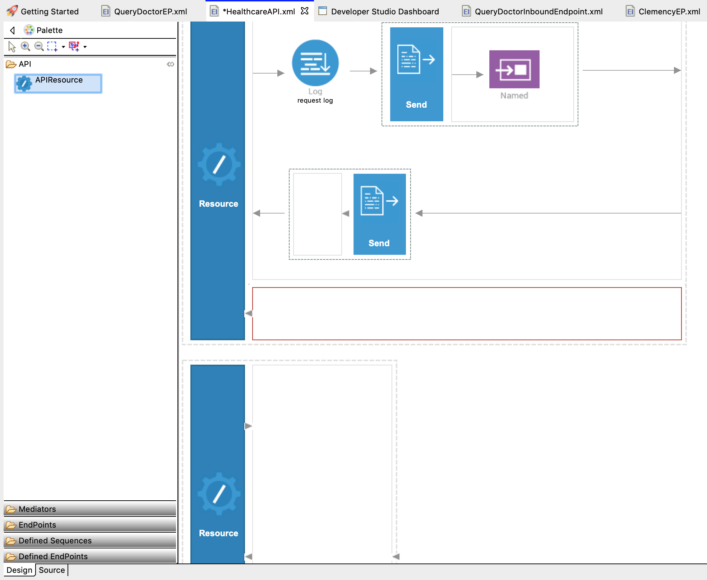
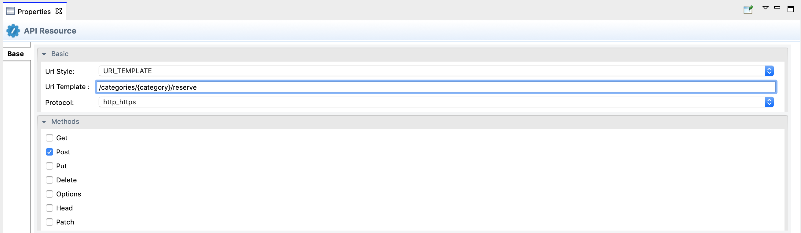
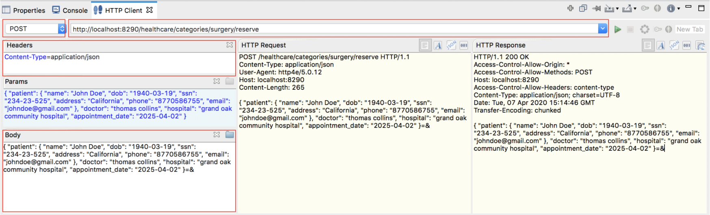

# Message Routing

## What you'll build

In the [Sending a Simple Message to a Service](sending-a-simple-message-to-a-service.md) tutorial, we routed a
simple message to a single endpoint in the back-end service. In this tutorial, we are building on the same sequence by creating the mediation artifacts that can route a message to the relevant endpoint depending on the content of the message payload.

When the client sends the appointment reservation request to the Micro Integrator, the message payload of the request contains the name of the hospital where the appointment needs to be confirmed. The HTTP request method that is used for this is POST. Based on the hospital name sent in the request message, the Micro Integrator should route the appointment reservation to the relevant hospital's back-end service.

To implement this use case, you will add a new REST resource to the existing REST API and define the new content-based mediation logic.

## Let's get started!

### Step 1: Set up the workspace

To set up the tools:

-  Download the relevant [WSO2 Integration Studio](https://wso2.com/integration/tooling/) based on your operating system.  The path to the extracted/installed folder is referred to as `MI_TOOLING_HOME` throughout this tutorial.
-  Download the [CLI Tool](https://wso2.com/integration/micro-integrator/install/) for monitoring artifact deployments.

If you did not try the [Sending a Simple Message to a Service](sending-a-simple-message-to-a-service.md) tutorial yet, open WSO2 Integration Studio, click **File**, and click **Import**. Next, expand the **WSO2** category and select **Existing WSO2 Projects into workspace**, click **Next** and upload the [pre-packaged
project](https://github.com/wso2-docs/WSO2_EI/blob/master/Integration-Tutorial-Artifacts/SimpleMessageToServiceTutorial.zip). 

### Step 2: Develop the integration artifacts

Follow the instructions given in this section to create and configure the required artifacts.

#### Create Endpoints

In this tutorial we have three hospital services hosted as the backend:

-   Grand Oak Community Hospital: `http://localhost:9090/grandoaks/`
-   Clemency Medical Center: `http://localhost:9090/clemency/`
-   Pine Valley Community Hospital: `http://localhost:9090/pinevalley/`

The request method is POST and the format of the request URL expected by the backend services is
`http://localhost:9090/grandoaks/categories/{category}/reserve`.

Let's create three different HTTP endpoints for the above services.

1.  Right-click **SampleServices** in the Project Explorer and navigate to **New -> Endpoint**. 
2.  Ensure **Create a New Endpoint** is selected and click **Next**.
3.  Enter the information given below to create the new endpoint.
    <table>
        <tr>
            <th>Property</th>
            <th>Value</th>
            <th>Description</th>
        </tr>
        <tr>
            <td>Endpoint Name </td>
            <td>
                <code>GrandOakEP</code>
            </td>
            <td>
                The name of the endpoint representing the Grand Oaks Hospital service.
            </td>
        </tr>
        <tr>
            <td>Endpoint Type </td>
            <td>
                <code>HTTP Endpoint</code>
            </td>
            <td>
                Indicates that the back-end service is HTTP.
            </td>
        </tr>
        <tr>
            <td>URI Template</td>
            <td>
                <code>http://localhost:9090/grandoaks/categories/{uri.var.category}/reserve</code>
            </td>
            <td>
                The template for the request URL expected by the back-end service.
            </td>
        </tr>
        <tr>
         <td>Static Endpoint</td>
         <td><br/>
         </td>
         <td>Select this option because we are going to use this endpoint only in this ESB Config project and will not reuse it in other projects.</br/></br/> <b>Note</b>: If you need to create a reusable endpoint, save it as a Dynamic Endpoint in either the Configuration or Governance Registry.</td>
      </tr>
      <tr>
         <td>Save Endpoint in</td>
         <td><code>               SampleServices              </code></td>
         <td>This is the ESB Config project we created in the last section</td>
      </tr>
    </table>

    

4.  Click **Finish**.
5.  Similarly, create the HTTP endpoints for the other two hospital services using the URI Templates given below:
    -   ClemencyEP: `http://localhost:9090/clemency/categories/{uri.var.category}/reserve`
    -   PineValleyEP: `http://localhost:9090/pinevalley/categories/{uri.var.category}/reserve`

You have now created the three endpoints for the hospital back-end services that will be used to make appointment reservations.

!!! Tip
    You can also create a single endpoint where the differentiation of the hospital name can be handled using a variable in the URI template. See the tutorial on [Exposing Several Services as a Single Service](exposing-several-services-as-a-single-service.md).

    Using three different endpoints is advantageous when the back-end services are very different from one another and/or when there is a requirement to configure error handling differently for each of them.

#### Add a REST resource

To implement the routing scenario, let's add a new API resource to the REST API we created in the [previous tutorial](sending-a-simple-message-to-a-service.md).

1.  Select **API Resource** in the API palette of the REST API and drag it to the canvas just below the previous API resource that was created.  

    

2.  Click the new API Resource to access the **Properties** tab and enter the following details:
    <table>
    <tr>
        <th>Property</th>
        <th>Description</th>
    </tr>
    <tr>
        <td>Url Style</td>
        <td>
            Click in the <b>Value</b> field, click the down arrow, and select <b>URI_TEMPLATE</b> from the list.
        </td>
    </tr>
    <tr>
        <td>URI-Template</td>
        <td>
            Enter <code>/categories/{category}/reserve</code>.
        </td>
    </tr>
    <tr>
        <td>Methods</td>
        <td>
            From the list of methods, select <b>POST</b>.
        </td>
    </tr>
    </table>

    

#### Define the mediation flow 

You can now start configuring the API resource.

1.  Drag a **Property** mediator from the **Mediators** palette to the In Sequence of the API resource and name it **Get Hospital**. This is used to extract the hospital name that is sent in the request payload. 
2.  With the **Property** mediator selected, access the **Properties** tab and give the following details:
    <table>
        <tr>
            <th>Property</th>
            <th>Description</th>
        </tr>
      <tr class="odd">
         <td>Property Name</td>
         <td>Enter <code>               New Property...              </code>.</td>
      </tr>
      <tr class="even">
         <td>New Property Name</td>
         <td>Enter <code>               Hospital              </code>.</td>
      </tr>
      <tr class="odd">
         <td>Property Action</td>
         <td>Enter <code>               set              </code>.</td>
      </tr>
      <tr class="even">
         <td>Property Scope</td>
         <td>Enter <code>               default              </code>.</td>
      </tr>
      <tr class="odd">
         <td>Value Type</td>
         <td>Enter <code>               EXPRESSION              </code>.</td>
      </tr>
      <tr class="even">
         <td>Value Expression</td>
         <td>
            <div class="content-wrapper">
               <p>Click <strong>Value</strong> field of Value Expression in the <strong>Property</strong> tab and add the following expression:<br />
                  <code>                 json-eval($.hospital)                </code>
               </p>
               <b>Note</b>:
               <p>This is the JSONPath expression that will extract the hospital from the request payload.</p>
            </div>
         </td>
      </tr>
    </table>

3.  Add a **Switch** mediator from the **Mediator** palette just after the Property Mediator.
4.  Right-click the Switch mediator you just added and select **Add/Remove Case** to add the number of cases you want to specify.  

     

    We hae three different hospital endpoints, which corresponds to three switch cases. Enter 3 for **Number of branches** and click **OK**.  

    

5.  With the Switch mediator selected, go to the **Properties** tab and give the following details:
    <table>
        <tr>
            <th>Property</th>
            <th>Description</th>
        </tr>
   <tr class="odd">With the Switch mediator selected
      <td><strong>Source XPath</strong></td>
      <td>
         <div class="content-wrapper">
            <p>The <strong>Source XPath</strong> field is where we specify the XPath expression, which obtains the value of Hospital that we stored in the Property mediator.</p>
            <p>Follow the steps given below to specify the expression:</p>
            <ol>
               <li>Click in the Textbox in front of the <strong>Source XPath</strong> property which will cause a pop up window to open.</li>
               <li>Select <strong>Expression</strong> from the dropdown list on top of the window.</li>
               <li>Enter <code>                  get-property('Hospital')                 </code> and overwrite the default expression.</li>
               <li>Click <strong>OK.</strong> <strong><br />
                  </strong>
               </li>
            </ol>
         </div>
      </td>
   </tr>
   <tr class="even">
      <td><strong>Case Branches</strong></td>
      <td>
         <div class="content-wrapper">
            <p>Follow the steps given below to add the case branches:</p>
            <ol>
               <li>Double click in the Textbox of each branch which will open up a window.</li>
               <li>
                  Change the RegExp values as follows:
                  <ul>
                     <li>Case 1: grand oak community hospital</li>
                     <li>Case 2:  clemency medical center</li>
                     <li>Case 3:  pine valley community hospital</li>
                  </ul>
               </li>
               <li>Click <strong>OK</strong> .</li>
            </ol>
         </div>
      </td>
   </tr>
    </table>

6.  Let's add a **Log** mediator to print a message indicating to which hospital the request message is being routed. Drag a Log mediator to the first Case box of the Switch mediator and name it **Grand Oak Log**.  
7.  With the Log mediator selected, access the **Properties** tab and give the following details:
    <table>
    <tr>
        <th>Property</th>
        <th>Value</th>
        <th>Description</th>
    </tr>
    <tr>
        <td>Log Category</td>
        <td>
           <code>INFO</code> 
        </td>
        <td>
            Indicates that the log contains an informational message.
        </td>
    </tr>
    <tr>
        <td>Log Level</td>
        <td>
            <code>CUSTOM</code>
        </td>
        <td>
            Only specified properties will be logged by this mediator.
        </td>
    </tr>
    <tr>
        <td>Log Separator</td>
        <td>(blank)</td>
        <td>
           Since there is only one property that is being logged, we do not require a separator, so this field can be left blank. 
        </td>
    </tr>
    <tr>
        <td>Properties</td>
        <td colspan="2">
            Follow the steps given below to extract the stock symbol from the request and print a welcome message in the log:
            <ul>
                <li>
                    Click the **Plus** icon that appears.
                </li>
                <li>
                    In the Log Property Configuration dialog add a property as follows:
                    <ol>
                        <li>
                        **Name** : `                    message                   `
                        </li>
                        <li> 
                            **Type** : `EXPRESSION`. (We select `EXPRESSION`
        because the required properties for the log message must be
        extracted from the request, which we can do using an XPath
        expression.)    </li>
                        <li>
            **Value/Expression** : Click the **browse (...)** icon in the
        **Value/Expression** field and enter
        `fn:concat('Routing to ', get-property('Hospital'))`.
                        </li>
                    </ol>
                <b>Note</b>: This XPath expression value gets the value stored in the Property mediator and concatenates the two strings to display the log message `Routing to <hospital name>`.
                </li>
                <li>
                    Click OK.
                </li>
            </ul>
        </td>
    </tr>
    </table>

8.  Add a **Send** mediator adjoining the Log mediator and add the **GrandOakEP endpoint** from **Defined Endpoints** palette to the empty box adjoining the Send mediator.  

    

9.  Add **Log mediators** in the other two **Case boxes** in the Switch mediator and then enter the same properties. Make sure to name the two Log mediators as follows:

    -   `Clemency Log`
    -   `Pine Valley Log`

10. Add **Send** mediators adjoining these log mediators and add the **ClemencyEP** and **PineValleyEP** endpoints respectively from the **Defined Endpoints** palette.

    !!! Info
        You have now configured the Switch mediator to log the `Routing to <Hospital Name>` message when a request is sent to this API resource. The request message will then be routed to the relevant hospital backend service based on the hospital that is sent in the request payload.

11. Add a **Log mediator** to the **Default** (the bottom box) of the Switch mediator and configure it the same way as the previous Log mediators.

    !!! Note
        Make sure to name this **Fault Log** and change its Value/Expression as follows:`fn:concat('Invalid hospital - ', get-property('Hospital'))`

    The default case of the Switch mediator handles the invalid hospital requests that are sent to the request payload. This logs the message `Invalid hospital - <Hospital Name>` " for requests that have the invalid hospital name.

12. Drag a **Respond mediator** next to the Log mediator you just added. This ensures that there is no further processing of the current message and returns the request message back to the client.  

13. Drag a **Send** mediator to the **Out sequence** of the API resource to send the response back to the client.

The In Sequence of the API resource configuration should now look like this:  


You have successfully created all the artifacts that are required for routing messages to a back-end service depending on the content in the request payload. 

### Step 3: Package the artifacts

Package the artifacts in your composite application project (SampleServicesCompositeApplication project) to be able to deploy the artifacts in the server.

1.  Open the `          pom.xml         ` file in the composite application project POM editor.
2.  Ensure that the following artifacts are selected in the POM file.

    -   `            HealthcareAPI           `
    -   `            ClemencyEP           `
    -   `            GrandOakEP           `
    -   `            PineValleyEP           `

3.  Save the project.

### Step 4: Build and run the artifacts

To test the artifacts, deploy the [packaged artifacts](#step-3-package-the-artifacts) in the embedded Micro Integrator:

1.  Right-click the composite application project and click **Export Project Artifacts and Run**.
2.  In the dialog that opens, select the composite application project that you want to deploy.  
4.  Click **Finish**. The artifacts will be deployed in the embedded Micro Integrator and the server will start. See the startup log in the **Console** tab. 

### Step 5: Test the use case

Let's test the use case by sending a simple client request that invokes the service.

#### Start the back-end service

1. Download the JAR file of the back-end service from [here](https://github.com/wso2-docs/WSO2_EI/blob/master/Back-End-Service/Hospital-Service-2.0.0-EI7.jar).
2. Open a terminal, navigate to the location where your saved the [back-end service](#step-1-set-up-the-workspace).
3. Execute the following command to start the service:

    ```bash
    java -jar Hospital-Service-2.0.0-EI7.jar
    ```

#### Send the client request

Let's use the **CLI Tool** to find the URL of the REST API that is deployed in the Micro Integrator:

1.  Open a terminal and navigate to the `CLI_HOME/bin` directory.
2.  Execute the following command to start the tool:
    `./mi`
3.  Execute the following command to find the APIs deployed in the server:
    `mi show api`

Let's send a request to the API resource to make a reservation.

1.  Create a JSON file names `           request.json          ` with
    the following request payload.

    ```json
    {
        "patient": {
        "name": "John Doe",
        "dob": "1940-03-19",
        "ssn": "234-23-525",
        "address": "California",
        "phone": "8770586755",
        "email": "johndoe@gmail.com"
        },
        "doctor": "thomas collins",
        "hospital": "grand oak community hospital",
        "appointment_date": "2025-04-02"
    }
    ```

    !!! Info
        You can also try using any of the following parameters in your
        request payload.

        For hospital:

        -   clemency medical center
        -   pine valley community hospital
    
        Doctor Names:
        
        -   thomas collins
        -   henry parker
        -   abner jones
        -   anne clement
        -   thomas kirk
        -   cailen cooper
        -   seth mears
        -   emeline fulton
        -   jared morris
        -   henry foster

2.  You can either use the terminal or the embedded HTTP Client in the bottom panel.

1.  To use the terminal, open a terminal, navigate to the directory where you have saved the `           request.json          ` file and execute the following command.

    ```json
    curl -v -X POST --data @request.json http://localhost:8290/healthcare/categories/surgery/reserve --header "Content-Type:application/json"
    ```

    !!! Info
        The URI-Template format that is used in this command was defined when creating the API resource:
        `http://<host>:<port>/categories/{category}/reserve`

2.  To use the HTTP Client, click on the HTTP Client Panel, set the following details, and click on the **Send** icon.

 <table>
    <tr>
        <th>Property</th>
        <th>Value</th>
    </tr>
    <tr>
        <td>Request Category</td>
        <td>
           <code>POST</code> 
        </td>
    </tr>
    <tr>
        <td>Headers</td>
        <td>
            <code>Content-Type=application/json</code>
        </td>
    </tr>
    <tr>
        <td>URL</td>
        <td>http://localhost:8290/healthcare/categories/surgery/reserve</td>
    </tr>
    <tr>
        <td>Body</td>
        <td>Set the above json here.</td>
    </tr>
 </table>
 
 

#### Analyze the response

You get the following response:

```json
{"appointmentNumber":1,
    "doctor":
         {"name":"thomas collins",
          "hospital":"grand oak community hospital",
          "category":"surgery","availability":"9.00 a.m - 11.00 a.m",
          "fee":7000.0},
    "patient":
        {"name":"John Doe",
         "dob":"1990-03-19",
         "ssn":"234-23-525",
         "address":"California",
         "phone":"8770586755",
         "email":"johndoe@gmail.com"},
    "fee":7000.0,
"confirmed":false,
"appointmentDate":"2025-04-02"}
```

Now check the **Console** tab of WSO2 Integration Studio and you will see the following message: `INFO - LogMediator message = Routing to grand oak community hospital`
    
This is the message printed by the Log mediator when the message from the client is routed to the relevant endpoint in the Switch mediator.

You have successfully completed this tutorial and have seen how the requests received by the Micro Integrator can be routed to the relevant endpoint using the Switch mediator.
