# Data Integration

## What you'll build

A **data service** provides a web service interface to access data that is stored in various datasources. The following sections describe how you can use WSO2 Integration Studio to work with data services' artifacts. 

!!! Tip
    Note that this feature is currently supported in WSO2 Integration Studio for relational datasources and CSV files.

## Let's get started!

### Step 1: Set up the workspace

To set up the tools:

-   Download the relevant [WSO2 Integration Studio](https://wso2.com/integration/tooling/) based on your operating system. The path to the extracted/installed folder is referred to as `MI_TOOLING_HOME` throughout this tutorial.

    !!! Tip
        If you do not see the features given below in the WSO2 Integrations Studio that you are using, you can [get the latest updates](../../../develop/installing-WSO2-Integration-Studio/#get-the-latest-updates).

-   Optionally, you can set up the **CLI tool** for artifact monitoring. This will later help you get details of the artifacts that you deploy in your Micro Integrator.

    1.  Go to the [WSO2 Micro Integrator website](https://wso2.com/integration/#). 
    2.  Click **Download -> Other Resources** and click **CLI Tooling** to download the tool. 
    3.  Extract the downloaded ZIP file. This will be your `MI_CLI_HOME` directory. 
    4.  Export the `MI_CLI_HOME/bin` directory path as an environment variable. This allows you to run the tool from any location on your computer using the `mi` command. Read more about the [CLI tool](../../../administer-and-observe/using-the-command-line-interface).

To demonstrate how data services work, we will use a MySQL database as the datasource. Follow the steps given below to set up a MySQL database:

1.  Install the MySQL server.
2.  Download the JDBC driver for MySQL from [here](http://dev.mysql.com/downloads/connector/j/) and copy it to the `lib` directory of the embedded Micro Integrator of WSO2 Integration Studio.
    
    !!! Note
        The `lib` directory of the embedded Micro Integrator of WSO2 Integration Studio is located in `MI_TOOLING_HOME/Contents/Eclipse/runtime/microesb/` (for MacOS/CentOS) or `MI_TOOLING_HOME/runtime/microesb/lib/` (for Windows/Linux). 

    If the driver class does not exist in the relevant directory when you create the datasource, you will get an exception such as `Cannot load JDBC driver class com.mysql.jdbc.Driver`.
    
3.  Create a database named `Employees`.

    ```bash
    CREATE DATABASE Employees;
    ```

4.  Create the `Employee` table inside the `Employees` database:

    ```bash
    USE Employees;
    CREATE TABLE Employees (EmployeeNumber int(11) NOT NULL, FirstName varchar(255) NOT NULL, LastName varchar(255) DEFAULT NULL, Email varchar(255) DEFAULT NULL, Salary varchar(255));
    INSERT INTO Employees (EmployeeNumber, FirstName, LastName, Email, Salary) values (3, "Edgar", "Code", "edgar@rdbms.com", 100000);
    ```

### Step 2: Creating a data service

Follow the steps given below to create a new data service.

#### Creating a data service project

All the data services' artifacts that you create should be stored in a
Data Service project. Follow the steps given below to create a project:

1.  Open **WSO2 Integration Studio** and click **Data Service → Create Data Service Project** in the **Getting Started** tab as shown below. 

    

2.  In the **New Data Service Project** wizard that opens, give a name
    for the project and click **Next**.
3.  Click **Finish**. The new project will be listed in the project
    explorer.

#### Creating the data service

Follow the steps given below to create the data service file:

1.  Select the already created **Data Service Project** in the project
    explorer, right-click and go to **New -> Data Service**.  

    

    The **New Data Service** window will open as shown below.  

    

2.  Select **Create New
    Data Service** and click **Next** to go to the next page.
3.  Enter a name for the data service and click **Finish**:

    

    <table>
        <tr>
            <th>Property</th>
            <th>Description</th>
        </tr>
    <tbody>
    <tr class="odd">
    <td>Data Service Name</td>
    <td>RDBMSDataService</td>
    </tr>
    </tbody>
    </table>
    
A data service file (DBS file) will now be created in your data service
project as shown below.


#### Creating the datasource connection

1.  Click **Data Sources** to expand the section.
    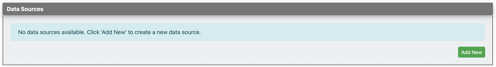
2.  Click **Add New** to open the **Create Datasource** page.
    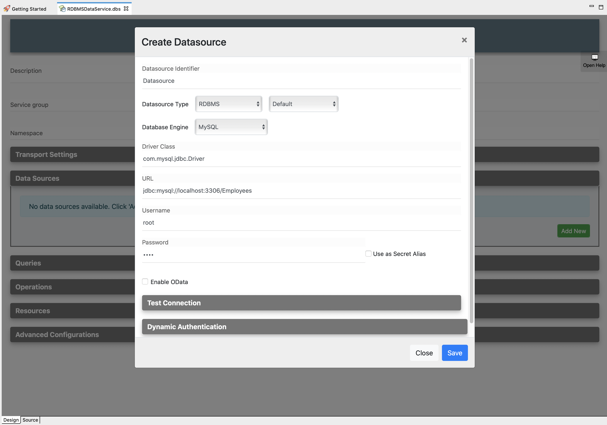
3.  Enter the datasource connection details given below.

    <table>
        <tr>
            <th>
                Parameter
            </th>
            <th>
                Description
            </th>
        </tr>
        <tr>
            <td>
                Datasource ID
            </td>
            <td>
                Enter <code>Datasource</code>.
            </td>
        </tr>
        <tr>
            <td>
               Datasource Type  
            </td>
            <td>
                Select <code>RDBMS</code> from the list.
            </td>
        </tr>
        <tr>
            <td>
               Datasource Type (Default/External) 
            </td>
            <td>
                Leave <code>Default</code> selected.
            </td>
        </tr>
        <tr>
            <td>
                Database Engine 
            </td>
            <td>
                Select <code>MySQL</code> from the list.
            </td>
        </tr>
        <tr>
            <td>
                Driver Class
            </td>
            <td>
                Enter <code>com.mysql.jdbc.Driver</code>.
            </td>
        </tr>
        <tr>
            <td>
                URL
            </td>
            <td>
                Enter <code>jdbc:mysql://localhost:3306/Employees</code>.
            </td>
        </tr>
        <tr>
            <td>
                User Name
            </td>
            <td>
               Enter <code>root</code>.
            </td>
        </tr>
    </table>

4.  Click **Test Connection** to expand the section.
    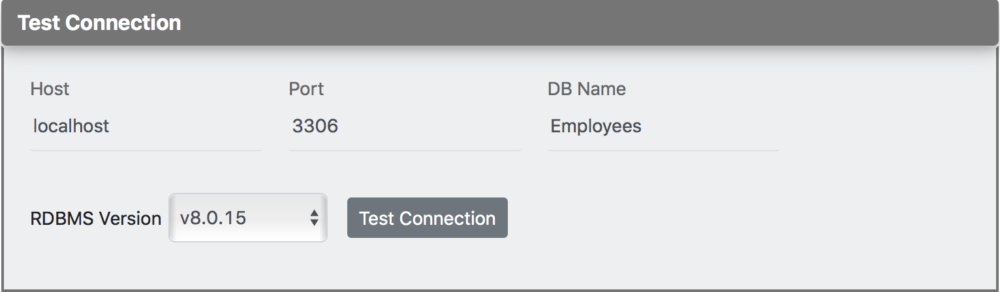

5.  Click the **Test Connection** button to verify the connectivity between the MySQL datasource and the data service.
6.  Save the datasource.

#### Creating a query

Let's write an SQL query to GET data from the MySQL datasource that you
configured in the previous step:

1.  Click **Queries** to expand the section. 
    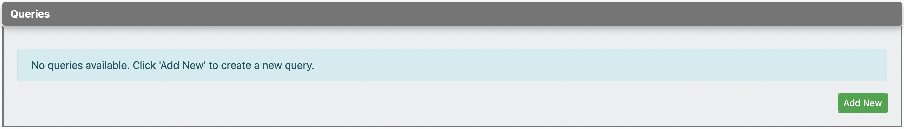
2.  Click **Add New** to open the **Add Query** page.
    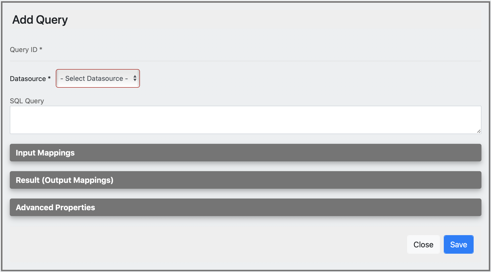
3.  Enter the following query details:

    <table>
        <tr>
            <th>
                Parameter
            </th>
            <th>
                Description
            </th>
        </tr>
        <tr>
            <td>
               Query ID 
            </td>
            <td>
                Enter <code>GetEmployeeDetails</code>.
            </td>
        </tr>
        <tr>
            <td>
                Datasource
            </td>
            <td>
                Select <code>Datasource</code> from the list.
            </td>
        </tr>
        <tr>
            <td>
                SQL Query
            </td>
            <td>
                Enter the following SQL statement:</br></br>
                <code>select EmployeeNumber, FirstName, LastName, Email from Employees where EmployeeNumber=:EmployeeNumber</code>
            </td>
        </tr>
    </table>

4.  Click **Input Mappings** to expand the section. 
    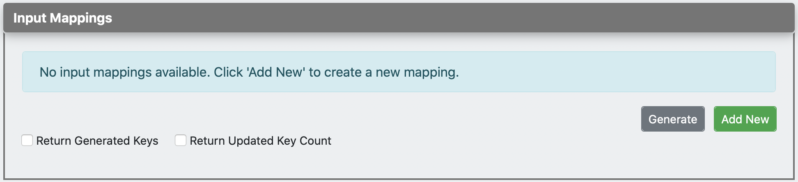
5.  Click **Add New** to open the **Add Input Mapping** page.
    
5.  Enter the following input mapping details:

    <table>
        <tr>
            <th>
                Parameter
            </th>
            <th>
                Description
            </th>
        </tr>
        <tr>
            <td>
                Mapping Name
            </td>
            <td>
                Enter <code>EmployeeNumber</code>.
            </td>
        </tr>
        <tr>
            <td>
                Parameter Type
            </td>
            <td>
                Select <code>SCALAR</code> from the list.
            </td>
        </tr>
        <tr>
            <td>
                SQL Type
            </td>
            <td>
                Select <code>STRING</code> from the list.
            </td>
        </tr>
    </table>

5.  Save the input mapping.
    
6.  Click **Result (Output Mappings)** to expand the section.
    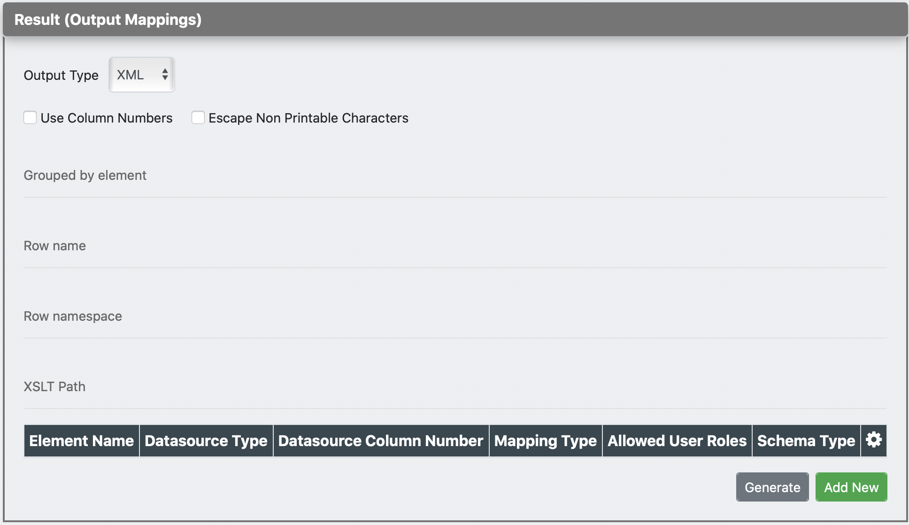
7.  Enter the following value to group the output mapping:

    <table>
        <tr>
            <th>Property</th>
            <th>Description</th>
        </tr>
        <tr class="odd">
            <td>Grouped by Element</td>
            <td>Employees</td>
        </tr>
    </table>

8.  Click **Generate** to generate output mappings automatically.

    !!! Tip

        Alternatively, you can manually add the mappings:

        1. Click **Add New** to open the **Add Output Mapping** page.
        2. Enter the following output element details.
            <table>
            <tr>
                    <th>Property</th>
                    <th>Description</th>
                </tr>
            <tbody>
            <tr class="odd">
            <td>Datasource Type</td>
            <td>column</td>
            </tr>
            <tr class="even">
            <td>Output Field Name</td>
            <td>EmployeeNumber</td>
            </tr>
            <tr class="odd">
            <td>Datasource Column Name</td>
            <td>EmployeeNumber</td>
            </tr>
            <tr class="even">
            <td>Schema Type</td>
            <td>String</td>
            </tr>
            </tbody>
            </table>   
        3.  Save the element.

9.  Follow the same steps to create the following output elements:

    | Datasource Type | Output Field Name | Datasource Column Name | Schema Type |
    |-----------------|-------------------|------------------------|-------------|
    | column          | FirstName         | FirstName              | string      |
    | column          | LastName          | LastName               | string      |
    | column          | Email             | Email                  | string      |
   
 
You will now have the following output elements created:

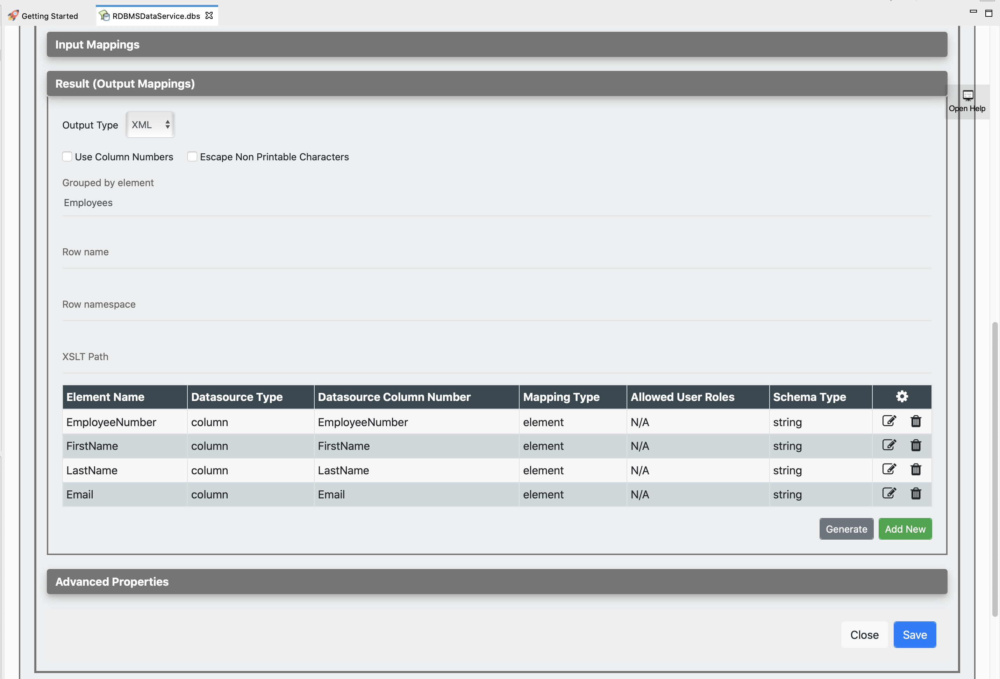

#### Creating a resource to invoke the query

Now, let's create a REST resource that can be used to invoke the query.

1.  Click **Resources** to expand the section. 
    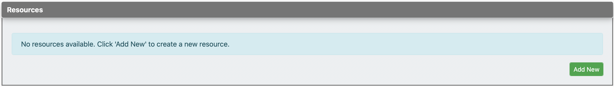
2.  Click **Add New** to open the **Create Resource** page.
    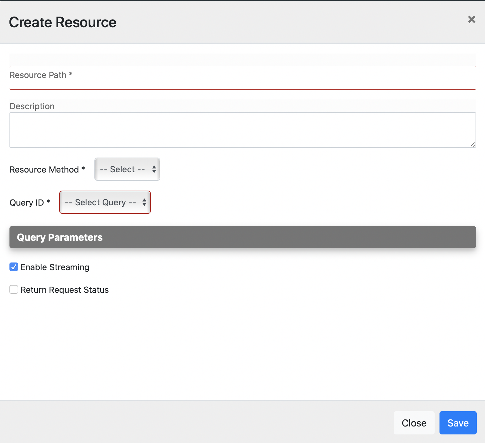
3.  Enter the following resource details.

    <table>
    <tr>
            <th>Property</th>
            <th>Description</th>
        </tr>
    <tbody>
    <tr class="odd">
    <td>Resource Path</td>
    <td>Employee/{EmployeeNumber}</td>
    </tr>
    <tr class="even">
    <td>Resource Method</td>
    <td>GET</td>
    </tr>
    <tr class="odd">
    <td>Query ID</td>
    <td>GetEmployeeDetails</td>
    </tr>
    </tbody>
    </table>
       
4.  Save the resource.

### Step 3: Package the artifacts

Create a new composite application project:

1.  Open the **Getting Started** view and click **Miscellaneous → Create New Composite Application**.  
     
2.  In the **New Composite Application Project** wizard that opens, select the data service file, and click **Finish**.  
    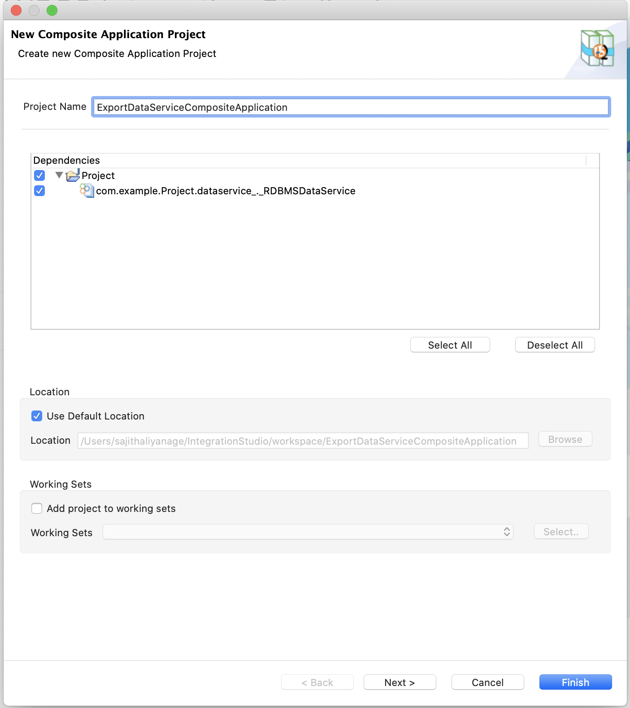

Package the artifacts in your composite application project to be able to deploy the artifacts in the server.

1.  Open the `pom.xml` file in the composite application project POM editor.
2.  Ensure that your data service file is selected in the POM file.
3.  Save the project.

### Step 4: Build and run the artifacts

To test the artifacts, deploy the [packaged artifacts](#step-3-package-the-artifacts) in the embedded Micro Integrator:

1.  Right-click the composite application project and click **Export Project Artifacts and Run**.
2.  In the dialog box that opens, select the composite application project that you want to deploy.  
4.  Click **Finish**. The artifacts will be deployed in the embedded Micro Integrator and the server will start. See the startup log in the **Console** tab. 

### Step 5: Testing the data service

Let's test the use case by sending a simple client request that invokes the service.

#### Get details of deployed artifacts (Optional)

Let's use the **CLI Tool** to find the URL of the data service (that is deployed in the Micro Integrator) to which you send a request. 

!!! Tip
    Be sure to set up the CLI tool for your work environment as explained in the [first step](#step-1-set-up-the-workspace) of this tutorial.

1.  Open a terminal and execute the following command to start the tool:
    ```bash
    mi
    ```
    
2.  Log in to the CLI tool. Let's use the server administrator user name and password:
    ```bash
    mi remote login admin admin
    ```

    You will receive the following message: *Login successful for remote: default!*

3.  Execute the following command to find the data services deployed in the server:
    ```bash
    mi dataservice show
    ```

Read more about [using the CLI tool](../../../administer-and-observe/using-the-command-line-interface).

#### Send the client request

Let's send a request to the API resource to make a reservation. You can use the embedded <b>HTTP Client</b> of WSO2 Integration Studio as follows:

1. Open the <b>HTTP Client</b> of WSO2 Integration Studio.

    !!! Tip
        If you don't see the <b>HTTP Client</b> tab, go to <b>Window -> Show View - Other</b> and select <b>HTTP Client</b> to enable the tab.

    

2. Enter the request information as given below and click the <b>Send</b> icon ().
    
    <table>
        <tr>
            <th>Method</th>
            <td>
               <code>GET</code> 
            </td>
        </tr>
        <tr>
            <th>URL</th>
            <td><code>http://localhost:8290/services/RDBMSDataService.HTTPEndpoint/Employee/3</code></br></br>
            </td>
        </tr>
     </table>
     
     
     
If you want to send the client request from your terminal:

1. Install and set up [cURL](https://curl.haxx.se/) as your REST client.
2. Execute the following command.
    ```bash
    curl -X GET http://localhost:8290/services/RDBMSDataService.HTTPEndpoint/Employee/3
    ```

#### Analyze the response

You will see the following response received to your <b>HTTP Client</b>:

```xml
<Employees xmlns="http://ws.wso2.org/dataservice">
  <EmployeeNumber>3</EmployeeNumber>
  <FirstName>Edgar</FirstName>
  <LastName>Code</LastName>
  <Email>edgar@rdbms.com</Email>
</Employees>
```
