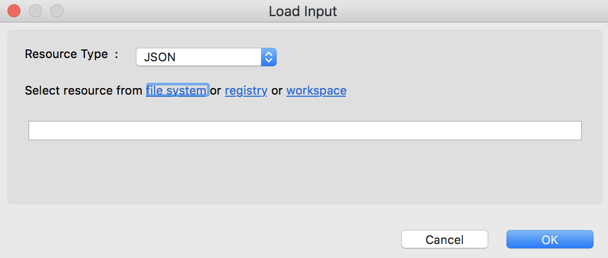
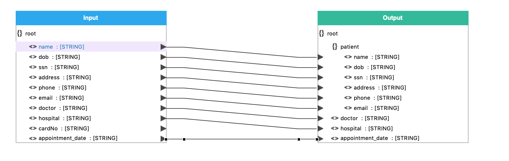
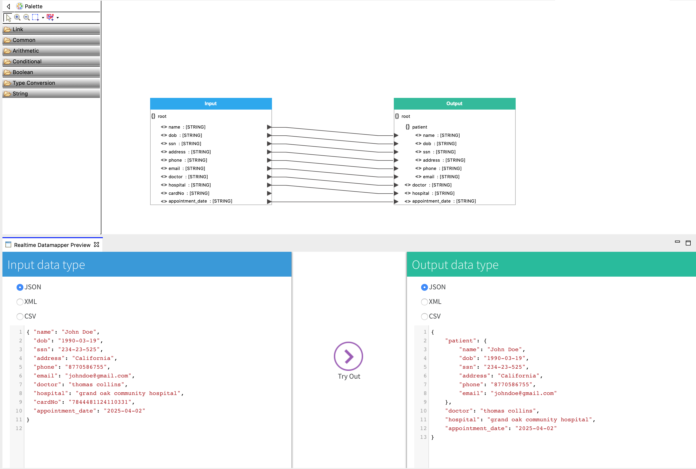

# Message Transformation

## What you'll build

Message transformation is necessary when the message format sent by the client is different from the message format expected by the back-end service. The **Message Translator** architectural pattern in WSO2 Micro Integrator describes how to translate from one data format to another.

**In this tutorial**, you send a request message to a back-end service where the format of the request payload is different to what is expected by the back-end service. The **Data Mapper** mediator is used to transform the request message payload to the format expected by the back-end service.

Let’s assume this is the format of the request sent by the client:

```json
{
  "name": "John Doe",
  "dob": "1940-03-19",
  "ssn": "234-23-525",
  "address": "California",
  "phone": "8770586755",
  "email": "johndoe@gmail.com",
  "doctor": "thomas collins",
  "hospital": "grand oak community hospital",
  "cardNo": "7844481124110331",
  "appointment_date": "2017-04-02"
}
```

However, the format of the message compatible with the backend service is as follows:

```json
{
  "patient": {
    "name": "John Doe",
    "dob": "1990-03-19",
    "ssn": "234-23-525",
    "address": "California",
    "phone": "8770586755",
    "email": "johndoe@gmail.com"
    "cardNo": "7844481124110331"
    },
  "doctor": "thomas collins",
  "hospital": "grand oak community hospital"
  "appointment_date": "2017-04-02"
}
```

The client message format must be transformed to the back-end service message format within the In sequence.

## Let's get started!

### Step 1: Set up the workspace

To set up the tools:

-  Download the relevant [WSO2 Integration Studio](https://wso2.com/integration/tooling/) based on your operating system. The path to the extracted/installed folder is referred to as `MI_TOOLING_HOME` throughout this tutorial.
-  Download the [CLI Tool](https://wso2.com/integration/micro-integrator/install/) for monitoring artifact deployments.

If you did not try the [Routing Requests Based on Message Content](routing-requests-based-on-message-content.md) tutorial yet, open WSO2 Integration Studio, click **File**, and then click **Import**. Next, select **Existing WSO2 Projects into workspace** under the **WSO2** category, click **Next** and upload the [pre-packaged project](https://github.com/wso2-docs/WSO2_EI/blob/master/Integration-Tutorial-Artifacts/RequestRoutingTutorial.zip).

### Step 2: Develop the integration artifacts

Let's update the API resource that was used in the [previous tutorial](routing-requests-based-on-message-content.md) by adding a **Data Mapper** mediator to configure the data transforrmation logic.

1.  In WSO2 Integration Studio, add a **Data Mapper** mediator just after
    the Property mediator in the In Sequence of the API resource.

    

2.  Double-click the Data Mapper mediator icon and specify the following details:
    <table>
      <tr>
        <th>Property</th>
        <th>Description</th>
      </tr>
      <tr>
        <td>Configuration Name</td>
        <td>Enter <code>RequestMapping</code> as the name.</td>
      </tr>
      <tr>
        <td>Save in project</td>
        <td>Specify the <b>Registry Resource project</b> where the data mapper configuration should be saved. The <b>SampleServicesRegistry</b> project is created at the time of creating the ESB Solution project and will selected by default.
      </td>
      </tr>
    </table>

    

    Click **OK**. You view the data mapping editor.  
    

3.  Create a JSON file (e.g., `input.json`) by copying the following sample content of the request message sent to the API resource and save it in your local file system.

    ```json
    { "name": "John Doe",
      "dob": "1990-03-19",
      "ssn": "234-23-525",
      "address": "California",
      "phone": "8770586755",
      "email": "johndoe@gmail.com",
      "doctor": "thomas collins",
      "hospital": "grand oak community hospital",
      "cardNo": "7844481124110331",
      "appointment_date": "2025-04-02"
    }
    ```

    !!! Info
        You can create a JSON schema manually for input and output using the Data Mapper Diagram editor.

4.  Right-click on the top title bar of the **Input** box and click **Load Input** as shown below.

    

5.  Select **JSON** as the **Resource Type** as shown below.

    

6.  Click the **file system** link in **Select resource from**, select the JSON file (i.e., `input.json` ) you saved in your local file system, and click **Open**. You can view the input format loaded in the **Input** box of the editor as shown below.

    

7.  Create another JSON file (e.g., `output.json`) by copying the following sample content of the request message expected by the back-end service and save it in your local file system.

    ```json
    {
      "patient": {
        "name": "John Doe",
        "dob": "1990-03-19",
        "ssn": "234-23-525",
        "address": "California",
        "phone": "8770586755",
        "email": "johndoe@gmail.com"
      },
      "doctor": "thomas collins",
      "hospital": "grand oak community hospital",
      "appointment_date": "2025-04-02"
    }
    ```

8.  Right-click on the top title bar of the **Output** box and click **Load Output** as shown below.  
    
9.  Select **JSON** as the resource type.
10. Click the **file system** link in **Select resource from**, select the JSON file you saved in your local file system, and click **Open**. You can view the input format loaded in the **Output** box in the editor as shown below.  
    

    !!! Info
        Check the **Input** and **Output** boxes with the sample messages to see if the element types (i.e. Arrays, Objects and Primitive values) are correctly identified. The following symbols will help you to identify them correctly.
    
        -  {} : represents object elements
        -  [] : represents array elements
        -  <> : represents primitive field values
        -  A : represents XML attribute value

11. Now there are 2 options to do the mapping; Using the AI Data mapper to perform the mapping automatically or you can draw the mappings manually. The final mapping is as follows:
    
1. For automatic option, click on the **Apply** button in the AI Mapping generation bar. You can also change the mapping manually afterwards.
    
2. For manual option, do the mapping by dragging arrows from field values in the input box to the relevant field values in the output box.  

12. Save and close the configuration.
13. Go back to the **Design View** of the API Resource and select the **Data Mapper** mediator and edit the following in the **Properties** tab:
    <table>
      <tr>
        <th>Property</th>
        <th>Description</th>
      </tr>
      <tr>
        <td>Input Type</td>
        <td>
          Select <b>JSON</b>.
        </td>
      </tr>
      <tr>
        <td>Output Type</td>
        <td>
          Select <b>JSON</b>.
        </td>
      </tr>
    </table>
    
    

14. Save the REST API configuration.

    

You have successfully created all the artifacts that are required for this use case. 

### Step 3: Package the artifacts

Package the artifacts in your composite application project (SampleServicesCompositeApplication project) and the registry resource project (SampleRegistryResource project) to be able to deploy the artifacts in the server.

1.  Open the `          pom.xml         ` file in the composite application project POM editor.
2.  Ensure that the following projects and artifacts are selected in the POM file.

    -   SampleServicesCompositeApplicationProject
        -   `HealthcareAPI`
        -   `ClemencyEP`
        -   `GrandOakEP`
        -   `PineValleyEP`
    -   SampleServicesRegistryProject

3.  Save the project.

### Step 4: Build and run the artifacts

To test the artifacts, deploy the [packaged artifacts](#step-3-package-the-artifacts) in the embedded Micro Integrator:

1.  Right-click the composite application project and click **Export Project Artifacts and Run**.
2.  In the dialog that opens, select the composite application project that you want to deploy.  
4.  Click **Finish**. The artifacts will be deployed in the embedded Micro Integrator and the server will start. See the startup log in the **Console** tab. 

### Step 5: Test the use case

Let's test the use case by sending a simple client request that invokes the service.

#### Start the backend service

1. Download the JAR file of the back-end service from [here](https://github.com/wso2-docs/WSO2_EI/blob/master/Back-End-Service/Hospital-Service-2.0.0-EI7.jar).
2. Open a terminal, navigate to the location where your saved the [back-end service](#step-1-set-up-the-workspace).
3. Execute the following command to start the service:

    ```
    java -jar Hospital-Service-2.0.0-EI7.jar
    ```

#### Send the client request

Let's use the **CLI Tool** to find the URL of the REST API that is deployed in the Micro Integrator:

1.  Open a terminal and navigate to the `CLI_HOME/bin` directory.
2.  Execute the following command to start the tool:
    `./mi`
3.  Execute the following command to find the APIs deployed in the server:
    `mi api show`

Let's send a request to the API resource.

1.  Create a JSON file names `           request.json          ` with the following request payload.

    ```json
    {
      "name": "John Doe",
      "dob": "1990-03-19",
      "ssn": "234-23-525",
      "address": "California",
      "phone": "8770586755",
      "email": "johndoe@gmail.com",
      "doctor": "thomas collins",
      "hospital": "grand oak community hospital",
      "cardNo": "7844481124110331",
      "appointment_date": "2025-04-02"
    }
    ```

2.  Open a command line terminal and execute the following command from the location where `request.json` file you created is saved: 

    ```bash
    curl -v -X POST --data @request.json http://localhost:8290/healthcare/categories/surgery/reserve --header "Content-Type:application/json"
    ```

    !!! Info
        This is derived from the **URI-Template** defined when creating the API resource: `http://<host>:<port>/categories/{category}/reserve`
    
#### Analyze the response

You will see the response as follows:

```json
{"appointmentNumber":1,
    "doctor":
          {"name":"thomas collins",
           "hospital":"grand oak community hospital",
           "category":"surgery","availability":"9.00 a.m - 11.00 a.m",
                "fee":7000.0},
    "patient":
      {"name":"John Doe",
       "dob":"1990-03-19",
       "ssn":"234-23-525",
       "address":"California",
       "phone":"8770586755",
       "email":"johndoe@gmail.com"},
  "fee":7000.0,
  "confirmed":false,
  "appointmentDate":"2025-04-02"
}
```

You have now explored how the Micro Integrator can receive a message in one format and transform it into the format expected by the back-end service using the Data Mapper mediator.
