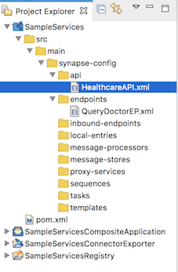

# Using Inbound Endpoints

## What you'll build

In this sample scenario, you will use an **Inbound Endpoint** to expose an already defined REST API through a different port. You can reuse the REST API that was defined in the [Sending a Simple Message to a Service](../sending-a-simple-message-to-a-service) tutorial. See [Creating an Inbound Endpoint](../../develop/creating-artifacts/creating-an-inbound-endpoint.md) for details on how to work with inbound endpoints using WSO2 Integration Studio.

## Let's get started!

### Step 1: Set up the workspace

Set up WSO2 Integration Studio as follows:

1.  Download the relevant [WSO2 Integration Studio](https://wso2.com/integration/tooling/) based on your operating system. The path to the extracted/installed folder is referred to as `MI_TOOLING_HOME` throughout this tutorial.
2.  If you did not try the [Sending a Simple Message to a Service](../sending-a-simple-message-to-a-service) tutorial yet:

    1.  Open WSO2 Integration Studio and go to **File -> Import**. 
    2.  Select **Existing WSO2 Projects into workspace** under the **WSO2** category, click **Next**, and then upload the [pre-packaged
project](https://github.com/wso2-docs/WSO2_EI/blob/master/Integration-Tutorial-Artifacts/SimpleMessageToServiceTutorial.zip).

Optionally, you can set up the **CLI tool** for artifact monitoring. This will later help you get details of the artifacts that you deploy in your Micro Integrator.

1.  Go to the [WSO2 Micro Integrator website](https://wso2.com/integration/#). 
2.  Click **Download -> Other Resources** and click **CLI Tooling** to download the tool. 
3.  Extract the downloaded ZIP file. This will be your `MI_CLI_HOME` directory. 
4.  Export the `MI_CLI_HOME/bin` directory path as an environment variable. This allows you to run the tool from any location on your computer using the `mi` command. Read more about the [CLI tool](../../../administer-and-observe/using-the-command-line-interface).

### Step 2: Develop the Inbound Endpoint

1.  Once you have exported the ESB project as described in above, the
    project directory will appear with the artifacts as shown below.
    Note the 'HealthcareAPI' that is already included.

    

2.  Right-click on **SampleServices** and navigate to **New -> Inbound
    Endpoint**. Select **Create A New Inbound Endpoint** and click
    **Next**.

3.  Enter the following details and click **Finish**.
    
    <table>
        <tr>
            <th>Parameter</th>
            <th>Description</th>
        </tr>
        <tr>
            <td>Inbound Endpoint Name</td>
            <td>
                QueryDoctorInboundEndpoint
            </td>
        </tr>
        <tr>
            <td>Inbound Endpoint Creation Type</td>
            <td>
                HTTP 
            </td>
        </tr>
    </table>

    

4.  Go to the **Properties** tab in the **Design** view and enter the following:

    <table>
        <tr>
            <th>Parameter</th>
            <th>Description</th>
        </tr>
        <tr>
            <td>Inbound HTTP port</td>
            <td>
                8285
            </td>
        </tr>
        <tr>
            <td>Dispatch Filter Pattern</td>
            <td>
                /healthcare/querydoctor/.\*
            </td>
        </tr>
    </table>

    

The endpoint will now get mapped to any URL that matches the above pattern provided. You will be exposing the health care API on a new port
through this inbound endpoint.

### Step 3: Package the artifacts

Package the artifacts in your composite application project (SampleServicesCompositeApplication project) to be able to deploy the artifacts in the server.

1.  Open the `pom.xml` file in the composite application project POM editor.
2.  Ensure that the following artifacts are selected in the POM file.

    -   `HealthcareAPI`
    -   `QueryDoctorInboundEndpoint`

3.  Save the project.

### Step 4: Build and run the artifacts

To test the artifacts, deploy the [packaged artifacts](#step-3-package-the-artifacts) in the embedded Micro Integrator:

1.  Right-click the composite application project and click **Export Project Artifacts and Run**.
2.  In the dialog that opens, select the composite application project that you want to deploy.  
4.  Click **Finish**. The artifacts will be deployed in the embedded Micro Integrator and the server will start. See the startup log in the **Console** tab. 

### Step 5: Test the use case

Let's test the use case by sending a simple client request that invokes the service.

#### Start the backend service

1. Download the JAR file of the back-end service from [here](https://github.com/wso2-docs/WSO2_EI/blob/master/Back-End-Service/Hospital-Service-2.0.0-EI7.jar).
2. Open a terminal, navigate to the location where your saved the [back-end service](#step-1-set-up-the-workspace).
3. Execute the following command to start the service:

    ```bash
    java -jar Hospital-Service-2.0.0-EI7.jar
    ```

#### Get details of deployed artifacts (Optional)

Let's use the **CLI Tool** to find details of the inbound endpoint and REST API. 

!!! Tip
    Be sure to set up the CLI tool for your work environment as explained in the [first step](#step-1-set-up-the-workspace) of this tutorial.

1.  Open a terminal and execute the following command to start the tool:
    ```bash
    mi
    ```
    
2.  Log in to the CLI tool. Let's use the server administrator user name and password:
    ```bash
    mi remote login admin admin
    ```

    You will receive the following message: *Login successful for remote: default!*

3.  Execute the following commands:

    -   To find the Inbound Endpoint artifacts deployed in the server:
        ```bash
        mi inboundendpoint show
        ```

        You will receive the following information:

        *Name : QueryDoctorInboundEndpoint*                       
        *Type : http* 

    -   To find the REST API deployed in the server:
        ```bash
        mi api show
        ```

        You will receive the following information:

        *NAME : HealthcareAPI*            
        *URL  : http://localhost:8290/healthcare* 

Similarly, you can get details of other artifacts deployed in the server. Read more about [using the CLI tool](../../../administer-and-observe/using-the-command-line-interface).

#### Send the client request

Let's send a message to the **healthcare** REST API (through the inbound endpoint) on port 8285. You can use the embedded <b>HTTP Client</b> of WSO2 Integration Studio as follows:

1. Open the <b>HTTP Client</b> of WSO2 Integration Studio.

    !!! Tip
        If you don't see the <b>HTTP Client</b> pane, go to <b>Window -> Show View - Other</b> and select <b>HTTP Client</b> to enable the client pane.

    
    
2. Enter the request information as given below and click the <b>Send</b> icon ().
    
    <table>
        <tr>
            <th>Method</th>
            <td>
               <code>GET</code> 
            </td>
        </tr>
        <tr>
            <th>URL</th>
            <td><code>http://localhost:8285/healthcare/querydoctor/surgery</code></br></br>
            </td>
        </tr>
     </table>
     
     

If you want to send the client request from your terminal:

1.  Install and set up [cURL](https://curl.haxx.se/) as your REST client.
2.  Open a command line terminal and execute the following command:

    ```bash
    curl -v http://localhost:8285/healthcare/querydoctor/surgery
    ```

You will get the response shown below. The inbound endpoint has successfully invoked the REST API, and further, the response received by the REST API has been routed back to the client through the inbound endpoint.

```json
[{"name":"thomas collins","hospital":"grand oak community 
hospital","category":"surgery","availability":"9.00 a.m - 11.00 a.m","fee":7000.0},
{"name":"anne clement","hospital":"clemency medical center","category":"surgery","availability":"8.00 a.m - 10.00 A.m","fee":12000.0},
{"name":"seth mears","hospital":"pine valley community hospital","category":"surgery","availability":"3.00 p.m - 5.00 p.m","fee":8000.0}]
```
