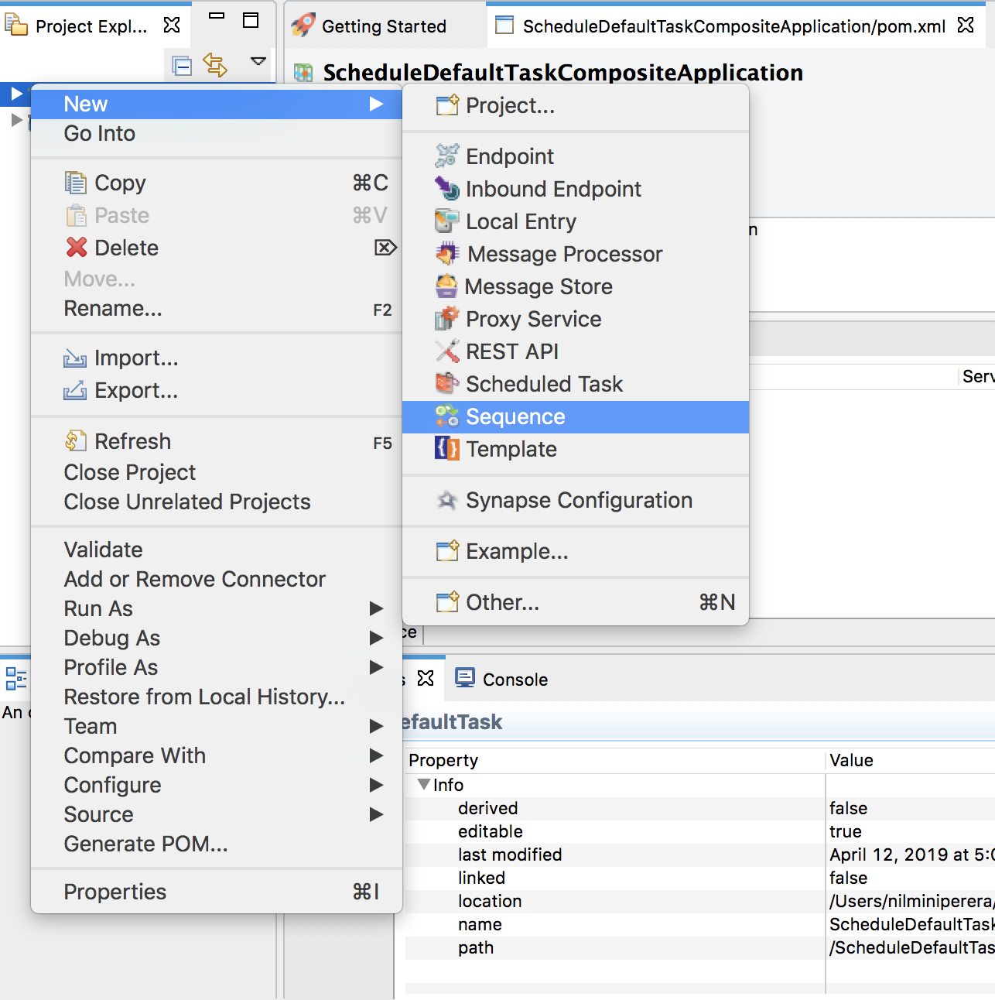
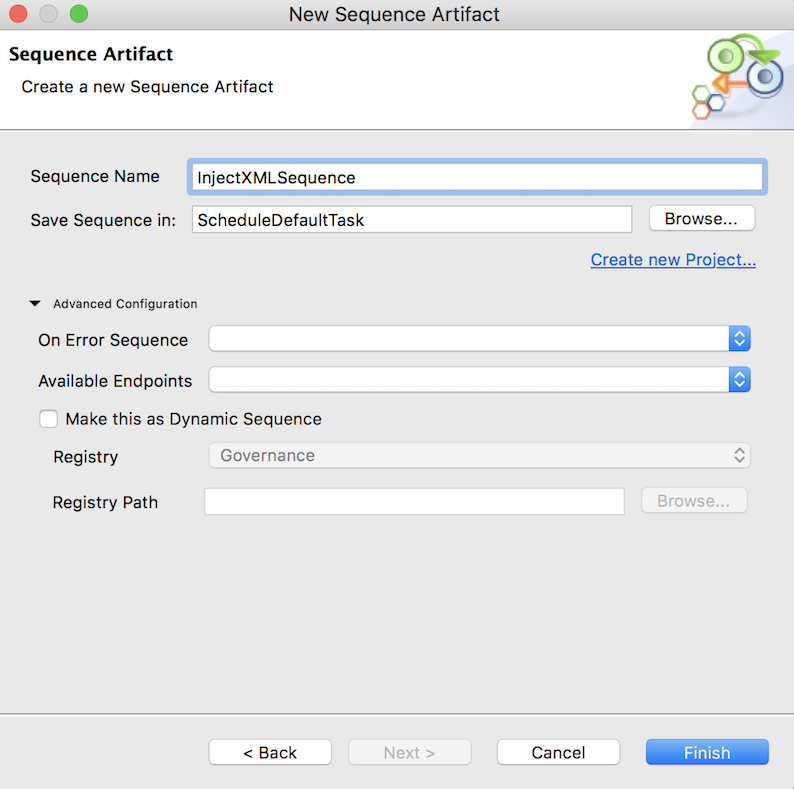
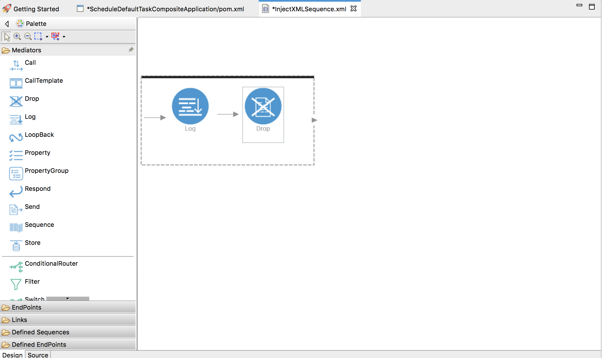
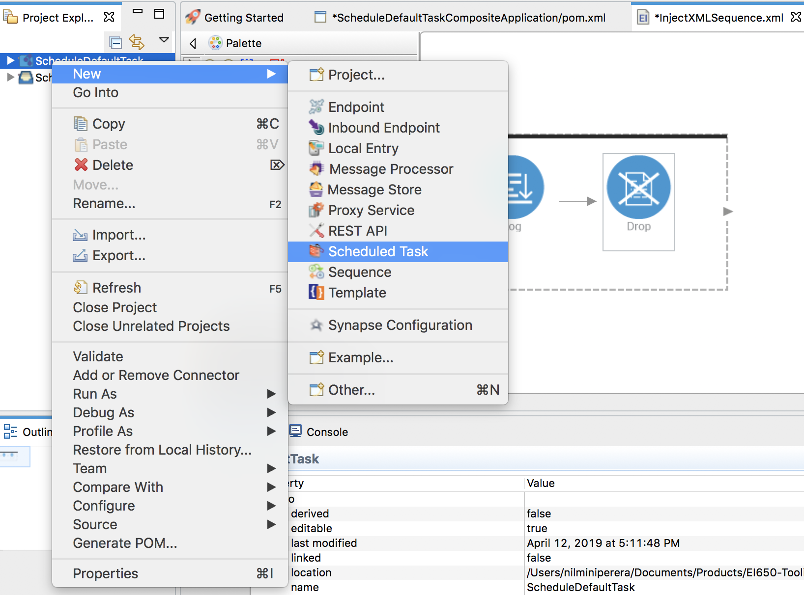
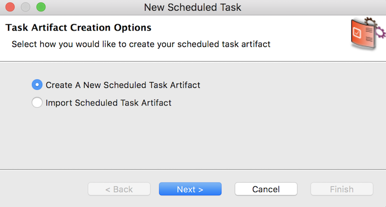
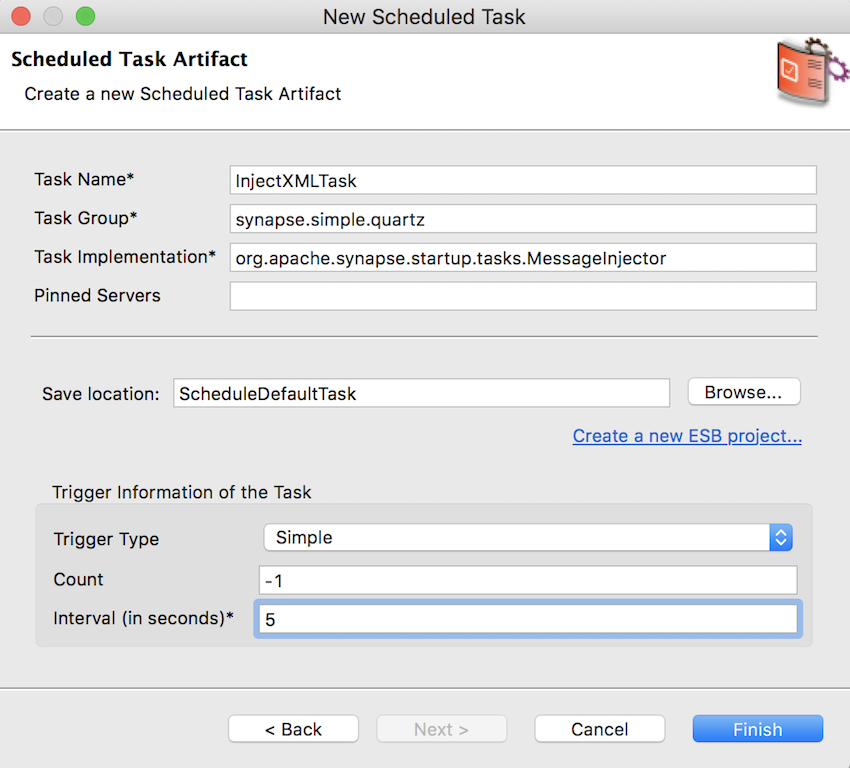
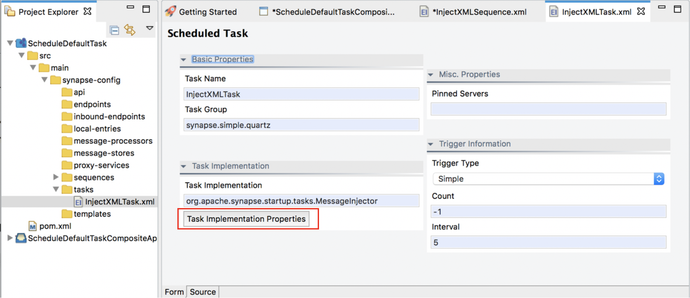
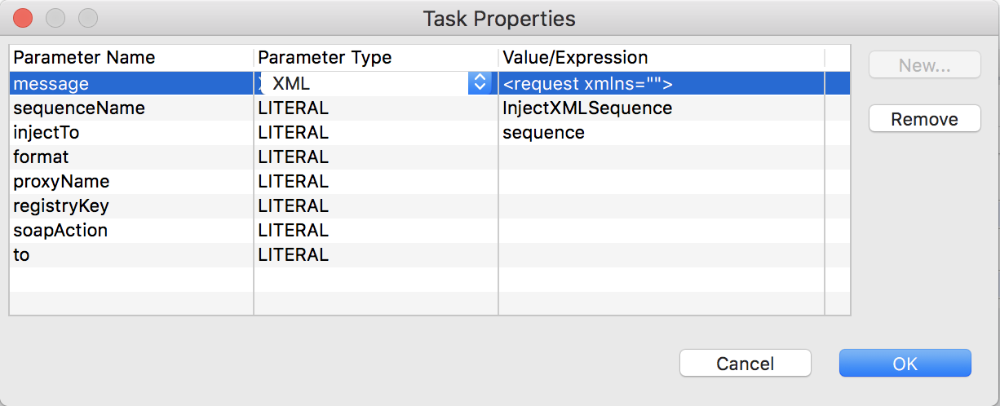

# Periodic Execution of Integration Process

## What you'll build

The sections below demonstrate an example of scheduling a task (using the default implementation) to inject an XML message and to print it in the logs of the server.

## Let's get started!

### Step 1: Set up the workspace

-  Select the relevant [WSO2 Integration Studio](https://wso2.com/integration/tooling/) based on your operating system and extract the ZIP file.  The path to the extracted folder is referred to as `MI_TOOLING_HOME` throughout this tutorial.
-  Download the [CLI Tool](https://wso2.com/integration/micro-integrator/install/) for monitoring artifact deployments.

### Step 2: Develop the integration artifacts

Follow the instructions given in this section to create and configure the required artifacts.

#### Create an ESB Config project

To create an ESB solution consisting of an **ESB config** project and a **Composite Application** project:

1.  Open **WSO2 Integration Studio**.
2.  Go to **ESB Project** and click **Create New**.
    

3.  Enter `ScheduleDefaultTask` as the project name. Be sure to select the following check boxes so that the relevant
    projects will be created.
    -   **Create Composite Application Project**

4.  Click **Finish**.  
    The created projects are saved in the **Project Explorer**.

#### Creating the Sequence

1.  In the **Project Explorer**, right click the **ScheduleDefaultTask** project, and click **New** → **Sequence**.  
     
2.  Click **Create New Sequence** and click **Next**.
3.  Enter **InjectXMLSequence** as the sequence name and click **Finish**.  
      
4.  Drag and drop a **Log** mediator and a **Drop** mediator from the **Mediators** Palette.  
     
5.  Click the **Log** mediator and enter the following details in the **Properties** section.  
    -  **Log Category**: `INFO`
    -  **Log Level**: `CUSTOM`
    - Add a new property with the following details:
        <table>
           <tr>
              <th>Property</th>
              <th>Description</th>
           </tr>
           <tr>
              <td>Property Name</td>
              <td>City</td>
           </tr> 
           <tr>
              <td>Value Type</td>
              <td>EXPRESSION</td>
           </tr> 
           <tr>
              <td>Expression</td>
              <td>//city</td>
           </tr> 
        </table>
    
Shown below is the complete source configuration of the Sequence (i.e., the `InjectXMLSequence.xml` file).

```xml
<?xml version="1.0" encoding="UTF-8"?>
<sequence name="InjectXMLSequence" trace="disable" xmlns="http://ws.apache.org/ns/synapse">
   <log level="custom">
       <property expression="//city" name="City"/>
   </log>
   <drop/>
</sequence>
```
#### Creating the Scheduled Task

1. Right click the **ScheduleDefaultTask** project and click **New → Scheduled Task**.
      

2. Select **Create a New Scheduled Task Artifact** and click **Next**.
      

3.  Enter the following details and click **Next**:
    -   **Task Name:** `InjectXMLTask`
    -   **Count:** `-1`
    -   **Interval (in seconds):** 5

     

4.  In the **Form View** of the `InjectXMLTask` task, click **Task Implementation Properties**. 

     

    1.  Enter the following parameters:
        -   **injectTo:** `InjectXMLTask`
        -   **sequenceName:** `InjectXMLSequence`

    2.  Select **XML** as the **Parameter Type** of the **message** parameter, and enter the following as the XML message in the **Value/Expression** field and click **OK**. 
        ```xml
        <request xmlns="">
           <location>
               <city>London</city>
               <country>UK</country>
           </location>
        </request>
        ``` 

        

Shown below is the complete source configuration of the scheduled task.

```xml
<?xml version="1.0" encoding="UTF-8"?>
<task class="org.apache.synapse.startup.tasks.MessageInjector" group="synapse.simple.quartz" name="InjectXMLTask" xmlns="http://ws.apache.org/ns/synapse">
   <trigger interval="5"/>
   <property name="injectTo" value="sequence" xmlns:task="http://www.wso2.org/products/wso2commons/tasks"/>
   <property name="sequenceName" value="InjectXMLSequence" xmlns:task="http://www.wso2.org/products/wso2commons/tasks"/>
   <property name="message" xmlns:task="http://www.wso2.org/products/wso2commons/tasks">
       <request xmlns="">
           <location>
               <city>London</city>
               <country>UK</country>
           </location>
       </request>
   </property>
</task>
``` 

### Step 3: Package the artifacts

Package the artifacts in your composite application project (SampleServicesCompositeApplication project) to be able to deploy the artifacts in the server.

1.  Open the `          pom.xml         ` file in the composite application project POM editor.
2.  Ensure that the relevant artifacts are selected in the POM file.
3.  Save the project.

### Step 4: Build and run the artifacts

To test the artifacts, deploy the [packaged artifacts](#step-3-package-the-artifacts) in the embedded Micro Integrator:

1.  Right-click the composite application project and click **Export Project Artifacts and Run**.
2.  In the dialog that opens, select the composite application project that you want to deploy.  
4.  Click **Finish**. The artifacts will be deployed in the embedded Micro Integrator and the server will start. See the startup log in the **Console** tab.

### Step 5: Test the use case

You view the XML message you injected (i.e., `<abc>This is a scheduled task of the default implementation.</abc>`) getting printed in the logs of the Micro Integrator every 5 seconds.
