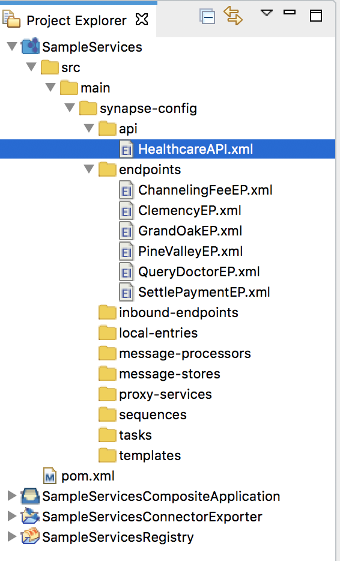
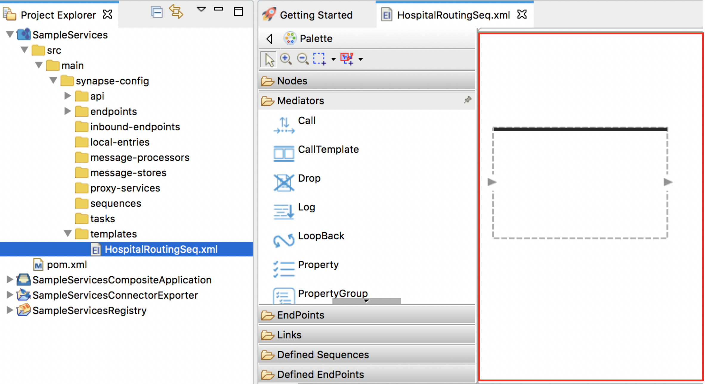
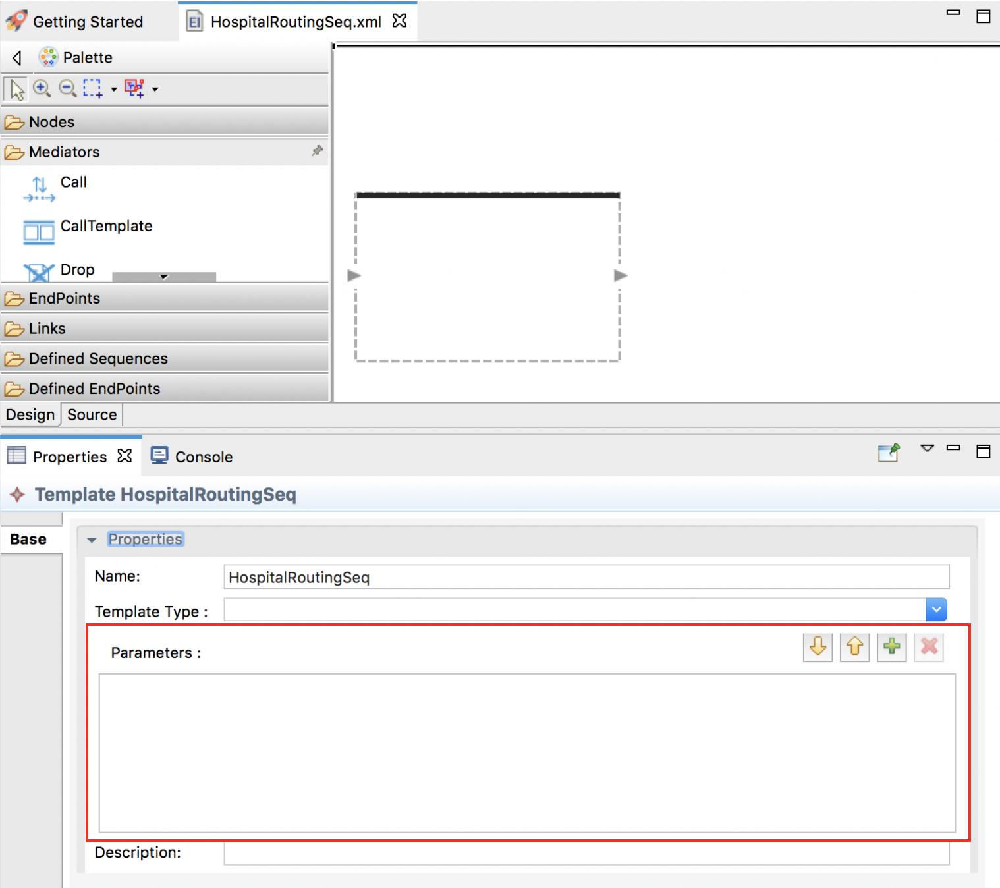
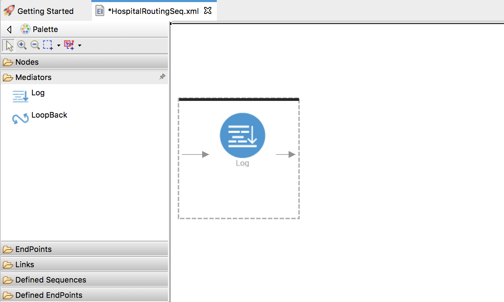

# Reusing Mediation Sequences

## What you'll build

In this sample scenario, you will use a **Sequence Template**
and reuse it in multiple places of the medation flow. You can reuse the
mediation flow that was defined in the [Sending a Simple Message to a Service](../sending-a-simple-message-to-a-service) tutorial and then replace its sections with the sequence template. See [Creating Templates](../../develop/creating-artifacts/creating-sequence-templates.md) for details
on how to work with templates using WSO2 Integration Studio.

## Let's get started!

### Step 1: Set up the workspace

Set up WSO2 Integration Studio as follows:

1.  Download the relevant [WSO2 Integration Studio](https://wso2.com/integration/tooling/) based on your operating system. The path to the extracted/installed folder is referred to as `MI_TOOLING_HOME` throughout this tutorial.
2.  Set up the project from the [Sending a Simple Message to a Service](sending-a-simple-message-to-a-service.md) tutorial:

    !!! Note
        This tutorial is a continuation of the [Sending a Simple Message to a Service](sending-a-simple-message-to-a-service.md) tutorial.

    1.  Download the [pre-packaged project](https://github.com/wso2-docs/WSO2_EI/blob/master/Integration-Tutorial-Artifacts/Integration-Tutorial-Artifacts-EI7.1.0/sending-simple-message-tutorial.zip).
    2.  Open WSO2 Integration Studio and go to **File -> Import**. 
    3.  Select **Existing WSO2 Projects into workspace** under the **WSO2** category, click **Next**, and then upload the **prepackaged project**.

### Step 2: Develop the integration artifacts

#### Create a Sequence Template

1.  Once you have exported the integration project as described in above, the
    project directory will appear with the artifacts as shown below.
    Note the 'HealthcareAPI' that is already included.

    

2.  Right-click on **SampleServicesConfigs** and navigate to **New -> Template** . The **New Template Artifact** dialog box will open.
3.  Select the **Create a New Template** and click **Next**.
4.  Enter the following details and click **Finish**.
    <table>
        <tr>
            <th>Parameter</th>
            <th>Description</th>
        </tr>
        <tr>
            <td>Template Name</td>
            <td>HospitalRoutingSeq</td>
        </tr>
        <tr>
            <td>Template Type</td>
            <td>Sequence Template</td>
        </tr>
    </table>

    

5.  The template artifact will open in the canvas as shown below.

    

6.  Open the **Properties** tab of the sequence template by clicking on
    the canvas (outside the sequence box).  

7.  Click the  icon
    to start adding parameters .

     

8.  In the **Template Parameter** dialog box that opens, enter 'sethospital' as the parameter name and click **Finish**.

9.  Add a **Log** mediator to the sequence template as shown below. This
    will print a message indicating to which hospital a requested
    message is routed.

     

10. Open the **Properties** tab of the log mediator and specify the
    following:

    <table>
        <tr>
            <th>Property</th>
            <th>Description</th>
        </tr>
        <tr>
            <td>Log Category</td>
            <td>INFO</td>
        </tr>
        <tr>
            <td>Log Level</td>
            <td>CUSTOM</td>
        </tr>
    </table>

11. Click the  icon
    to start defining a property. Then add the following details for the
    property:

    <table>
        <tr>
            <th>Property Name</th>
            <th>Description</th>
        </tr>
        <tr>
            <td> Name</td>
            <td>message</td>
        </tr>
        <tr>
            <td>Type</td>
            <td>EXPRESSION</td>
        </tr>
        <tr>
            <td>Property Expression</td>
            <td><code>fn:concat('Routing to ', get-property('Hospital')) </code></td>
        </tr>
    </table>

    We select EXPRESSION because the required properties for the log
    message must be extracted from the request, which we can do using an
    XPath expression.  

12. Add a **Property** mediator just after the **Log** mediator to store
    the value for uri.var.hospital.

     

13. With the **Property** mediator selected, access the **Properties**
    tab and enter the information given below:
    <table>
        <tr>
            <th>Property</th>
            <th>Description</th>
        </tr>
        <tr>
            <td>Property Name</td>
            <td>Select New Property</td>
        </tr>
        <tr>
            <td>New Property Name</td>
            <td>uri.var.hospital  </td>
        </tr>
        <tr>
            <td>URI Template</td>
            <td>Select set </td>
        </tr>
        <tr>
            <td>Value Type</td>
            <td>Select EXPRESSION</td>
        </tr>
        <tr>
            <td>Property Data Type</td>
            <td>Select STRING</td>
        </tr>
        <tr>
            <td>Value Expression</td>
            <td><code>$func:sethospital</code></td>
        </tr>
        <tr>
            <td>Description</td>
            <td>Set Hospital Variable</td>
        </tr>
    </table>

#### Update the mediation flow

1.  Open the design view of the HealthcareAPI.xml and delete 'GrandOak'
    **Log** mediator by right clicking the mediator and selecting
    **Delete from Model** .  
    

2.  Delete the 'Set Hospital Variable' **Property** mediator.

3.  Add a **Call Template** mediator to the sequence as shown below.  
    

4.  Open the **Properties** tab of the **Call Template** mediator and
    select ' HospitalRoutingSeq' from the list of available templates.

5.  Click the  icon
    to start adding parameters. Enter the following parameter details
    and click **Finish** .

    <table>
        <tr>
            <th>Parameter</th>
            <th>Description</th>
        </tr>
        <tr>
            <td>Parameter Name</td>
            <td>sethospital</td>
        </tr>
        <tr>
            <td>Parameter Type</td>
            <td>value</td>
        </tr>
        <tr>
            <td>Value/Expression</td>
            <td>grandoaks</td>
        </tr>
    </table>

    

6.  Repeat the above steps to add **Call Templates** for 'Clemency' and
    'Pine Valley' hospitals. Add **clemency** and **pinevalley** as the
    respective parameter values.

7.  Save the configuration.

### Step 3: Package the artifacts

Package the artifacts in your composite exporter module (SampleServicesCompositeExporter) to be able to deploy the artifacts in the server.

1.  Open the `pom.xml` file in the composite exporter module.
2.  Ensure that the following artifacts are selected in the POM file.

    -   `HealthcareAPI`
    -   `HospitalRoutingSeq`

3.  Save the changes.

### Step 4: Build and run the artifacts

To test the artifacts, deploy the [packaged artifacts](#step-3-package-the-artifacts) in the embedded Micro Integrator:

1.  Right-click the composite exporter module and click **Export Project Artifacts and Run**.
2.  In the dialog box that opens, confirm that the required artifacts from the composite exporter module are selected.     
4.  Click **Finish**. 

The artifacts will be deployed in the embedded Micro Integrator and the server will start.

- See the startup log in the **Console** tab.
- See the URLs of the deployed services and APIs in the **Deployed Services** tab. 

### Step 5: Testing the use case

Let's test the use case by sending a simple client request that invokes the service.

#### Start the backend service

1. Download the JAR file of the back-end service from [here](https://github.com/wso2-docs/WSO2_EI/blob/master/Back-End-Service/Hospital-Service-2.0.0-EI7.jar).
2. Open a terminal, navigate to the location where your saved the [back-end service](#step-1-set-up-the-workspace).
3. Execute the following command to start the service:

    ```bash
    java -jar Hospital-Service-2.0.0-EI7.jar
    ```

#### Send the client request

Let's send a simple request to invoke the service. You can use the embedded <b>HTTP Client</b> of WSO2 Integration Studio as follows:

1. Open the <b>HTTP Client</b> of WSO2 Integration Studio.

    !!! Tip
        If you don't see the <b>HTTP Client</b> pane, go to <b>Window -> Show View - Other</b> and select <b>HTTP Client</b> to enable the client pane.

    
    
2. Enter the request information as given below and click the <b>Send</b> icon ().
    
    <table>
        <tr>
            <th>Method</th>
            <td>
               <code>POST</code> 
            </td>
        </tr>
        <tr>
            <th>Headers</th>
            <td>
              <code>Content-Type=application/json</code>
            </td>
        </tr>
        <tr>
            <th>URL</th>
            <td><code>http://localhost:8290/healthcare/categories/surgery/reserve</code></br></br>
            </td>
        </tr>
        <tr>
            <th>Body</th>
            <td>
            <div>
              <code>
                {
                 "name": "John Doe",
                 "dob": "1940-03-19",
                 "ssn": "234-23-525",
                 "address": "California",
                 "phone": "8770586755",
                 "email": "johndoe@gmail.com",
                 "doctor": "thomas collins",
                 "hospital": "grand oak community hospital",
                 "cardNo": "7844481124110331",
                 "appointment_date": "2025-04-02"
                }
              </code>
            </div></br>
            <ul>
              <li>
                This JSON payload contains details of the appointment reservation, which includes patient details, doctor, hospital, and data of appointment.
              </li>
            </ul>
        </tr>
     </table>
     
     

If you want to send the client request from your terminal:

1.  Install and set up [cURL](https://curl.haxx.se/) as your REST client.
2.  Create a JSON file names `request.json` with the following request payload.

    ```json
    {
     "name": "John Doe",
     "dob": "1940-03-19",
     "ssn": "234-23-525",
     "address": "California",
     "phone": "8770586755",
     "email": "johndoe@gmail.com",
     "doctor": "thomas collins",
     "hospital": "grand oak community hospital",
     "cardNo": "7844481124110331",
     "appointment_date": "2025-04-02"
    }
    ```

3.  Open a command line terminal and execute the following command from
    the location where the request.json file you created is saved:

    ```bash
    curl -v -X POST --data @request.json http://localhost:8290/healthcare/categories/surgery/reserve --header "Content-Type:application/json"
    ```

#### Analyze the response

You will see the response received to your <b>HTTP Client</b>:
    ```bash
    {"appointmentNo":2,"doctorName":"thomas collins","patient":"John Doe","actualFee":7000.0,"discount":20,"discounted":5600.0,"paymentID":"cc7e4c23-a66d-4d60-8b72-2cf9143c6335","status":"Settled"}
    ```
