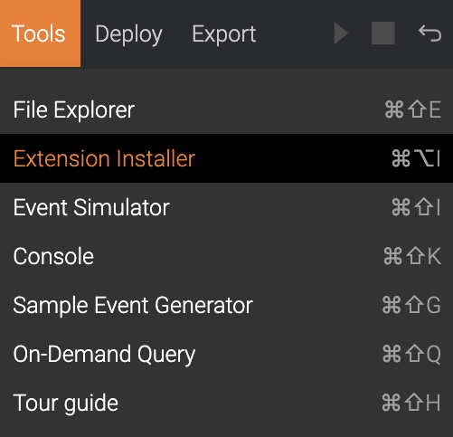
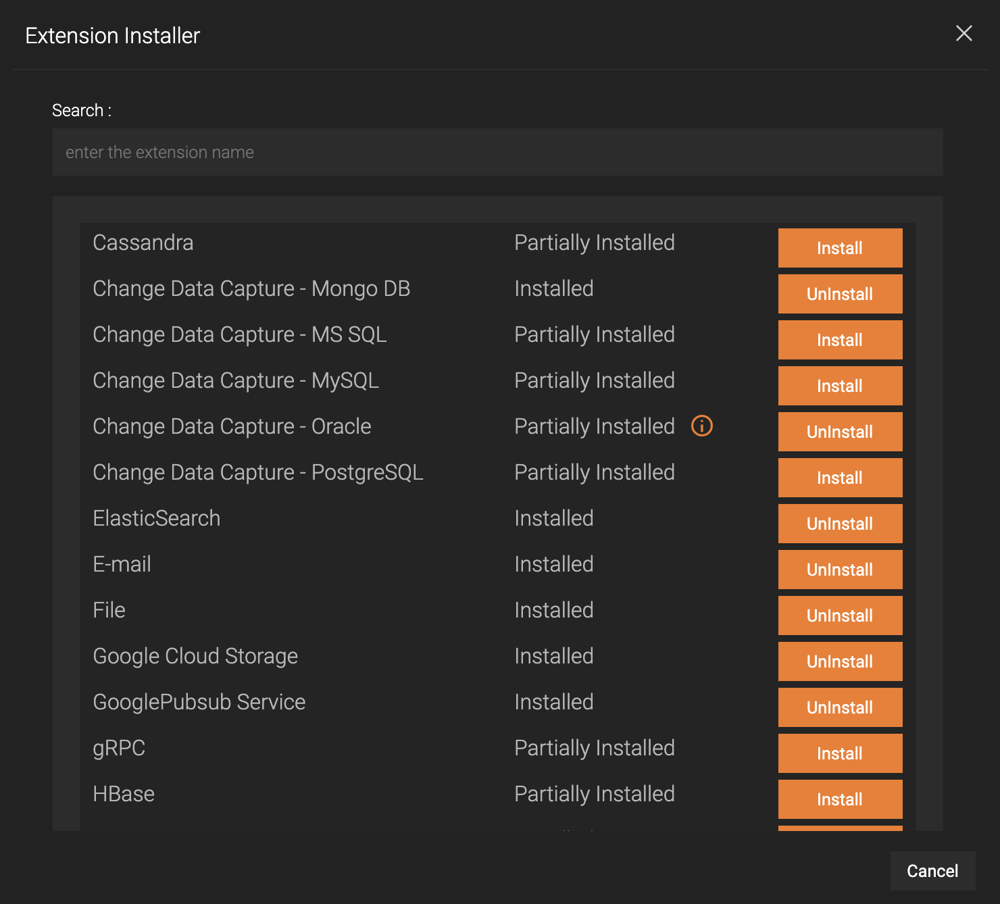

# Installing Siddhi Extensions

Streaming Integrator Tooling uses Siddhi extensions to connect with various data sources. Siddhi extensions can be installed or un-installed using the Extension Installer.

To install or un-install Siddhi extensions, follow the steps given below.

## Accessing the Extension Installer

1. Start the Streaming Integrator Tooling by issuing one of the following commands from the `<SI_HOME>/bin` directory.

    - For Windows: `tooling.bat`

    - For Linux: `./tooling.sh`

2. Click **Tools** menu option and then click **Extension Installer**. 
    
    

    As a result, the following dialog box opens.

    

3. Locate the extension you wish to install/un-install.

    !!! tip
        Enter the name, or part of the name of an extension in the search bar, which will filter the extension(s) matching the entered keyword.
        
    
    
    An extension will have one of the following statuses.
    <table>
        <tr>
            <th>Status</th>
            <th>Description</th>
        </tr>
        <tr>
            <td>Installed</td>
            <td>
            <b>The extension has been completely installed.</b> Jar of the extension itself, and all its dependencies (if any) are present.
            </td>
        </tr>
        <tr>
            <td>Not Installed</td>
            <td>
            <b>The extension has not been installed.</b> Jar of the extension itself is not present. Dependencies (if any) might be present due to [shared dependencies](#shared-dependencies-among-multiple-extensions).
            </td>
        </tr>
        <tr>
            <td>Partially Installed</td>
            <td>
            Jar of the extension itself has been installed. But, some of the dependencies of the extension have to be installed.
            </td>
        </tr>
        <tr>
            <td>Restart Required</td>
            <td>
                Installation or un-installation has finished for this extension. The editor has to be restarted in order to update the status.
            </td>
        </tr>
    </table>

4. An icon is shown next to the status as shown below, when there are [manually installable dependencies](#manually-installable-dependencies).

    

## Installing an extension

1. Click on the **Install** button next to an extension.

    

    The confirmation dialog will be shown as follows.

    

2. Click on the **Install** button to confirm. Installation will begin.

    

3. After the installation has been finished, the following dialog will be shown. A restart is required after the installation.

    

4. After restarting the editor, the particular extension's status will be updated.

    

## Un-installing an extension

1. Click on the **UnInstall** button next to an extension.

    

    The confirmation dialog will be shown as follows.

    

2. Click on the **UnInstall** button to confirm un-installation.

3. If the particular extension shares any dependency with other extension(s), a dialog box will be shown with information about [shared dependencies](#shared-dependencies-among-multiple-extensions). Otherwise, un-installation will begin.

    ### Shared Dependencies among Multiple Extensions

    Some dependencies are common for more than one extension. For example, _MySQL Connector_ is used by the _RDBMS MySQL extension_, as well as the _Change Data Capture MySQL extension_. In cases similar to this, un-installing one such extension will implicitly delete dependencies of other extension(s) too. You will have to re-install those extensions, in order to use them.

    When trying to un-install such an extension, the following dialog box will be shown.
    
    

    This denotes that, some dependencies of _this_ extension (which you are trying to un-install), are also used by some other extension(s). Those extensions are shown in **bold**, and the dependencies that are common to _this_ extension are listed under them.

    The above screenshot shows that, the dependency `mysql-connector-java` is _also_ used by the **rdbms-mysql** extension, and the dependency `siddhi-io-cdc` is _also_ used by the extensions:  **cdc-oracle**, **cdc-postgresql**, **cdc-mssql** and **cdc-mongodb**.

    Pressing the **Confirm** button will continue the un-installation. The shown dependencies will be deleted as part of the un-installation, and therefore, the listed down extensions will loose some of their dependencies. You will have to re-install those extensions again in order to use them.

4. The following dialog box will appear once the un-installation is complete. A restart is required after the un-installation.

    

## Manually Installable Dependencies
Certain dependencies of some extensions can not be automatically downloaded through the Siddhi Extensions Installer. These dependencies should be manually downloaded and installed. When there is at least one such dependency for an extension, an icon will be shown as follows, next to the extension's status.
    

Clicking this icon will open the following dialog box.
    

The dialog box will show each dependency - that should be manually installed, of the particular extension, along with the following information.

- **Instructions** - Instructions to follow, in order to download, and optionally convert the jar of the dependency.
- **Installation Locations** - After following the instructions, the resultant jar should be placed in its specific location as mentioned, based on the table below.

    <table>
        <tr>
            <th>Location</th>
            <th>Directory</th>
            <th>Jar Types</th>
        </tr>
        <tr>
            <td>runtime</td>
            <td>
                <code>&lt;SI_HOME&gt;/lib</code>
            </td>
            <td>
                <ul>
                    <li><b>bundle in runtime:</b> An OSGi bundle should be placed in this location.</li>
                    <li><b>jar in runtime:</b> A non-OSGi bundle can be placed in this location.</li>
                </ul>
            </td>
        </tr>
        <tr>
            <td>samples</td>
            <td>
                <code>&lt;SI_HOME&gt;/samples/sample-clients/lib</code>
            </td>
            <td>
                <ul>
                    <li><b>jar in samples:</b> A non-OSGi bundle can be placed in this location.</li>
                </ul>
            </td>
        </tr>
    </table>

Installation of extensions of which, manually installable dependencies are present, will not be complete until you install these dependencies manually.

## Configuring Extension Dependencies

<!-- TODO Talk about the JSON file. -->